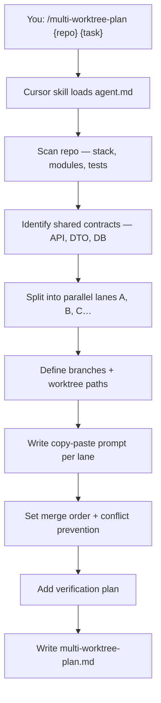
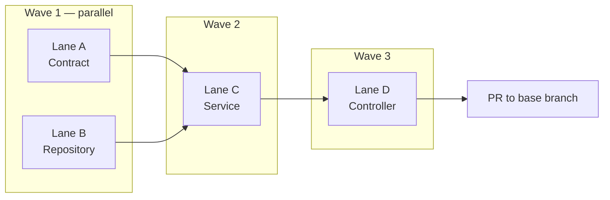
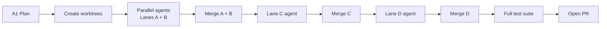

# A1 — Multi-Worktree Parallel Plan

> **Plan first. Code in parallel. Merge with confidence.**

Split a feature, bug fix, or migration into **independent agent lanes** — each with its own branch, worktree, file ownership, and copy-paste Cursor prompt. One command produces a complete parallel delivery plan.

```bash
/multi-worktree-plan ~/Downloads/bo-migration-service Add bulk export API for migration status
```

| | |
| --- | --- |
| **Project** | A1 — Multi-Worktree Parallel Plan |
| **Agent** | [`agent.md`](agent.md) · slash command `/multi-worktree-plan` |
| **Cursor skill** | `.cursor/skills/multi-worktree-plan/SKILL.md` |
| **Latest plan** | [`multi-worktree-plan.md`](multi-worktree-plan.md) · 2026-06-17 |
| **Latest target** | `~/Downloads/bo-migration-service` — bulk export API |
| **Mode** | Plan only — no worktrees/branches created unless you ask |

---

## At a Glance

| Metric | Value |
| ------ | ----- |
| **Output** | Single `multi-worktree-plan.md` (8 required sections) |
| **Lanes in latest plan** | 4 — Contract · Repository · Service · Controller |
| **Parallel wave 1** | Lanes A + B (zero file overlap) |
| **Merge sequence** | A → B → C → D |
| **Stack (example)** | Java 17 · Spring Boot 3.2 · Maven · JPA |

---

## How It Works



| Step | Agent action | Output |
| ---- | ------------ | ------ |
| 1 | Scan target repo structure | Stack, packages, test layout |
| 2 | Identify shared contracts | API paths, DTOs, DB, config |
| 3 | Decompose into lanes | File ownership per lane |
| 4 | Define branch strategy | `git worktree add` commands |
| 5 | Write agent prompts | Allowed / forbidden files per lane |
| 6 | Specify merge order | Wave 1 parallel → Wave 2 serial |
| 7 | Plan verification | Per-lane + post-merge tests |
| 8 | Write plan file | [`multi-worktree-plan.md`](multi-worktree-plan.md) |

> The agent **does not** create worktrees, branches, or commits unless you explicitly ask.

---

## Architecture — Parallel Lanes

```
                         ┌─────────────────────────────────────────┐
                         │         Target repo (base branch)        │
                         └─────────────────────────────────────────┘
                                            │
              ┌─────────────────────────────┼─────────────────────────────┐
              │                             │                             │
              ▼                             ▼                             │
   ┌──────────────────────┐      ┌──────────────────────┐                  │
   │  Lane A — Contract   │      │  Lane B — Repository │   ◄── Wave 1   │
   │  worktree + branch   │      │  worktree + branch   │      (parallel)  │
   │  DTOs · API doc      │      │  JPA pagination      │                  │
   └──────────┬───────────┘      └──────────┬───────────┘                  │
              │                             │                             │
              └──────────────┬──────────────┘                             │
                             ▼                                             │
                  ┌──────────────────────┐                                 │
                  │  Lane C — Service    │                    ◄── Wave 2   │
                  │  export logic · CSV  │                        (serial) │
                  └──────────┬───────────┘                                 │
                             ▼                                             │
                  ┌──────────────────────┐                                 │
                  │  Lane D — Controller │                    ◄── Wave 3   │
                  │  HTTP · WebMvc tests │                        (serial) │
                  └──────────┬───────────┘                                 │
                             ▼                                             │
                  ┌──────────────────────┐                                 │
                  │  Merge A→B→C→D → PR  │                                 │
                  └──────────────────────┘                                 │
```



---

## Start with the Agent

### Step 1 — Open Cursor Agent chat

| Scenario | Command |
| -------- | ------- |
| **Repo + task** | `/multi-worktree-plan ~/Downloads/bo-migration-service Add bulk export API for migration status` |
| **Auth refactor** | `/multi-worktree-plan ~/my-app Refactor auth module to JWT — split across contract, service, and tests` |
| **Repo only** | `/multi-worktree-plan ~/my-app` — agent asks for the task |

### Step 2 — Review the plan

Open [`multi-worktree-plan.md`](multi-worktree-plan.md). Confirm lanes, file ownership, and merge order before creating worktrees.

### Step 3 — Execute in parallel

Create worktrees, open each in a separate Cursor window, and paste the lane prompt from the plan.

---

## Plan Deliverable — 8 Sections

Every run overwrites [`multi-worktree-plan.md`](multi-worktree-plan.md) with:

| # | Section | What you get |
| - | ------- | ------------ |
| 1 | **Task Definition** | Scope, stack, `[NEEDS CLARIFICATION]` defaults |
| 2 | **Task Decomposition** | Lane table — objective, files, risk, dependencies |
| 3 | **Branch Strategy** | Branch names, worktree paths, shell commands |
| 4 | **Agent Prompt Per Lane** | Full copy-paste Cursor prompts |
| 5 | **Shared Constraints** | Frozen API contract, DTO shapes, DB rules |
| 6 | **Merge Order** | Exact A → B → C → D sequence with rationale |
| 7 | **Conflict Prevention** | Shared files, high-risk areas, reconciliation |
| 8 | **Verification Plan** | Per-lane build/test + post-merge integration |

---

## Lane Design — Do's and Don'ts

| ✅ Good split | ❌ Bad split |
| ------------ | ----------- |
| Lane A: OpenAPI contract + DTOs only | "Backend work" with no file list |
| Lane B: Repository — single file owner | Two lanes editing the same service class |
| Lane C: Service layer in **new** files | Parallel Flyway migrations without sequence |
| Lane D: Controller in **new** controller | Vague "frontend + backend" lanes |

Each lane requires: **objective** · **concrete file paths** · **risk level** · **dependencies**.

---

## Latest Example — Bulk Export API

From [`multi-worktree-plan.md`](multi-worktree-plan.md):

**Endpoint:** `GET /bo-migration/v1/exportMigrationStatus?format=csv&limit=10000&offset=0`

| Lane | Branch | Worktree | Scope | Risk |
| ---- | ------ | -------- | ----- | ---- |
| **A** — Contract | `feature/export-migration-status-contract` | `../bo-migration-export-contract` | DTOs + API contract doc | Low |
| **B** — Repository | `feature/export-migration-status-repo` | `../bo-migration-export-repo` | Paginated JPA read | Low |
| **C** — Service | `feature/export-migration-status-service` | `../bo-migration-export-service` | Export service + CSV writer | Medium |
| **D** — Controller | `feature/export-migration-status-controller` | `../bo-migration-export-controller` | HTTP endpoint + WebMvc tests | Low |

### Create worktrees (after plan approval)

```bash
cd ~/Downloads/bo-migration-service
git checkout master-foundry-changes-bo-migration-service

# Wave 1 — run in parallel
git worktree add ../bo-migration-export-contract -b feature/export-migration-status-contract
git worktree add ../bo-migration-export-repo     -b feature/export-migration-status-repo

# Wave 2 — after A + B merged
git worktree add ../bo-migration-export-service   -b feature/export-migration-status-service

# Wave 3 — after C merged
git worktree add ../bo-migration-export-controller -b feature/export-migration-status-controller
```

### Per-lane verification (from plan)

| Lane | Build | Test | Done when |
| ---- | ----- | ---- | --------- |
| A | `./mvnw compile` | — | DTOs compile, contract doc exists |
| B | `./mvnw compile` | `./mvnw test -Dtest=MigrationStatusRepositoryTest` | Pagination verified |
| C | `./mvnw compile` | `./mvnw test -Dtest=MigrationExport*` | CSV bytes match fixture |
| D | `./mvnw compile` | `./mvnw test -Dtest=MigrationExportControllerTest` | 200 + CSV content-type |

### Cleanup after merge

```bash
git worktree remove ../bo-migration-export-contract
git worktree remove ../bo-migration-export-repo
git worktree remove ../bo-migration-export-service
git worktree remove ../bo-migration-export-controller
```

---

## End-to-End Delivery Flow



Typical pipeline:

```
A1 plan  →  create worktrees  →  parallel lane agents  →  merge in order  →  verify  →  PR
```

| Agent | Role |
| ----- | ---- |
| **A1** `/multi-worktree-plan` | Decompose work into parallel lanes |
| **D5** `/reproducible-dev-environment` | One-command bootstrap for target repo |
| **BE Agent** `/be-ship-from-ticket` | Implement a single lane or serial feature |

---

## Success Checklist

After an agent run, confirm:

| Check | Expected |
| ----- | -------- |
| Plan file | `multi-worktree-plan.md` with all 8 sections |
| Lane independence | Each lane has allowed **and** forbidden file lists |
| Branch names | `feature/<lane-short-name>` per lane |
| Prompts | Copy-paste ready with definition of done |
| Merge order | Serial sequence with dependency rationale |
| Verification | Per-lane + post-merge commands documented |
| Shared files | Explicit owner — no parallel edits |

---

## Project Layout

```
A1_Multi-worktree_parallel_plan/
├── README.md                 ← you are here
├── agent.md                  ← agent spec, rules, output template
└── multi-worktree-plan.md    ← latest plan (overwritten each run)
```

Plans live here. Code changes happen in the target repo's worktrees.

---

## Documentation

| Document | Description |
| -------- | ----------- |
| [`agent.md`](agent.md) | Full A1 spec — workflow, rules, output template |
| [`multi-worktree-plan.md`](multi-worktree-plan.md) | Latest plan with lane prompts and merge strategy |
| `.cursor/skills/multi-worktree-plan/SKILL.md` | Slash command entry point |

---

<p align="center"><sub>A1 — Multi-Worktree Parallel Plan · Plan first · Code in parallel · Merge with confidence</sub></p>
