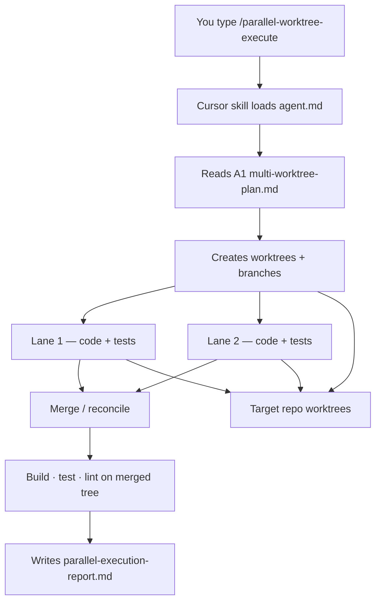
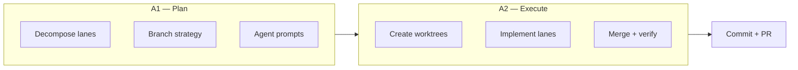
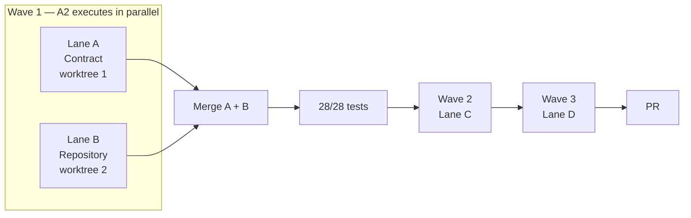
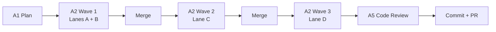

# A2 — Execute Two Parallel Worktrees

> **Plan with A1. Execute with A2. Verify before you merge.**

Create **two or more git worktrees**, implement independent lane changes in parallel, reconcile merges cleanly, and prove integration with build, test, and lint evidence.

```bash
/parallel-worktree-execute ~/Downloads/bo-migration-service — execute Lane A and Lane B from A1 export plan
```

| | |
| --- | --- |
| **Project** | A2 — Execute Two Parallel Worktrees |
| **Agent** | [`agent.md`](agent.md) · slash command `/parallel-worktree-execute` |
| **Cursor skill** | `.cursor/skills/parallel-worktree-execute/SKILL.md` |
| **Location** | `Advanced-parallel agent operator and system builder/A2_Execute_two_parallel_worktrees` |
| **Latest report** | [`parallel-execution-report.md`](parallel-execution-report.md) · 2026-06-17 |
| **Latest target** | `~/Downloads/bo-migration-service` — Wave 1 (Lanes A + B) |
| **Companion plan** | [A1 `multi-worktree-plan.md`](../A1_Multi-worktree_parallel_plan/multi-worktree-plan.md) |

---

## Latest Verification — Executive Summary

| Metric | Result |
| ------ | ------ |
| **Overall status** | ✅ **PASS** — Wave 1 complete |
| **Worktrees active** | 2 / 2 (Contract + Repository) |
| **Per-lane tests** | Lane A compile ✅ · Lane B **1/1** ✅ |
| **Integration tests** | **28 passed · 0 failed** |
| **Lint** | ✅ `mvn validate` clean |
| **Merge conflicts** | **0** — disjoint file ownership |

```
┌─────────────────────────────────────┐
│  INTEGRATION SUMMARY (merged tree)  │
├─────────────────────────────────────┤
│  Build     ✅  exit 0               │
│  Tests     ✅  28 / 28              │
│  Lint      ✅  clean                │
│  Conflicts ✅  none                 │
└─────────────────────────────────────┘
```

---

## At a Glance

| Metric | Value |
| ------ | ----- |
| **Output** | Single `parallel-execution-report.md` (7 required sections) |
| **Minimum lanes** | 2 parallel worktrees |
| **Latest wave** | Wave 1 — Lanes A + B (contract + repository) |
| **Stack (example)** | Java 17 · Spring Boot 3.2 · Maven · JPA |
| **Mode** | Execute + verify — no commit/push unless you ask |

---

## How A1 and A2 Connect



| Component | Path | Purpose |
| --------- | ---- | ------- |
| Agent spec | [`agent.md`](agent.md) | Workflow, rules, success criteria |
| Cursor skill | `.cursor/skills/parallel-worktree-execute/SKILL.md` | Slash command entry point |
| A1 plan | [`../A1_Multi-worktree_parallel_plan/multi-worktree-plan.md`](../A1_Multi-worktree_parallel_plan/multi-worktree-plan.md) | Lane definitions, prompts, merge order |
| Execution report | [`parallel-execution-report.md`](parallel-execution-report.md) | Evidence from latest run |
| Code changes | Target repo worktrees | Scoped implementation per lane |

---

## A1 vs A2 — Plan vs Execute

| | **A1** — Plan | **A2** — Execute |
| --- | ------------- | ---------------- |
| **Command** | `/multi-worktree-plan` | `/parallel-worktree-execute` |
| **Output file** | `multi-worktree-plan.md` | `parallel-execution-report.md` |
| **Creates worktrees** | No | **Yes** |
| **Writes code** | No | **Yes** — scoped per lane |
| **Runs tests** | Documents commands | **Executes** + captures output |
| **Merge + verify** | Documents strategy | **Performs** merge + integration proof |



---

## How It Works

| Step | Agent action | Evidence captured |
| ---- | ------------ | ----------------- |
| 1 | Read A1 plan or user lane definitions | Lane scope, merge order |
| 2 | Create worktrees + feature branches | Exact `git worktree add` + output |
| 3 | Execute Lane 1 in worktree 1 | Files, diff, tests, exit codes |
| 4 | Execute Lane 2 in worktree 2 | Files, diff, tests, exit codes |
| 5 | Reconcile per plan | Merge / rebase / cherry-pick commands |
| 6 | Analyze conflicts | File, lanes, resolution, re-test |
| 7 | Integration verify | Build + test + lint on merged tree |
| 8 | Write report | [`parallel-execution-report.md`](parallel-execution-report.md) |

> The agent **does not** commit or push unless you explicitly ask. Merge success is **never** claimed without build + test proof.

---

## Architecture — Parallel Worktrees

```
                         ┌─────────────────────────────────────────┐
                         │   Base repo — integration branch         │
                         │   ~/Downloads/bo-migration-service       │
                         └─────────────────────────────────────────┘
                                            │
              ┌─────────────────────────────┼─────────────────────────────┐
              │                             │                             │
              ▼                             ▼                             │
   ┌──────────────────────┐      ┌──────────────────────┐                  │
   │  Worktree — Lane A   │      │  Worktree — Lane B   │   ◄── Wave 1   │
   │  ../export-contract  │      │  ../export-repo      │    (parallel) │
   │  DTOs · API doc      │      │  JPA pagination      │                  │
   │  mvn compile ✅      │      │  @DataJpaTest ✅     │                  │
   └──────────┬───────────┘      └──────────┬───────────┘                  │
              │                             │                             │
              └──────────────┬──────────────┘                             │
                             ▼                                             │
                  ┌──────────────────────┐                                 │
                  │  Reconcile + merge   │                                 │
                  │  conflict analysis   │                                 │
                  └──────────┬───────────┘                                 │
                             ▼                                             │
                  ┌──────────────────────┐                                 │
                  │  Integration tree    │                                 │
                  │  28/28 tests · lint ✅│                                 │
                  └──────────┬───────────┘                                 │
                             ▼                                             │
                  ┌──────────────────────┐                                 │
                  │  Wave 2 → Lane C     │                    (next run) │
                  └──────────────────────┘                                 │
```



---

## Start with the Agent

### Step 1 — Plan first (recommended)

Run [A1](../A1_Multi-worktree_parallel_plan/README.md) to produce lane definitions:

```bash
/multi-worktree-plan ~/Downloads/bo-migration-service Add bulk export API for migration status
```

### Step 2 — Execute parallel lanes

Open **Cursor Agent chat**:

| Scenario | Command |
| -------- | ------- |
| **From A1 plan** | `/parallel-worktree-execute ~/Downloads/bo-migration-service — execute Lane A and Lane B from A1 export plan` |
| **Explicit lanes** | `/parallel-worktree-execute ~/Downloads/bo-migration-service Execute contract lane + repository lane for bulk export API` |
| **Custom split** | `/parallel-worktree-execute ~/my-app Lane 1: add health endpoint, Lane 2: add metrics config` |
| **Repo only** | `/parallel-worktree-execute ~/my-app` — agent asks which lanes to run |

### Step 3 — What the agent does automatically

| Step | Agent action |
| ---- | ------------ |
| 1 | Read A1 plan or parse inline lane definitions |
| 2 | `git worktree add` for each lane — capture output |
| 3 | Implement Lane 1 — scoped files only, run lane tests |
| 4 | Implement Lane 2 — scoped files only, run lane tests |
| 5 | Merge / reconcile per A1 merge order |
| 6 | Document conflicts (actual + potential) |
| 7 | Run build + test + lint on merged tree |
| 8 | Write [`parallel-execution-report.md`](parallel-execution-report.md) |

### Step 4 — Review before commit

Confirm worktree commands, per-lane test output, merge outcome, and integration verification in the report.

---

## Report Deliverable — 7 Sections

| # | Section | What you get |
| - | ------- | ------------ |
| 1 | **Worktree Creation** | Exact commands + `git worktree list` output |
| 2 | **Branch Layout** | Worktree path · branch · purpose |
| 3 | **Lane 1 Output** | Files, diff summary, tests + exit codes |
| 4 | **Lane 2 Output** | Files, diff summary, tests + exit codes |
| 5 | **Reconciliation** | Merge / rebase / cherry-pick commands |
| 6 | **Conflict Analysis** | Actual conflicts, risks, resolution |
| 7 | **Verification** | Build, test, lint on merged tree |

---

## Latest Run — Detailed Results

From [`parallel-execution-report.md`](parallel-execution-report.md) · **2026-06-17**

**Task:** A1 bulk export API — Wave 1 (Lanes A + B)

### 1 · Worktree Layout

| Worktree | Branch | Lane | Status |
| -------- | ------ | ---- | ------ |
| `~/Downloads/bo-migration-export-contract` | `feature/export-migration-status-contract` | **A** — Contract | ✅ Complete |
| `~/Downloads/bo-migration-export-repo` | `feature/export-migration-status-repo` | **B** — Repository | ✅ Complete |
| `~/Downloads/bo-migration-service` | `master-foundry-changes-bo-migration-service` | Integration | ✅ Verified |

### 2 · Lane A — Files Changed

| File | Change |
| ---- | ------ |
| `model/enums/ExportFormat.java` | **New** — `CSV` enum |
| `model/dto/MigrationExportQuery.java` | **New** — format, limit, offset validation |
| `docs/api/migration-export-contract.md` | **New** — endpoint contract |

| Command | Exit | Result |
| ------- | ---- | ------ |
| `mvn -B compile` | 0 | ✅ BUILD SUCCESS |

### 3 · Lane B — Files Changed

| File | Change |
| ---- | ------ |
| `repository/MigrationStatusRepository.java` | **Edit** — `findAllByOrderByIdAsc(Pageable)` |
| `repository/MigrationStatusRepositoryTest.java` | **New** — `@DataJpaTest` pagination |
| `pom.xml` | **Edit** — H2 test dependency |

| Command | Exit | Result |
| ------- | ---- | ------ |
| `mvn -B test -Dtest=MigrationStatusRepositoryTest` | 0 | ✅ **1/1** passed |

### 4 · Integration Verification

| # | Check | Command | Result |
| - | ----- | ------- | ------ |
| 1 | Build | `mvn -q compile` | ✅ Pass |
| 2 | Full test suite | `mvn -B test` | ✅ **28/28** |
| 3 | Lint | `mvn -q validate` | ✅ Pass |
| 4 | Conflicts | — | ✅ None |

### 5 · Sign-off Checklist

| Requirement | Status |
| ----------- | ------ |
| Worktrees created with evidence | ✅ Verified |
| Lane scope respected (disjoint files) | ✅ Verified |
| Per-lane tests green | ✅ Verified |
| Merged tree builds | ✅ Verified |
| Integration tests pass | ✅ Verified |
| Report written with captured output | ✅ Verified |

---

## Manual Commands

### Create worktrees

```bash
cd ~/Downloads/bo-migration-service
git checkout master-foundry-changes-bo-migration-service

git worktree add ../bo-migration-export-contract -b feature/export-migration-status-contract
git worktree add ../bo-migration-export-repo     -b feature/export-migration-status-repo
git worktree list
```

### Merge (when ready to commit)

```bash
cd ~/Downloads/bo-migration-service
git merge --no-ff feature/export-migration-status-contract
git merge --no-ff feature/export-migration-status-repo
```

### Cleanup (optional)

```bash
git worktree remove ../bo-migration-export-contract
git worktree remove ../bo-migration-export-repo
git branch -d feature/export-migration-status-contract
git branch -d feature/export-migration-status-repo
```

---

## Execution Rules

| ✅ Do | ❌ Don't |
| ----- | ------- |
| Edit only lane-allowed files | Touch files owned by another lane |
| Run lane tests before merge | Claim merge success without output |
| Capture exact git commands | Force-push to `main` / `master` |
| Use worktrees for parallelism | Switch branches repeatedly in one tree |
| Follow A1 merge order | Skip integration verification |

| Rule | Why |
| ---- | --- |
| Evidence for every action | Audit trail in report |
| Two lanes minimum | True parallel execution |
| No merge claim without tests | Build + test must pass on merged tree |

---

## End-to-End Delivery Flow



| Agent | Role |
| ----- | ---- |
| **A1** `/multi-worktree-plan` | Decompose feature into lanes + prompts |
| **A2** `/parallel-worktree-execute` | Worktrees, code, merge, verify |
| **A5** `/agent-code-review` | Review merged changes (optional) |
| **D5** `/reproducible-dev-environment` | Bootstrap target repo |
| **BE Agent** | Serial delivery alternative |

---

## Next Steps — Wave 2

From the latest report:

| Step | Action |
| ---- | ------ |
| 1 | Commit Lane A on contract worktree, Lane B on repo worktree (if desired) |
| 2 | Merge A → B → base (or create `../bo-migration-export-service` worktree) |
| 3 | Run A2 again for Lane C — `MigrationExportService`, `MigrationStatusCsvWriter` |
| 4 | Run A2 for Lane D — controller + `@WebMvcTest` |

```bash
/parallel-worktree-execute ~/Downloads/bo-migration-service — execute Lane C from A1 export plan
```

---

## Quick Reference

| Goal | Command |
| ---- | ------- |
| Plan lanes | `/multi-worktree-plan ~/Downloads/bo-migration-service Add bulk export API` |
| Execute Wave 1 | `/parallel-worktree-execute ~/Downloads/bo-migration-service — Lane A and B from A1 plan` |
| List worktrees | `git worktree list` |
| Per-lane test | `cd ../bo-migration-export-repo && mvn test -Dtest=MigrationStatusRepositoryTest` |
| Integration test | `cd ~/Downloads/bo-migration-service && mvn test` |
| Read evidence | [`parallel-execution-report.md`](parallel-execution-report.md) |

---

## Project Layout

```
A2_Execute_two_parallel_worktrees/
├── README.md                      ← you are here
├── agent.md                       ← agent spec, rules, output template
└── parallel-execution-report.md   ← latest execution evidence (overwritten each run)
```

Code changes live in the **target repo's worktrees**, not in this folder.

---

## Documentation

| Document | Description |
| -------- | ----------- |
| [`agent.md`](agent.md) | Full A2 spec — workflow, rules, deliverables |
| [`parallel-execution-report.md`](parallel-execution-report.md) | Latest worktree + merge evidence |
| [A1 README](../A1_Multi-worktree_parallel_plan/README.md) | Plan parallel lanes before executing |
| [A1 plan](../A1_Multi-worktree_parallel_plan/multi-worktree-plan.md) | Lane prompts and merge order |
| `.cursor/skills/parallel-worktree-execute/SKILL.md` | Slash command entry point |

---

<p align="center"><sub>A2 — Execute Two Parallel Worktrees · Plan with A1 · Execute with A2 · Verify before you merge</sub></p>
