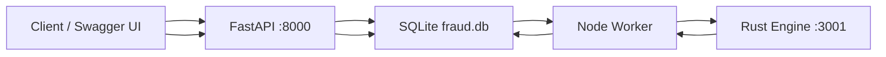

# A3 — Fraud Scoring System

> **Three languages. One pipeline. Async fraud scoring from API to engine.**

Polyglot distributed fraud scoring demo — **FastAPI** ingests transactions, **Node.js** processes them asynchronously, and a **Rust** engine computes `LOW` / `MEDIUM` / `HIGH` risk scores. Shared state lives in **SQLite** with an outbox queue pattern.

```bash
cd "Advanced-parallel agent operator and system builder/A3_Fraud_Score_system"
make verify && ./scripts/run-all.sh
```

| | |
| --- | --- |
| **Project** | A3 — Fraud Scoring System (Polyglot System Builder) |
| **Agent** | [`agent.md`](agent.md) · slash command `/fraud-score-system` |
| **Cursor skill** | `.cursor/skills/fraud-score-system/SKILL.md` |
| **Architecture** | [`docs/architecture.md`](docs/architecture.md) |
| **Local testing** | [`docs/local-testing.md`](docs/local-testing.md) · verified 2026-06-21 |
| **Validation proof** | [`validation-results.md`](validation-results.md) |
| **Screenshots** | [`docs/testing screenshots/`](docs/testing%20screenshots/README.md) · 8 captures |
| **Stack** | Python 3.9+ · Node.js 22+ · Rust 1.70+ · SQLite |

### Live links (start all services first)

| Service | URL | Purpose |
| ------- | --- | ------- |
| **Swagger UI** (interactive API) | [http://127.0.0.1:8000/docs](http://127.0.0.1:8000/docs) | POST / GET transactions |
| FastAPI ReDoc | [http://127.0.0.1:8000/redoc](http://127.0.0.1:8000/redoc) | Alternative API docs |
| OpenAPI JSON | [http://127.0.0.1:8000/openapi.json](http://127.0.0.1:8000/openapi.json) | Machine-readable schema |
| FastAPI health | [http://127.0.0.1:8000/health](http://127.0.0.1:8000/health) | API liveness |
| Rust engine health | [http://127.0.0.1:3001/health](http://127.0.0.1:3001/health) | Scoring engine liveness |

> No custom web frontend — use **Swagger UI** at `/docs` to test the API interactively.

---

## At a Glance

| Metric | Value |
| ------ | ----- |
| **Components** | 3 — FastAPI · Node worker · Rust engine |
| **Languages** | Python · JavaScript · Rust |
| **Database** | SQLite (`data/fraud.db`) + outbox queue |
| **Unit tests** | Rust 4/4 · FastAPI 4/4 · Node 7/7 |
| **E2E test** | `./scripts/run-all.sh` → **PASSED** |
| **Manual Swagger tests** | 6/6 scenarios · HIGH · MEDIUM · LOW |
| **Last verified** | 2026-06-21 |

---

## What This Project Does

A client submits a financial transaction. The system:

1. **FastAPI** validates and persists it as `PENDING`, enqueues a processing job
2. **Node worker** polls the queue, calls the Rust engine
3. **Rust engine** evaluates risk rules and returns `LOW` / `MEDIUM` / `HIGH`
4. **Node worker** writes the score back to SQLite
5. **FastAPI** serves the completed result via `GET /transactions/{id}`



| Component | Technology | Port | Responsibility |
| --------- | ---------- | ---- | -------------- |
| API | FastAPI (Python) | **8000** | Ingest transactions, serve results |
| Worker | Node.js 22+ | — | Poll queue, orchestrate scoring |
| Engine | Rust / Axum | **3001** | Compute risk score + reasons |
| Storage | SQLite | file | Transactions + `processing_queue` |

---

## Requirements (for agents)

From [`agent.md`](agent.md) — what this project must deliver:

| Requirement | Implementation |
| ----------- | -------------- |
| Three separated components | `services/fastapi/` · `workers/node/` · `engines/rust/` |
| Clear JSON contracts | `contracts/*.schema.json` |
| Async processing | Outbox queue in SQLite; worker polls every 500ms |
| Risk levels | `LOW` · `MEDIUM` · `HIGH` with numeric `score_value` |
| Tests per layer | Rust unit · FastAPI pytest · Node `--test` · E2E script |
| Architecture docs | [`docs/architecture.md`](docs/architecture.md) |
| Execution proof | [`validation-results.md`](validation-results.md) · [`docs/local-testing.md`](docs/local-testing.md) |

**Agent invocation:**

```bash
/fraud-score-system
```

---

## Project Structure

```
A3_Fraud_Score_system/
├── README.md                          ← you are here
├── agent.md                           ← A3 agent spec
├── Makefile                           ← build · test · verify · lint
├── validation-results.md              ← automated test evidence
│
├── contracts/                         # JSON Schema data contracts
│   ├── transaction.schema.json
│   ├── processing-request.schema.json
│   └── risk-score.schema.json
│
├── services/fastapi/                  # Python API (port 8000)
│   ├── app/
│   │   ├── main.py                    # FastAPI app + /health
│   │   ├── routes/transactions.py     # POST / GET endpoints
│   │   ├── repository.py              # SQLite read/write
│   │   ├── database.py                # Schema init
│   │   └── schemas.py                 # Pydantic models
│   ├── tests/test_transactions.py
│   └── requirements.txt
│
├── workers/node/                      # Node.js async worker
│   ├── src/
│   │   ├── index.js                   # Entry point
│   │   ├── processor.js               # Job loop
│   │   ├── rustClient.js              # HTTP → Rust engine
│   │   └── db.js                      # SQLite (node:sqlite)
│   └── tests/*.test.js
│
├── engines/rust/                      # Rust scoring engine (port 3001)
│   ├── src/
│   │   ├── main.rs                    # Axum HTTP server
│   │   ├── scorer.rs                  # Risk rules
│   │   └── models.rs                  # Request/response types
│   └── benches/scoring.rs
│
├── tests/integration/
│   └── test_e2e.py                    # Full-stack E2E test
│
├── scripts/
│   ├── run-all.sh                     # Start all + E2E (one command)
│   └── verify.sh                      # Unit test runner (make test)
│
├── data/
│   └── fraud.db                       # Created at runtime (gitignored)
│
└── docs/
    ├── architecture.md                # Diagrams + sequence flow
    ├── local-testing.md               # Manual Swagger test evidence
    └── testing screenshots/           # 8 Swagger UI captures
```

---

## Prerequisites

| Tool | Version | Check |
| ---- | ------- | ----- |
| [Python](https://www.python.org/) | 3.9+ | `python3 --version` |
| [Node.js](https://nodejs.org/) | 22+ (uses built-in `node:sqlite`) | `node --version` |
| [Rust](https://rustup.rs/) | 1.70+ | `rustc --version` · `cargo --version` |
| curl | any | `curl --version` |
| jq | optional | For pretty JSON in terminal |

---

## Quick Start — One Command

Builds Rust, starts all three services, runs integration test, then exits:

```bash
cd "Advanced-parallel agent operator and system builder/A3_Fraud_Score_system"
chmod +x scripts/run-all.sh
./scripts/run-all.sh
```

**Expected:**

```
Integration test PASSED
==> All services ran successfully
```

---

## Run Manually — Three Terminals

Start in **this order**. All three must run for transactions to move from `PENDING` → `COMPLETED`.

### Terminal 1 — Rust Engine (start first)

```bash
cd "Advanced-parallel agent operator and system builder/A3_Fraud_Score_system/engines/rust"
cargo run --release
```

**Expected:**

```
INFO fraud_engine: Rust fraud engine listening on port 3001
```

Verify: [http://127.0.0.1:3001/health](http://127.0.0.1:3001/health)

### Terminal 2 — Node Worker

```bash
cd "Advanced-parallel agent operator and system builder/A3_Fraud_Score_system/workers/node"
npm start
```

**Expected:**

```
Node worker started — db=.../data/fraud.db, rust=http://127.0.0.1:3001
```

When a job processes:

```
Processed <transaction-id> -> HIGH (0.92)
```

### Terminal 3 — FastAPI

```bash
cd "Advanced-parallel agent operator and system builder/A3_Fraud_Score_system/services/fastapi"
python3 -m venv .venv && source .venv/bin/activate
pip install -r requirements.txt
uvicorn app.main:app --reload --port 8000
```

Open **[http://127.0.0.1:8000/docs](http://127.0.0.1:8000/docs)** (Swagger UI).

Verify: [http://127.0.0.1:8000/health](http://127.0.0.1:8000/health)

---

## Submit a Transaction

### Option A — Swagger UI (recommended)

1. Open [http://127.0.0.1:8000/docs](http://127.0.0.1:8000/docs)
2. Expand **POST /transactions** → **Try it out**
3. Paste sample JSON (see [Sample payloads](#sample-payloads) below)
4. Click **Execute** — note the `id` in the response
5. Expand **GET /transactions/{transaction_id}** → paste `id` → **Execute**
6. Poll until `status` is **`COMPLETED`** and `risk_score` is populated

### Option B — curl

```bash
# Create transaction
curl -s -X POST http://127.0.0.1:8000/transactions \
  -H 'Content-Type: application/json' \
  -d '{"user_id":"user-01","merchant_id":"MERCH-1","amount":15000,"currency":"USD"}' | jq

# Poll result (replace {id})
curl -s http://127.0.0.1:8000/transactions/{id} | jq
```

**Expected flow:**

| Stage | `status` | `risk_score` |
| ----- | -------- | ------------ |
| Immediately after POST | `PENDING` | `null` |
| After worker + Rust (~1–2s) | `COMPLETED` | `LOW` / `MEDIUM` / `HIGH` |

> If `status` stays `PENDING` forever, Node or Rust is not running.

---

## Sample Payloads

| Scenario | JSON | Expected `risk_score` |
| -------- | ---- | --------------------- |
| HIGH — large amount | `{"user_id":"user-rohit-01","merchant_id":"MERCH-1","amount":15000,"currency":"USD"}` | **HIGH** (0.92) |
| LOW — small amount | `{"user_id":"user-rohit-02","merchant_id":"MERCH-1","amount":50,"currency":"USD"}` | **LOW** (0.15) |
| MEDIUM — mid amount | `{"user_id":"user-rohit-03","merchant_id":"MERCH-1","amount":2500,"currency":"USD"}` | **MEDIUM** (0.45) |
| MEDIUM — suspicious merchant | `{"user_id":"user-rohit-04","merchant_id":"SUS-999","amount":50,"currency":"USD"}` | **MEDIUM** (0.35) |

### Risk rules (Rust engine)

| Condition | Risk |
| --------- | ---- |
| Amount &lt; 1,000 | LOW |
| Amount 1,000 – 4,999 | MEDIUM |
| Amount 5,000 – 9,999 | MEDIUM (higher score) |
| Amount ≥ 10,000 | HIGH |
| Merchant starts with `SUS` | +1 risk level |
| Currency not USD/EUR/GBP | +1 risk level |

---

## API Reference

### FastAPI (port 8000)

| Method | Path | Description |
| ------ | ---- | ----------- |
| `POST` | `/transactions` | Create transaction + enqueue processing |
| `GET` | `/transactions/{id}` | Fetch transaction and score |
| `GET` | `/health` | Health check |

**POST /transactions request:**

```json
{
  "user_id": "string",
  "merchant_id": "string",
  "amount": 15000,
  "currency": "USD"
}
```

**GET response (completed):**

```json
{
  "id": "uuid",
  "status": "COMPLETED",
  "risk_score": "HIGH",
  "score_value": 0.92,
  "reasons": ["amount_exceeds_high_threshold"]
}
```

### Rust Engine (port 3001 — internal)

| Method | Path | Description |
| ------ | ---- | ----------- |
| `POST` | `/score` | Compute risk score (called by Node worker) |
| `GET` | `/health` | Health check |

---

## Testing

### Automated — recommended gate

```bash
cd "Advanced-parallel agent operator and system builder/A3_Fraud_Score_system"

make verify          # build Rust + run all unit tests
./scripts/run-all.sh # full E2E (starts services + integration test)
```

| Command | What it runs | Expected |
| ------- | ------------ | -------- |
| `make build` | `cargo build --release` | Rust binary built |
| `make test` | `scripts/verify.sh` | All unit tests pass |
| `make verify` | build + test | Exit 0 |
| `make lint` | `cargo fmt --check` + clippy | Clean |
| `./scripts/run-all.sh` | Full stack + E2E | `Integration test PASSED` |

### Unit tests per component

```bash
# Rust (4 tests)
cd engines/rust && cargo test

# FastAPI (4 tests)
cd services/fastapi
python3 -m venv .venv && source .venv/bin/activate
pip install -r requirements.txt && pytest -q

# Node (7 tests)
cd workers/node && npm test
```

### Validation summary

| Layer | Command | Result |
| ----- | ------- | ------ |
| Rust unit | `cargo test` | **4/4** passed |
| FastAPI | `pytest -q` | **4/4** passed |
| Node | `npm test` | **7/7** passed |
| E2E | `./scripts/run-all.sh` | **PASSED** |

Full output: [`validation-results.md`](validation-results.md)

### Manual testing — Swagger + screenshots

Detailed step-by-step guide with terminal evidence and 8 Swagger screenshots:

**[`docs/local-testing.md`](docs/local-testing.md)**

| Manual test | POST payload | Verified result |
| ----------- | ------------ | --------------- |
| HIGH | amount 15,000 | `COMPLETED` · HIGH · 0.92 |
| LOW | amount 50 | `COMPLETED` · LOW · 0.15 |
| MEDIUM | amount 2,500 | `COMPLETED` · MEDIUM · 0.45 |
| Suspicious merchant | `SUS-999` | `COMPLETED` · MEDIUM · 0.35 |

Screenshots: [`docs/testing screenshots/`](docs/testing%20screenshots/README.md)

---

## Configuration

| Variable | Default | Component | Description |
| -------- | ------- | --------- | ----------- |
| `FRAUD_DB_PATH` | `data/fraud.db` | All | Shared SQLite database path |
| `RUST_ENGINE_PORT` | `3001` | Rust | HTTP listen port |
| `RUST_ENGINE_URL` | `http://127.0.0.1:3001` | Node | Worker → Rust base URL |
| `POLL_INTERVAL_MS` | `500` | Node | Queue poll interval |

Example:

```bash
export FRAUD_DB_PATH=/tmp/fraud-test.db
export RUST_ENGINE_URL=http://127.0.0.1:3001
```

---

## Troubleshooting

| Symptom | Cause | Fix |
| ------- | ----- | --- |
| `status: PENDING` forever | Node or Rust not running | Start terminals 1 + 2 |
| `risk_score: null` | Worker hasn't processed yet | Wait 1–2s, GET again |
| Node can't reach Rust | Engine not on :3001 | Run `cargo run --release` |
| Port 8000 in use | Another FastAPI dev server | Use `--port 8001` and update curl URL |
| `node:sqlite` error | Node &lt; 22 | Upgrade to Node.js 22+ |

---

## Data Contracts

JSON schemas in `contracts/` define cross-component payloads:

| Schema | Purpose |
| ------ | ------- |
| `transaction.schema.json` | Stored transaction + scoring result |
| `processing-request.schema.json` | Queue message payload |
| `risk-score.schema.json` | Rust engine response |

See [`docs/architecture.md`](docs/architecture.md) for sequence diagrams and full contract examples.

---

## Documentation Index

| Document | Description |
| -------- | ----------- |
| [`agent.md`](agent.md) | A3 agent spec, deliverables, rules |
| [`docs/architecture.md`](docs/architecture.md) | Component diagram, sequence flow, contracts |
| [`docs/local-testing.md`](docs/local-testing.md) | Manual Swagger tests + Node/Rust terminal evidence |
| [`docs/testing screenshots/README.md`](docs/testing%20screenshots/README.md) | 8 Swagger UI screenshot index |
| [`validation-results.md`](validation-results.md) | Automated test output proof |

---

## Agent Quick Reference

An agent reading this README should:

1. **Understand** — 3-component polyglot fraud pipeline with SQLite outbox queue
2. **Prerequisites** — Python 3.9+, Node 22+, Rust 1.70+
3. **Run unit tests** — `make verify`
4. **Run full stack** — `./scripts/run-all.sh` OR three terminals (Rust → Node → FastAPI)
5. **Test manually** — Swagger at [http://127.0.0.1:8000/docs](http://127.0.0.1:8000/docs)
6. **Verify success** — POST returns `PENDING`, GET returns `COMPLETED` with `risk_score`
7. **Read evidence** — `validation-results.md` + `docs/local-testing.md`

```bash
# Minimum agent verification sequence
cd "Advanced-parallel agent operator and system builder/A3_Fraud_Score_system"
make verify
./scripts/run-all.sh
curl -s http://127.0.0.1:8000/health   # after manual start
```

---

<p align="center"><sub>A3 — Fraud Scoring System · FastAPI → Node → Rust · Polyglot async fraud scoring</sub></p>
