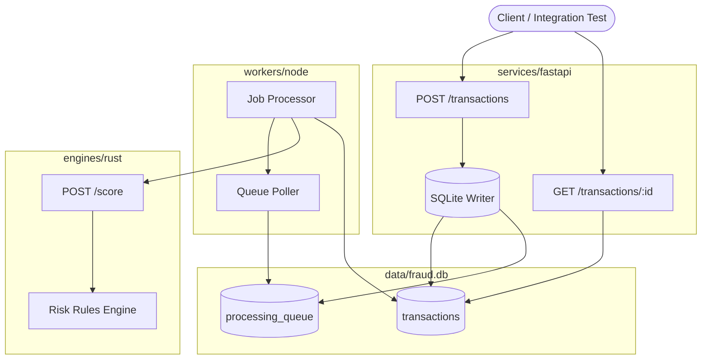
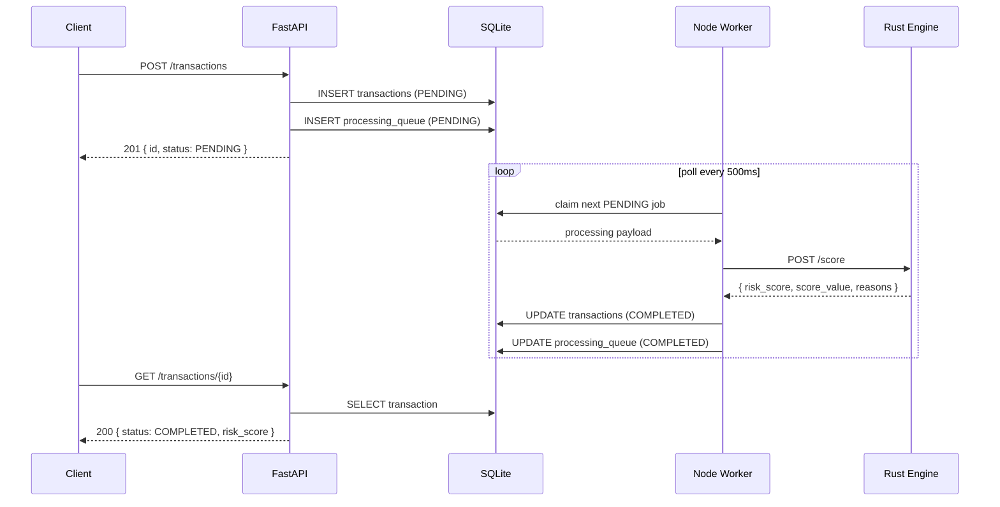

# Fraud Scoring System — Architecture

## Overview

Polyglot fraud scoring pipeline with three independently deployable components:

| Component | Technology | Responsibility |
| --------- | ---------- | -------------- |
| API | FastAPI | Ingest transactions, persist, enqueue processing |
| Worker | Node.js | Consume queue, orchestrate scoring, persist results |
| Engine | Rust | Compute `LOW` / `MEDIUM` / `HIGH` risk score |

Shared state: **SQLite** database (`data/fraud.db`) with an **outbox queue** (`processing_queue`).

---

## Component Diagram



---

## Data Contract

JSON schemas live in `contracts/`:

| Schema | Purpose |
| ------ | ------- |
| `transaction.schema.json` | Stored transaction + scoring result |
| `processing-request.schema.json` | Message published to `processing_queue` |
| `risk-score.schema.json` | Rust engine response |

### Transaction (create request)

```json
{
  "user_id": "user-42",
  "merchant_id": "MERCH-100",
  "amount": 250.0,
  "currency": "USD"
}
```

### Processing request (queue payload)

```json
{
  "transaction_id": "550e8400-e29b-41d4-a716-446655440000",
  "user_id": "user-42",
  "merchant_id": "MERCH-100",
  "amount": 250.0,
  "currency": "USD"
}
```

### Risk score (Rust response)

```json
{
  "transaction_id": "550e8400-e29b-41d4-a716-446655440000",
  "risk_score": "LOW",
  "score_value": 0.15,
  "reasons": ["amount_within_normal_range"]
}
```

### Risk levels

| Level | Typical triggers |
| ----- | ---------------- |
| `LOW` | amount &lt; 1,000 USD-equivalent |
| `MEDIUM` | amount 1,000–9,999 or suspicious merchant prefix `SUS` |
| `HIGH` | amount ≥ 10,000 or compounded risk signals |

---

## Sequence Diagram



---

## Integration Flow

```
FastAPI → Node → Rust
```

1. **FastAPI** accepts `POST /transactions`, writes row + queue entry.
2. **Node worker** polls `processing_queue`, marks job `PROCESSING`.
3. **Node** calls **Rust** `POST /score` with processing payload.
4. **Rust** applies deterministic rules, returns `LOW` | `MEDIUM` | `HIGH`.
5. **Node** writes `risk_score`, `score_value`, `reasons` back to `transactions`.
6. **Client** reads final state via `GET /transactions/{id}`.

### Environment variables

| Variable | Default | Used by |
| -------- | ------- | ------- |
| `FRAUD_DB_PATH` | `data/fraud.db` | FastAPI, Node |
| `RUST_ENGINE_PORT` | `3001` | Rust |
| `RUST_ENGINE_URL` | `http://127.0.0.1:3001` | Node |
| `POLL_INTERVAL_MS` | `500` | Node |

---

## Testing Strategy

| Layer | Location | Command |
| ----- | -------- | ------- |
| Rust unit | `engines/rust/src/scorer.rs` | `cargo test` |
| FastAPI | `services/fastapi/tests/` | `pytest` |
| Node unit | `workers/node/tests/` | `npm test` |
| End-to-end | `tests/integration/` | `python test_e2e.py` |

---

## Directory Layout

```
A3_Fraud_Score_system/
├── contracts/           # JSON schemas (source of truth)
├── docs/
│   └── architecture.md
├── engines/rust/        # Risk scoring HTTP service
├── services/fastapi/    # Transaction ingestion API
├── workers/node/        # Async queue consumer
├── tests/integration/   # Cross-component e2e
├── scripts/             # Run helpers
└── README.md
```
