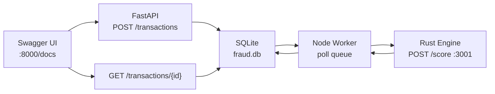
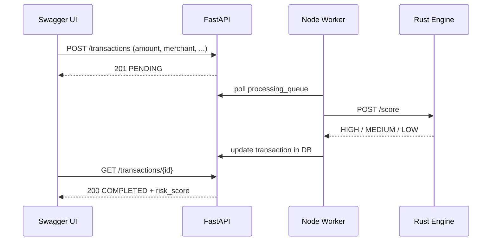

# A3 Fraud Scoring System — Local Testing

| | |
| --- | --- |
| **Project** | A3 — Fraud Scoring System |
| **Agent** | [`agent.md`](../agent.md) |
| **Architecture** | [`architecture.md`](architecture.md) |
| **Last verified** | 2026-06-21 · rohitverma · PMLMBT4677 |
| **Environment** | Local · macOS · three-terminal manual run |
| **UI used** | Swagger UI at [http://127.0.0.1:8000/docs](http://127.0.0.1:8000/docs) |
| **Screenshots** | [`testing screenshots/`](testing%20screenshots/README.md) · 8 captures |

### Live links (all services running)

| Service | URL | Purpose |
| ------- | --- | ------- |
| **Swagger UI** | [http://127.0.0.1:8000/docs](http://127.0.0.1:8000/docs) | POST / GET transactions |
| FastAPI health | [http://127.0.0.1:8000/health](http://127.0.0.1:8000/health) | API health check |
| Rust engine health | [http://127.0.0.1:3001/health](http://127.0.0.1:3001/health) | Scoring engine health |

---

## Executive Summary

| Metric | Result |
| ------ | ------ |
| **Overall status** | ✅ **PASS** — full pipeline verified |
| **Services running** | 3 / 3 (Rust · Node · FastAPI) |
| **Manual Swagger tests** | **6 / 6** scored successfully |
| **Risk levels observed** | HIGH · MEDIUM · LOW |
| **Stuck PENDING cases** | Resolved after Node + Rust started |

```
┌─────────────────────────────────────────────┐
│  LOCAL TEST SUMMARY                         │
├─────────────────────────────────────────────┤
│  Rust engine     ✅  6 transactions scored  │
│  Node worker     ✅  6 jobs processed       │
│  FastAPI Swagger ✅  6 COMPLETED responses  │
│  Pipeline        ✅  FastAPI → Node → Rust  │
└─────────────────────────────────────────────┘
```

---

## Pipeline Under Test



| Step | Component | What happens |
| ---- | --------- | ------------ |
| 1 | FastAPI | Saves transaction as `PENDING`, enqueues job |
| 2 | Node Worker | Claims job from `processing_queue` |
| 3 | Rust Engine | Computes `LOW` / `MEDIUM` / `HIGH` |
| 4 | Node Worker | Writes score back to DB |
| 5 | FastAPI | GET returns `COMPLETED` with score |

---

## 1. Start All Services

Run in **three separate terminals**, in this order:

### Terminal 1 — Rust Engine (port 3001)

```bash
cd "Advanced-parallel agent operator and system builder/A3_Fraud_Score_system/engines/rust"
cargo run --release
```

**Expected:**

```
INFO fraud_engine: Rust fraud engine listening on port 3001
```

### Terminal 2 — Node Worker

```bash
cd "Advanced-parallel agent operator and system builder/A3_Fraud_Score_system/workers/node"
npm start
```

**Expected:**

```
Node worker started — db=.../data/fraud.db, rust=http://127.0.0.1:3001
```

### Terminal 3 — FastAPI (port 8000)

```bash
cd "Advanced-parallel agent operator and system builder/A3_Fraud_Score_system/services/fastapi"
python3 -m venv .venv && source .venv/bin/activate
pip install -r requirements.txt
uvicorn app.main:app --reload --port 8000
```

Open **http://127.0.0.1:8000/docs** in your browser.

---

## 2. Test Matrix — All Verified Cases

| # | User | Merchant | Amount | Currency | Expected risk | Actual risk | Status |
| - | ---- | -------- | ------ | -------- | ------------- | ----------- | ------ |
| 1 | user-rohit-01 | MERCH-1 | 15,000 | USD | HIGH | **HIGH** (0.92) | ✅ Pass |
| 2 | user-rohit-01 | MERCH-1 | 15,000 | USD | HIGH | **HIGH** (0.92) | ✅ Pass |
| 3 | user-rohit-02 | MERCH-1 | 50 | USD | LOW | **LOW** (0.15) | ✅ Pass |
| 4 | user-rohit-02 | MERCH-1 | 50 | USD | LOW | **LOW** (0.15) | ✅ Pass |
| 5 | user-rohit-03 | MERCH-1 | 2,500 | USD | MEDIUM | **MEDIUM** (0.45) | ✅ Pass |
| 6 | user-rohit-04 | SUS-999 | 50 | USD | MEDIUM | **MEDIUM** (0.35) | ✅ Pass |

---

## 2b. Screenshots Gallery

All Swagger UI captures from this session: [`testing screenshots/`](testing%20screenshots/README.md)

| Scenario | POST (request) | GET (response) |
| -------- | -------------- | -------------- |
| HIGH — amount 15,000 | [01](testing%20screenshots/01-post-high-15000-request.png) | [02](testing%20screenshots/02-get-high-completed-169ba0a1.png) |
| LOW — amount 50 | [03](testing%20screenshots/03-post-low-50-request.png) · [04](testing%20screenshots/04-post-low-50-request-alt.png) | JSON in [Test 3](#test-3--low-risk-small-amount) below |
| MEDIUM — amount 2,500 | [05](testing%20screenshots/05-post-medium-2500-request.png) | [06](testing%20screenshots/06-get-medium-completed-d70ca198.png) |
| MEDIUM — merchant SUS-999 | [07](testing%20screenshots/07-post-suspicious-merchant-sus999.png) | [08](testing%20screenshots/08-get-suspicious-merchant-completed.png) |

---

## 3. Swagger Test Cases — Request & Response

For each test: **POST /transactions** in Swagger → copy `id` → **GET /transactions/{id}**.

---

### Test 1 — HIGH risk (amount ≥ 10,000)


**Request body (POST /transactions):**

```json
{
  "user_id": "user-rohit-01",
  "merchant_id": "MERCH-1",
  "amount": 15000,
  "currency": "USD"
}
```

**Response (GET /transactions/{id}):**

| Field | Value |
| ----- | ----- |
| Transaction ID | `169ba0a1-d2a2-4c70-bc2f-00303307364a` |
| HTTP status | `200` |
| `status` | `COMPLETED` |
| `risk_score` | `HIGH` |
| `score_value` | `0.92` |
| `reasons` | `["amount_exceeds_high_threshold"]` |

```json
{
  "id": "169ba0a1-d2a2-4c70-bc2f-00303307364a",
  "user_id": "user-rohit-01",
  "merchant_id": "MERCH-1",
  "amount": 15000,
  "currency": "USD",
  "status": "COMPLETED",
  "risk_score": "HIGH",
  "score_value": 0.92,
  "reasons": ["amount_exceeds_high_threshold"],
  "created_at": "2026-06-21T21:16:00.032685+00:00",
  "updated_at": "2026-06-21T21:22:32.346Z"
}
```

> **Note:** An earlier POST with the same payload stayed `PENDING` until Node + Rust were started. After services were up, this transaction was scored successfully.

---

### Test 2 — HIGH risk (duplicate scenario)

**Request body:**

```json
{
  "user_id": "user-rohit-01",
  "merchant_id": "MERCH-1",
  "amount": 15000,
  "currency": "USD"
}
```

**Response:**

| Field | Value |
| ----- | ----- |
| Transaction ID | `5ddd9d22-4956-4589-b9c5-2f1d396ab471` |
| `risk_score` | `HIGH` |
| `score_value` | `0.92` |

---

### Test 3 — LOW risk (small amount)


**Request body (POST /transactions):**

```json
{
  "user_id": "user-rohit-02",
  "merchant_id": "MERCH-1",
  "amount": 50,
  "currency": "USD"
}
```

**Response (GET /transactions/{id}):**

| Field | Value |
| ----- | ----- |
| Transaction ID | `4097efd6-a42b-4383-99f3-133f1043b008` |
| HTTP status | `200` |
| `status` | `COMPLETED` |
| `risk_score` | `LOW` |
| `score_value` | `0.15` |
| `reasons` | `["amount_within_normal_range"]` |

```json
{
  "id": "4097efd6-a42b-4383-99f3-133f1043b008",
  "user_id": "user-rohit-02",
  "merchant_id": "MERCH-1",
  "amount": 50,
  "currency": "USD",
  "status": "COMPLETED",
  "risk_score": "LOW",
  "score_value": 0.15,
  "reasons": ["amount_within_normal_range"],
  "created_at": "2026-06-21T21:23:22.030314+00:00",
  "updated_at": "2026-06-21T21:23:22.455Z"
}
```

---

### Test 4 — LOW risk (second run)

**Request body:** same as Test 3

| Field | Value |
| ----- | ----- |
| Transaction ID | `35ebadda-6fe7-402e-9eb4-2f451c1519be` |
| `risk_score` | `LOW` |
| `score_value` | `0.15` |

---

### Test 5 — MEDIUM risk (amount 1,000–4,999)


**Request body (POST /transactions):**

```json
{
  "user_id": "user-rohit-03",
  "merchant_id": "MERCH-1",
  "amount": 2500,
  "currency": "USD"
}
```

**Response (GET /transactions/{id}):**

| Field | Value |
| ----- | ----- |
| Transaction ID | `d70ca198-a7f0-4f29-86d1-9735841ca667` |
| HTTP status | `200` |
| `status` | `COMPLETED` |
| `risk_score` | `MEDIUM` |
| `score_value` | `0.45` |
| `reasons` | `["amount_exceeds_low_threshold"]` |

```json
{
  "id": "d70ca198-a7f0-4f29-86d1-9735841ca667",
  "user_id": "user-rohit-03",
  "merchant_id": "MERCH-1",
  "amount": 2500,
  "currency": "USD",
  "status": "COMPLETED",
  "risk_score": "MEDIUM",
  "score_value": 0.45,
  "reasons": ["amount_exceeds_low_threshold"],
  "created_at": "2026-06-21T21:30:50.105761+00:00",
  "updated_at": "2026-06-21T21:30:50.292Z"
}
```

---

### Test 6 — MEDIUM risk (suspicious merchant prefix)


**Request body (POST /transactions):**

```json
{
  "user_id": "user-rohit-04",
  "merchant_id": "SUS-999",
  "amount": 50,
  "currency": "USD"
}
```

**Response (GET /transactions/{id}):**

| Field | Value |
| ----- | ----- |
| Transaction ID | `3dae0bd9-54cb-4988-831a-da81e607dccd` |
| HTTP status | `200` |
| `status` | `COMPLETED` |
| `risk_score` | `MEDIUM` |
| `score_value` | `0.35` |
| `reasons` | `["amount_within_normal_range", "suspicious_merchant_prefix"]` |

```json
{
  "id": "3dae0bd9-54cb-4988-831a-da81e607dccd",
  "user_id": "user-rohit-04",
  "merchant_id": "SUS-999",
  "amount": 50,
  "currency": "USD",
  "status": "COMPLETED",
  "risk_score": "MEDIUM",
  "score_value": 0.35,
  "reasons": ["amount_within_normal_range", "suspicious_merchant_prefix"],
  "created_at": "2026-06-21T21:32:05.294456+00:00",
  "updated_at": "2026-06-21T21:32:05.430Z"
}
```

> Small amount (50) would normally be LOW, but merchant `SUS-999` triggers `suspicious_merchant_prefix` and bumps risk to MEDIUM.

---

## 4. Rust Engine — Terminal Evidence

**Command:** `cargo run --release` in `engines/rust`

**Captured output:**

```
Finished `release` profile [optimized] target(s) in 0.28s
Running `target/release/fraud-engine`
2026-06-21T21:22:19.890717Z  INFO fraud_engine: Rust fraud engine listening on port 3001
2026-06-21T21:22:31.918370Z  INFO fraud_engine: scoring transaction transaction_id=5ddd9d22-4956-4589-b9c5-2f1d396ab471 amount=15000.0
2026-06-21T21:22:32.344999Z  INFO fraud_engine: scoring transaction transaction_id=169ba0a1-d2a2-4c70-bc2f-00303307364a amount=15000.0
2026-06-21T21:23:22.453612Z  INFO fraud_engine: scoring transaction transaction_id=4097efd6-a42b-4383-99f3-133f1043b008 amount=50.0
2026-06-21T21:25:23.175147Z  INFO fraud_engine: scoring transaction transaction_id=35ebadda-6fe7-402e-9eb4-2f451c1519be amount=50.0
2026-06-21T21:30:50.291485Z  INFO fraud_engine: scoring transaction transaction_id=d70ca198-a7f0-4f29-86d1-9735841ca667 amount=2500.0
2026-06-21T21:32:05.430069Z  INFO fraud_engine: scoring transaction transaction_id=3dae0bd9-54cb-4988-831a-da81e607dccd amount=50.0
```

| Check | Result |
| ----- | ------ |
| Engine started on port 3001 | ✅ Pass |
| All 6 transactions scored | ✅ Pass |
| Amounts match Swagger POST data | ✅ Pass |

---

## 5. Node Worker — Terminal Evidence

**Command:** `npm start` in `workers/node`

**Captured output:**

```
Node worker started — db=.../A3_Fraud_Score_system/data/fraud.db, rust=http://127.0.0.1:3001
Processed 5ddd9d22-4956-4589-b9c5-2f1d396ab471 -> HIGH (0.92)
Processed 169ba0a1-d2a2-4c70-bc2f-00303307364a -> HIGH (0.92)
Processed 4097efd6-a42b-4383-99f3-133f1043b008 -> LOW (0.15)
Processed 35ebadda-6fe7-402e-9eb4-2f451c1519be -> LOW (0.15)
Processed d70ca198-a7f0-4f29-86d1-9735841ca667 -> MEDIUM (0.45)
Processed 3dae0bd9-54cb-4988-831a-da81e607dccd -> MEDIUM (0.35)
```

| Transaction ID | Worker result | Matches Swagger GET |
| -------------- | ------------- | ------------------- |
| `5ddd9d22-...` | HIGH (0.92) | ✅ |
| `169ba0a1-...` | HIGH (0.92) | ✅ |
| `4097efd6-...` | LOW (0.15) | ✅ |
| `35ebadda-...` | LOW (0.15) | ✅ |
| `d70ca198-...` | MEDIUM (0.45) | ✅ |
| `3dae0bd9-...` | MEDIUM (0.35) | ✅ |

---

## 6. Cross-Layer Verification

End-to-end proof that all three languages processed the same transactions:

| Layer | Technology | Port | Evidence |
| ----- | ---------- | ---- | -------- |
| API | Python / FastAPI | 8000 | Swagger GET → `COMPLETED` + score |
| Worker | Node.js | — | `Processed {id} -> {risk}` logs |
| Engine | Rust / Axum | 3001 | `scoring transaction transaction_id=...` logs |
| Storage | SQLite | `data/fraud.db` | Shared by FastAPI + Node |



---

## 7. Risk Scoring Rules (Reference)

| Condition | Risk level |
| --------- | ---------- |
| Amount &lt; 1,000 | LOW |
| Amount 1,000 – 4,999 | MEDIUM |
| Amount 5,000 – 9,999 | MEDIUM (higher score) |
| Amount ≥ 10,000 | HIGH |
| Merchant starts with `SUS` | +1 risk level |
| Currency not USD/EUR/GBP | +1 risk level |

---

## 8. Troubleshooting

| Symptom | Cause | Fix |
| ------- | ----- | --- |
| `status: "PENDING"` forever | Node or Rust not running | Start terminals 1 + 2 |
| `risk_score: null` | Worker hasn't processed yet | Wait 1–2s, GET again |
| Node can't connect to Rust | Rust not on :3001 | Run `cargo run --release` |
| Wrong DB path | Services started from different cwd | Use paths from this doc |

---

## 9. Sign-off Checklist

| Requirement | Status |
| ----------- | ------ |
| Rust engine listening on :3001 | ✅ Verified |
| Node worker connected to Rust + SQLite | ✅ Verified |
| FastAPI Swagger UI accessible | ✅ Verified |
| POST /transactions creates PENDING record | ✅ Verified |
| Worker processes queue asynchronously | ✅ Verified |
| GET returns COMPLETED with score | ✅ Verified |
| HIGH / MEDIUM / LOW rules behave correctly | ✅ Verified |
| Swagger ↔ Node ↔ Rust IDs match | ✅ Verified |

---

## Quick Reference

| Goal | Command / URL |
| ---- | ------------- |
| Swagger UI | [http://127.0.0.1:8000/docs](http://127.0.0.1:8000/docs) |
| Start Rust | `cd engines/rust && cargo run --release` |
| Start Node | `cd workers/node && npm start` |
| Start FastAPI | `cd services/fastapi && uvicorn app.main:app --reload --port 8000` |
| Unit tests only | `make test` |
| Full automated E2E | `./scripts/run-all.sh` |

---

<p align="center"><sub>A3 Fraud Scoring System · Local Testing · 2026-06-21 · FastAPI → Node → Rust verified</sub></p>
