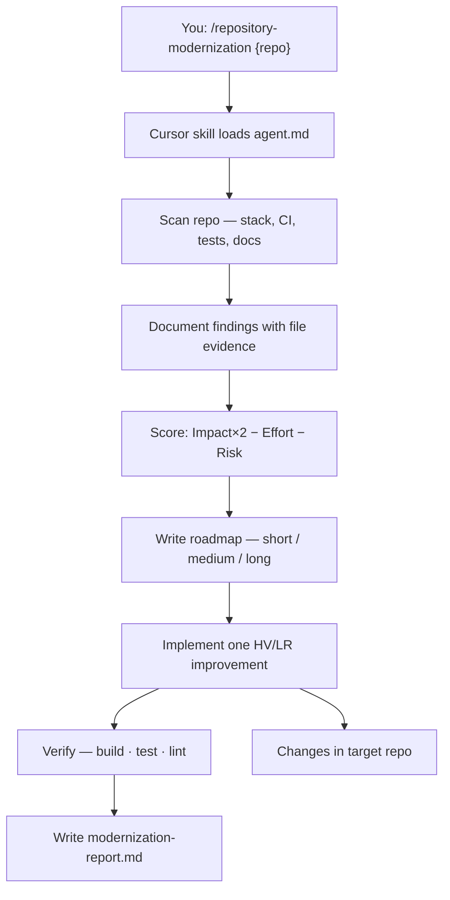

# A4 — Repository Modernization Plan

> **Analyze with evidence. Prioritize pragmatically. Ship one improvement.**

Analyze any repository, produce a **scored modernization roadmap**, and **implement** the highest-value, lowest-risk first improvement — with build, test, and rollback proof.

```bash
/repository-modernization ~/Downloads/bo-migration-service
```

| | |
| --- | --- |
| **Project** | A4 — Repository Modernization Plan |
| **Agent** | [`agent.md`](agent.md) · slash command `/repository-modernization` |
| **Cursor skill** | `.cursor/skills/repository-modernization/SKILL.md` |
| **Location** | `Advanced-parallel agent operator and system builder/A4_Repository_Modernization_Plan` |
| **Latest report** | [`docs/modernization-report.md`](docs/modernization-report.md) · 2026-06-17 |
| **Latest target** | `~/Downloads/bo-migration-service` — Spring Boot migration service |
| **Mode** | Analyze + implement one HV/LR change — no commit unless you ask |

---

## Latest Verification — Executive Summary

From [`docs/modernization-report.md`](docs/modernization-report.md):

| Metric | Result |
| ------ | ------ |
| **Overall status** | ✅ **PASS** — first improvement implemented |
| **Target repo** | `bo-migration-service` (Java 17 · Spring Boot 3.2 · Maven) |
| **First improvement** | Maven wrapper + `make verify` + script alignment |
| **Priority score** | **7** (Impact 5 · Effort 2 · Risk 1) |
| **`make verify`** | ✅ **27/27** tests · BUILD SUCCESS |
| **`make integration-test`** | ✅ BUILD SUCCESS |

```
┌─────────────────────────────────────────────┐
│  MODERNIZATION SUMMARY                      │
├─────────────────────────────────────────────┤
│  Findings documented     ✅  12 items       │
│  Roadmap written         ✅  short/med/long │
│  First improvement       ✅  Maven wrapper  │
│  Verification captured   ✅  exit 0         │
│  Rollback plan           ✅  documented     │
└─────────────────────────────────────────────┘
```

---

## At a Glance

| Metric | Value |
| ------ | ----- |
| **Output** | `docs/modernization-report.md` (7 required sections) |
| **Analysis areas** | 9 — build, deps, logging, monitoring, security, testing, CI/CD, org, debt |
| **Scoring** | Priority = `Impact × 2 − Effort − Risk` |
| **Implementation scope** | Exactly **one** HV/LR improvement per run |
| **Code changes** | Target repository only (not this A4 folder) |

---

## What This Agent Does

Unlike planning-only agents (A1), A4 **analyzes and ships**:

```
Target repo
    │
    └── /repository-modernization {repo-path}
              │
              ├── scan 9 analysis areas (evidence from disk)
              ├── score findings (Impact · Effort · Risk)
              ├── write short / medium / long roadmap
              ├── implement #1 highest-priority item
              ├── verify (build · test · lint)
              └── write modernization-report.md
```



| Step | Agent action | Output |
| ---- | ------------ | ------ |
| 1 | Identify repo root and stack | Language, build tool, test framework |
| 2 | Review 9 analysis areas | Findings table with file paths |
| 3 | Score each finding | Priority ranking |
| 4 | Write roadmap | Short · medium · long term |
| 5 | Implement first improvement | Scoped code/config in target repo |
| 6 | Verify | Captured build/test/lint output |
| 7 | Write report | [`docs/modernization-report.md`](docs/modernization-report.md) |

> The agent **does not** commit unless you explicitly ask. Application logic changes are avoided unless the finding requires it.

---

## Analysis Areas

Every run reviews these nine areas with **evidence from files on disk**:

| # | Area | What the agent looks for |
| - | ---- | ------------------------ |
| 1 | **Build system** | Maven/Gradle wrapper, Makefile, reproducible builds |
| 2 | **Dependency management** | Version pins, outdated parents, lockfiles |
| 3 | **Logging** | Structured logs, levels, correlation IDs |
| 4 | **Monitoring** | Actuator, Prometheus, health endpoints |
| 5 | **Security** | API keys, secrets, dependency scanning |
| 6 | **Testing** | Unit/integration coverage, test commands |
| 7 | **CI/CD** | Jenkins, GitHub Actions, test gates before deploy |
| 8 | **Code organization** | Package structure, dead code, layering |
| 9 | **Technical debt** | Doc drift, missing tooling referenced in README |

---

## Prioritization Formula

**Priority score** = `Impact × 2 − Effort − Risk`

| Dimension | Range | Meaning |
| --------- | ----- | ------- |
| **Impact** | 1–5 | How much value if fixed |
| **Effort** | 1–5 | How hard to implement |
| **Risk** | 1–5 | Chance of breakage |

Higher score = better first candidate. Tie-break: lower **Risk**, then lower **Effort**.

### Latest scoring (bo-migration-service)

| # | Finding | Impact | Effort | Risk | Priority | Status |
| - | ------- | ------ | ------ | ---- | -------- | ------ |
| 1 | Restore Maven wrapper + `make verify` | 5 | 2 | 1 | **7** | ✅ Implemented |
| 2 | Jenkins `unit-test` stage before docker-build | 5 | 2 | 2 | 6 | Roadmap |
| 3 | Reconcile docs vs `pom.xml` quality gates | 4 | 3 | 2 | 3 | Roadmap |
| 4 | GitHub Actions `make verify` on PR | 4 | 2 | 1 | 5 | Roadmap |
| 5 | Bump Spring Boot 3.2.0 → 3.2.12 | 3 | 2 | 2 | 2 | Roadmap |
| 6 | Dockerfile use `./mvnw` | 3 | 2 | 2 | 2 | Roadmap |
| 7 | Restore static analysis plugins | 4 | 4 | 3 | 1 | Roadmap |

---

## Start with the Agent

### Step 1 — Open Cursor Agent chat

| Scenario | Command |
| -------- | ------- |
| **Spring Boot service** | `/repository-modernization ~/Downloads/bo-migration-service` |
| **In-repo agent target** | `/repository-modernization ../A3_Fraud_Score_system` |
| **No path given** | `/repository-modernization` — agent asks or uses context |

### Step 2 — Review the report

Open [`docs/modernization-report.md`](docs/modernization-report.md). Confirm findings, roadmap, and verification before committing changes in the target repo.

### Step 3 — Verify in the target repo

Run the verification commands documented in the report (example for latest run):

```bash
cd ~/Downloads/bo-migration-service
make verify
./mvnw -version
```

---

## Report Deliverable — 7 Sections

Every run overwrites [`docs/modernization-report.md`](docs/modernization-report.md) with:

| # | Section | What you get |
| - | ------- | ------------ |
| 1 | **Repository** | Path, stack summary, branch |
| 2 | **Findings** | Table — Finding · Evidence · File |
| 3 | **Prioritization** | Scored ranking with formula |
| 4 | **Roadmap** | Short (0–2 wk) · medium (1–2 mo) · long (3+ mo) |
| 5 | **First improvement** | What was implemented and why (HV/LR) |
| 6 | **Verification** | Commands + captured output + exit codes |
| 7 | **Rollback plan** | Exact steps to undo the change |

---

## Latest Example — bo-migration-service

### Target repository

| Attribute | Value |
| --------- | ----- |
| **Type** | Spring Boot microservice (user migration CLASS ↔ TechExcel) |
| **Stack** | Java 17 · Spring Boot 3.2.0 · Maven · MySQL · Redis · Flyway |
| **Tests** | 27 JUnit tests |
| **CI** | Jenkins (`docker-build` only) |

### Key findings (sample)

| Finding | Evidence |
| ------- | -------- |
| Maven wrapper missing despite docs | README references `./mvnw` — file absent |
| Jenkins does not run tests | Single `docker-build` stage only |
| Documentation drift | Docs mention spotless/JaCoCo — not in `pom.xml` |
| **Good:** Actuator + Prometheus | `application.yml` metrics configured |
| **Good:** 27 tests green | Controller/service/scheduler coverage |

### First improvement implemented

| Change | Why |
| ------ | --- |
| Added `./mvnw` + `.mvn/wrapper/` (Maven 3.9.6) | Docs already assumed wrapper; fixes reproducibility |
| Enhanced `Makefile` — `help`, `verify`, `compile` | Single local quality gate |
| `infra/unit-test.sh` → `./mvnw` | Align scripts with wrapper |

**Usage in target repo:**

```bash
cd ~/Downloads/bo-migration-service
make verify              # compile + unit tests (recommended gate)
make integration-test    # full mvn verify
./mvnw -version          # pinned Maven 3.9.6
```

### Verification results

| Command | Result |
| ------- | ------ |
| `./mvnw -version` | Maven **3.9.6** · exit **0** |
| `make verify` | **27/27** tests · BUILD SUCCESS · exit **0** |
| `make integration-test` | BUILD SUCCESS · exit **0** |

### Rollback

```bash
cd ~/Downloads/bo-migration-service
git checkout -- Makefile infra/unit-test.sh infra/integration-test.sh
rm -f mvnw mvnw.cmd && rm -rf .mvn/wrapper
```

---

## Roadmap (from latest report)

### Short term (0–2 weeks)

- [x] Maven wrapper + `make verify` + script alignment
- [ ] Jenkins stage: `make verify` before `docker-build`
- [ ] Fix README Spring Boot version vs `pom.xml`
- [ ] Dockerfile: use `./mvnw` in build stage

### Medium term (1–2 months)

- Align `pom.xml` with documented quality gates **or** trim docs
- Add `.github/workflows/ci.yml` running `make verify`
- Enable Testcontainers in CI with Docker requirement

### Long term (3+ months)

- Split Jenkins: test gate on PR, docker push on release branches
- OWASP dependency-check stage
- Remote trace exporter
- Deprecate duplicate `/health` controller in favor of actuator

---

## Project Layout

```
A4_Repository_Modernization_Plan/
├── README.md                      ← you are here
├── agent.md                       ← agent spec, scoring, workflow
└── docs/
    └── modernization-report.md    ← latest analysis (overwritten each run)
```

Modernization **code changes** live in the **target repository**, not in this folder.

---

## Rules

| Rule | Why |
| ---- | --- |
| **Evidence required** | Every finding cites a file path on disk |
| **No speculation** | Avoid recommendations without proof |
| **One improvement per run** | Scoped, verifiable, rollback-friendly |
| **Verify before claiming done** | Build + test + lint with captured output |
| **Document rollback** | Every change must be reversible |
| **No commit unless asked** | User controls git history |

| ✅ Do | ❌ Don't |
| ----- | ------- |
| Cite file paths as evidence | Guess about CI or deps without reading files |
| Score all findings | Implement multiple unrelated changes |
| Run tests after change | Skip verification |
| Keep app logic unchanged when possible | Large refactors in first improvement |

---

## Related Agents

| Agent | When to use |
| ----- | ----------- |
| **A4** (this) | Analyze repo + ship first modernization step |
| **D5** `/reproducible-dev-environment` | One-command bootstrap after modernization |
| **D3** `/ci-pipeline` | Add GitHub Actions CI (roadmap item #4) |
| **D6** `/observability` | Bolt on metrics if monitoring gaps found |
| **A1** `/multi-worktree-plan` | Split large modernization across parallel lanes |

Typical flow:

```
A4 modernize  →  D5 bootstrap  →  D3 CI  →  A1 split large refactors
```

---

## Agent Quick Reference

An agent reading this README should:

1. **Understand** — analyze target repo, score findings, implement one HV/LR fix
2. **Invoke** — `/repository-modernization {repo-path}`
3. **Analyze** — 9 areas with file evidence
4. **Score** — `Impact × 2 − Effort − Risk`
5. **Implement** — single scoped change in target repo
6. **Verify** — `make verify` / `./mvnw test` / project-specific gates
7. **Document** — write `docs/modernization-report.md` with rollback plan

```bash
/repository-modernization ~/Downloads/bo-migration-service
# Then in target repo:
cd ~/Downloads/bo-migration-service && make verify
```

---

## Documentation

| Document | Description |
| -------- | ----------- |
| [`agent.md`](agent.md) | Full A4 spec — workflow, scoring, report template |
| [`docs/modernization-report.md`](docs/modernization-report.md) | Latest analysis, roadmap, verification evidence |
| `.cursor/skills/repository-modernization/SKILL.md` | Slash command entry point |

---

<p align="center"><sub>A4 — Repository Modernization Plan · Analyze with evidence · Prioritize pragmatically · Ship one improvement</sub></p>
