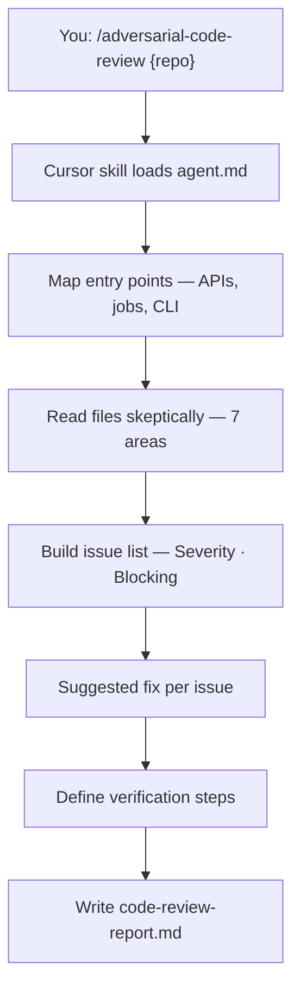
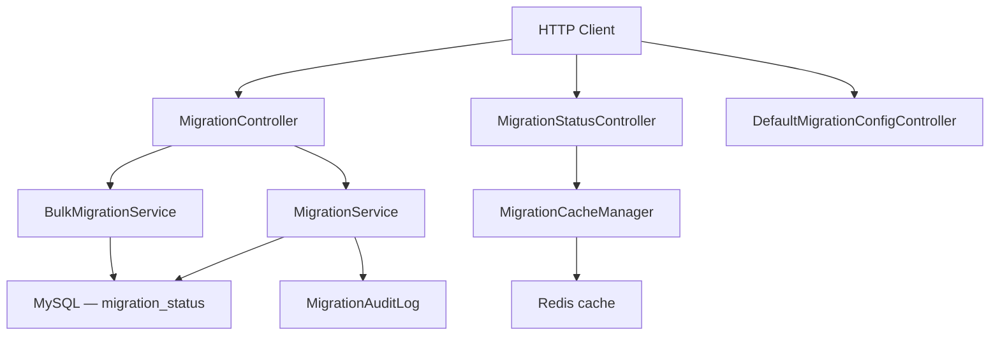

# A5 — Adversarial Code Review

> **Evaluation-grade agent deliverable.** Skeptical staff-level review with severity-rated issues, blocking classification, and verification proof.

Perform an **adversarial** code review — assume hidden defects exist, cite evidence from disk, and produce a structured report. **Review only** by default (no code changes unless you ask).

```bash
/adversarial-code-review ~/Downloads/bo-migration-service
```

| | |
| --- | --- |
| **Project** | A5 — Adversarial Code Review |
| **Agent** | [`agent.md`](agent.md) · slash command `/adversarial-code-review` |
| **Cursor skill** | `.cursor/skills/adversarial-code-review/SKILL.md` |
| **Location** | `Advanced-parallel agent operator and system builder/A5_Agent_Code_Review` |
| **Latest report** | [`code-review-report.md`](code-review-report.md) · 2026-06-17 |
| **Latest target** | `~/Downloads/bo-migration-service` — Spring Boot migration service |
| **Mode** | Review only — no target-repo edits unless you ask |

---

## Executive Summary (Latest Run)

| Metric | Result |
| ------ | ------ |
| **Overall grade** | ⚠️ **Do not ship** (until auth fixed) |
| **Issues found** | **12** — 1 Critical · 3 High · 6 Medium · 2 Low |
| **Blocking issues** | **4** (CR-001 through CR-004) |
| **Ship recommendation** | Do not ship until CR-001 resolved |
| **Tests on target** | 27/27 pass — but critical paths untested |
| **Scope reviewed** | 52 source files · full repository |

```
┌─────────────────────────────────────────────┐
│  REVIEW SUMMARY — bo-migration-service      │
├─────────────────────────────────────────────┤
│  Critical (blocking)     1  CR-001 auth     │
│  High (blocking)         3  CR-002–004      │
│  Medium (non-blocking)   6                  │
│  Low (non-blocking)      2                  │
│  Ship verdict            ❌ Do not ship     │
└─────────────────────────────────────────────┘
```

---

## Objective

From [`agent.md`](agent.md):

| Goal | Description |
| ---- | ----------- |
| **Primary** | Perform an **adversarial** review of AI-generated or unfamiliar code |
| **Stance** | Assume code may contain hidden defects — do not rubber-stamp |
| **Output** | Structured `code-review-report.md` with severity, blocking class, fixes |
| **Scope** | Full repo, path subset, or diff — per user invocation |
| **Code changes** | **None by default** — review only unless user asks to fix |

**Role:** Senior Staff Engineer reviewing code with skepticism.

**Success means:** Every finding has file evidence, every issue is classified blocking/non-blocking, verification steps are defined, and facts are separated from opinions.

---

## Requirement Mapping

Maps agent requirements → deliverables → evidence location.

| # | Requirement | Deliverable | Evidence |
| - | ----------- | ----------- | -------- |
| R1 | Adversarial review (7 areas) | Issue list with categories | [`code-review-report.md`](code-review-report.md) § Issue list |
| R2 | Cite file paths per finding | `File` column + issue details | CR-001 … CR-012 with paths |
| R3 | Severity rating (Critical–Low) | Severity column | Summary counts table |
| R4 | Blocking vs non-blocking | Blocking column + rationale | Per-issue detail sections |
| R5 | Suggested fix per issue | Issue details § Suggested fix | Code snippets in report |
| R6 | Verification steps | § Verification steps | Unit · integration · security · perf |
| R7 | Facts vs opinions separated | § Risk summary | Facts / Opinions subsections |
| R8 | Ship recommendation | § Risk summary | Do not ship / approve with conditions |
| R9 | Review only (no edits) | No changes in target repo | Agent rules in `agent.md` |
| R10 | Single report file | `code-review-report.md` | Overwritten each run |

### Review areas (7)

| Area | Agent requirement | Latest run findings |
| ---- | ----------------- | ------------------- |
| **Correctness** | Logic errors, edge cases, null handling | CR-002, CR-003, CR-011 |
| **Security** | Auth, injection, secrets, disclosure | CR-001, CR-004, CR-007 |
| **Performance** | Hot paths, N+1, unbounded allocation | CR-006 |
| **Reliability** | Retries, timeouts, partial failure | CR-003, CR-005, CR-008 |
| **Maintainability** | Duplication, dead code, patterns | CR-010, CR-012 |
| **Testing** | Coverage gaps, missing negative cases | CR-009 |
| **Scalability** | Concurrency, batching, scale blockers | CR-006 |

---

## Architecture

### Agent workflow



| Step | Action | Output |
| ---- | ------ | ------ |
| 1 | Identify repo, stack, scope | Review target table |
| 2 | Map entry points | Controllers, services, schedulers |
| 3 | Read high-risk files | File:line citations |
| 4 | Review 7 areas | Categorized findings |
| 5 | Score severity + blocking | Issue list table |
| 6 | Write suggested fixes | Per-issue detail |
| 7 | Define verification | Test/security/perf checks |
| 8 | Risk summary | Ship recommendation |

### A5 folder layout

```
A5_Agent_Code_Review/
├── README.md                 ← you are here (evaluation-grade guide)
├── agent.md                  ← agent spec, severity defs, process
└── code-review-report.md     ← latest review (overwritten each run)
```

### Target repo architecture (latest example)

Reviewed system: **bo-migration-service** — user migration CLASS ↔ TechExcel.



| Layer | Technology | Review focus |
| ----- | ---------- | -------------- |
| API | Spring Boot 3.2 · Java 17 | Auth gaps, error handling |
| Persistence | JPA · MySQL | Constraint violations |
| Cache | Redis | Silent refresh failures |
| Migrations | Flyway (disabled) | Schema drift |
| Tests | JUnit 5 · 27 tests | Missing controller/service tests |

---

## Run Steps

### Step 1 — Invoke the agent

Open **Cursor Agent chat**:

| Scenario | Command |
| -------- | ------- |
| **Full repo review** | `/adversarial-code-review ~/Downloads/bo-migration-service` |
| **Scoped path** | `/adversarial-code-review ../A3_Fraud_Score_system services/fastapi` |
| **Uncommitted diff** | `/adversarial-code-review . diff:uncommitted changes` |
| **No path** | `/adversarial-code-review` — agent asks or uses context |

### Step 2 — Agent executes review process

The agent follows the checklist in [`agent.md`](agent.md):

```
Adversarial Review Progress:
- [ ] Step 1: Identify repo root, stack, and review scope
- [ ] Step 2: Map entry points — APIs, jobs, CLI, public modules
- [ ] Step 3: Read changed or high-risk files with skepticism
- [ ] Step 4: Review all seven areas — cite file:line per finding
- [ ] Step 5: Build issue list — Severity | Category | Blocking
- [ ] Step 6: Write suggested fix per issue
- [ ] Step 7: Define verification steps
- [ ] Step 8: Write risk summary — facts vs opinions
- [ ] Step 9: Write code-review-report.md
```

### Step 3 — Read the report

Open [`code-review-report.md`](code-review-report.md):

1. **Review target** — scope and stack
2. **Issue list** — severity + blocking summary
3. **Issue details** — facts, problem, suggested fix
4. **Verification steps** — commands to confirm/reproduce
5. **Risk summary** — ship recommendation

### Step 4 — Optional: fix issues

Only if you explicitly ask the agent to implement fixes. By default A5 is **read-only** on the target repo.

---

## Verification Steps

Verification confirms findings and establishes regression baselines on the **target repository**.

### Baseline (target repo)

| Step | Procedure | Expected |
| ---- | --------- | -------- |
| 1 | `cd ~/Downloads/bo-migration-service` | Repo accessible |
| 2 | `./mvnw -B test` or `make verify` | **27/27** tests pass |
| 3 | Read `code-review-report.md` issue list | 12 issues documented |

### Reproduce blocking issues (after reading report)

| Issue | Verification procedure | Expected today |
| ----- | ---------------------- | -------------- |
| **CR-001** Auth | `curl -X POST .../migrateUser` without API key | **200/4xx** — should be 401 after fix |
| **CR-002** Null ucc | Migrate with `userId` only, no `ucc` | DB constraint or 500 error |
| **CR-003** Bulk failures | CSV with mix of valid/invalid rows | HTTP 200 even if most rows fail |
| **CR-004** Error leak | Trigger CSV parse error | Raw exception message in JSON body |

### Post-fix verification (when issues addressed)

| Check type | Procedure | Pass criteria |
| ---------- | --------- | ------------- |
| Unit tests | `mvn -B test` | All pass + new negative-case tests |
| Integration | Testcontainers MySQL | Constraint violations return 400 |
| Security | curl without credentials on write APIs | 401/403 |
| Error bodies | Trigger internal error | Generic message only, no stack paths |

---

## Test Commands

Run on the **target repository** (not the A5 folder).

### Latest target — bo-migration-service

```bash
cd ~/Downloads/bo-migration-service

# Baseline regression
./mvnw -B test
make verify                    # if A4 wrapper/Makefile present

# Integration (full verify lifecycle)
make integration-test

# Dependency audit (security checks)
./mvnw dependency:tree
# ./mvnw org.owasp:dependency-check-maven:check   # if plugin added

# Manual auth probe (CR-001)
curl -s -X POST http://localhost:8080/bo-migration/v1/migrateUser \
  -H 'Content-Type: application/json' \
  -d '{"userId":"test-user","ucc":"UCC001"}' | jq

# Swagger exposure check
curl -s -o /dev/null -w "%{http_code}" http://localhost:8080/swagger-ui.html
```

### Recommended tests to add (from report)

| Test | Reproduces | Command after added |
| ---- | ---------- | ------------------- |
| `MigrationServiceTest.migrateUserRejectsUserIdOnlyWithoutUcc` | CR-002 | `./mvnw test -Dtest=MigrationServiceTest` |
| `BulkMigrationServiceTest.reportsFailureCount` | CR-003 | `./mvnw test -Dtest=BulkMigrationServiceTest` |
| `@WebMvcTest` auth negative cases | CR-001 | `./mvnw test -Dtest=MigrationControllerTest` |

### Other target repos

```bash
/adversarial-code-review ../A3_Fraud_Score_system
cd "../A3_Fraud_Score_system" && make verify && ./scripts/run-all.sh
```

---

## Evidence

### Report deliverable

| Artifact | Path | Content |
| -------- | ---- | ------- |
| Code review report | [`code-review-report.md`](code-review-report.md) | Full adversarial review |
| Agent spec | [`agent.md`](agent.md) | Process, severity defs, rules |

### Latest run — captured evidence

**Review target:**

| Field | Value |
| ----- | ----- |
| Repository | `bo-migration-service` |
| Path | `/Users/rohitverma/Downloads/bo-migration-service` |
| Branch / commit | `master-foundry-changes-bo-migration-service` @ `6a375b7` |
| Scope | Full repo — 52 source files, 27 unit tests |
| Generated | 2026-06-17 |

**Issue summary:**

| Severity | Blocking | Non-blocking | Total |
| -------- | -------- | ------------ | ----- |
| Critical | 1 | 0 | 1 |
| High | 3 | 0 | 3 |
| Medium | 0 | 6 | 6 |
| Low | 0 | 2 | 2 |
| **Total** | **4** | **8** | **12** |

**Test baseline (verified 2026-06-17):**

```
cd ~/Downloads/bo-migration-service && mvn -B test
[INFO] Tests run: 27, Failures: 0, Errors: 0, Skipped: 0
[INFO] BUILD SUCCESS
```

**Ship recommendation (from report):**

> **Do not ship** until **CR-001** (authentication) is resolved.  
> **Approve with conditions** after auth: fix **CR-002**, **CR-003**, **CR-004**.

**Top blocking issues:**

| ID | Severity | Issue |
| -- | -------- | ----- |
| CR-001 | Critical | No Spring Security — all `/bo-migration/**` write APIs unauthenticated |
| CR-002 | High | Can persist `MigrationStatus` with `ucc = null` — violates DB NOT NULL |
| CR-003 | High | Bulk migration swallows failures — returns 200 with partial success |
| CR-004 | High | `GlobalExceptionHandler` leaks `e.getMessage()` to clients |

---

## Limitations

| Limitation | Detail |
| ---------- | ------ |
| **Review only** | A5 does not fix code unless you explicitly ask |
| **Static analysis** | No runtime penetration test or load test executed by default |
| **Scope boundary** | Infra (K8s, network policies, gateway auth) may be out of scope |
| **Doc vs code** | Findings cite files on disk — docs may claim features code lacks |
| **Severity context** | CR-001 may be lowered if network-layer auth exists (unknown in review) |
| **Single report** | Each run overwrites `code-review-report.md` |
| **No auto-commit** | Changes to target repo are never committed by the agent |
| **Test pass ≠ ship-ready** | 27/27 tests passed while 4 blocking issues exist — tests don't cover critical paths |

### What A5 does not cover

- Production deployment configuration
- CI pipeline execution (unless files are reviewed)
- Third-party SaaS integrations
- Legal/compliance sign-off beyond code-level audit gaps

---

## Success Checklist

Use this checklist to evaluate an A5 agent run.

### Agent process

| # | Requirement | Status (latest run) |
| - | ----------- | ------------------- |
| 1 | Repo path and stack identified | ✅ bo-migration-service · Java 17 · Spring Boot 3.2 |
| 2 | Entry points mapped | ✅ Controllers, schedulers, cache manager |
| 3 | All 7 review areas examined | ✅ Area coverage table in report |
| 4 | Every finding cites file path | ✅ CR-001 … CR-012 |
| 5 | Severity assigned per issue | ✅ Critical / High / Medium / Low |
| 6 | Blocking classification per issue | ✅ 4 blocking · 8 non-blocking |
| 7 | Suggested fix for each issue | ✅ Code snippets in issue details |
| 8 | Verification steps documented | ✅ Unit · integration · security · perf |
| 9 | Facts separated from opinions | ✅ Risk summary subsections |
| 10 | Ship recommendation stated | ✅ Do not ship until CR-001 fixed |
| 11 | Report written to `code-review-report.md` | ✅ Complete |
| 12 | Target repo unchanged (review only) | ✅ No agent commits |

### Evaluator sign-off

| Criterion | Pass? |
| --------- | ----- |
| Report contains all 5 required sections (target, issues, details, verification, risk) | ✅ |
| At least one Critical or High finding with evidence | ✅ (4 blocking) |
| Verification commands are actionable | ✅ |
| Agent did not rubber-stamp (tests pass but issues found) | ✅ |
| README + report enable another agent to reproduce review | ✅ |

---

## Severity & Blocking Reference

| Severity | Meaning |
| -------- | ------- |
| **Critical** | Exploitable security flaw, data loss, or production outage risk |
| **High** | Correctness bug in common path, missing auth, reliability failure |
| **Medium** | Edge-case bug, measurable operational cost, weak test coverage |
| **Low** | Style, minor inefficiency, low blast radius |

| Class | Meaning |
| ----- | ------- |
| **Blocking** | Must fix before merge/release |
| **Non-blocking** | Should fix soon — not a ship-stopper |

---

## Related Agents

| Agent | When to use |
| ----- | ----------- |
| **A5** (this) | Adversarial review before merge/ship |
| **A4** `/repository-modernization` | Fix tech debt and tooling gaps found in review |
| **A2** `/parallel-worktree-execute` | Implement fixes in parallel lanes |
| **D3** `/ci-pipeline` | Add CI gates for tests found missing (CR-009) |
| **D6** `/observability` | Add monitoring if reliability gaps found (CR-005) |

Typical flow:

```
A2 implement  →  A5 review  →  fix blocking issues  →  A5 re-review  →  ship
```

---

## Documentation

| Document | Description |
| -------- | ----------- |
| [`agent.md`](agent.md) | Full A5 spec — process, heuristics, report template |
| [`code-review-report.md`](code-review-report.md) | Latest adversarial review with 12 issues |
| `.cursor/skills/adversarial-code-review/SKILL.md` | Slash command entry point |

---

<p align="center"><sub>A5 — Adversarial Code Review · Evaluation-grade deliverable · Skeptical · Evidence-backed · Ship-safe</sub></p>
