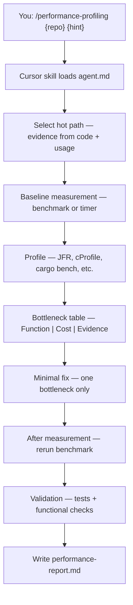
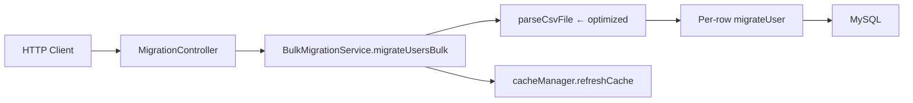

# A6 — Performance Profiling

> **Evaluation-grade agent deliverable.** Measure first, optimize second, prove with before/after benchmarks and validation evidence.

Identify a **measurable** bottleneck, profile with stack-appropriate tools, implement a **minimal** fix, and document before/after numbers in a structured performance report.

```bash
/performance-profiling ~/Downloads/bo-migration-service bulk CSV import
```

| | |
| --- | --- |
| **Project** | A6 — Performance Profiling |
| **Agent** | [`agent.md`](agent.md) · slash command `/performance-profiling` |
| **Cursor skill** | `.cursor/skills/performance-profiling/SKILL.md` |
| **Location** | `Advanced-parallel agent operator and system builder/A6_Performence_Profiling` |
| **Latest report** | [`performance-report.md`](performance-report.md) · 2026-06-17 |
| **Latest target** | `~/Downloads/bo-migration-service` — bulk CSV import hot path |
| **Mode** | Profile + minimal code change — no commit unless you ask |

---

## Executive Summary (Latest Run)

| Metric | Result |
| ------ | ------ |
| **Overall grade** | ✅ **PASS** — measured improvement with validation |
| **Hot path** | `BulkMigrationService.parseCsvFile` — 10,000-row CSV |
| **Baseline** | **2.678 ms** median parse · ~3.73M rows/sec |
| **After optimization** | **2.526 ms** median parse · ~3.96M rows/sec |
| **Improvement** | **~5.7% faster** parse · **~6.2% higher** throughput |
| **Tests on target** | **28/28** pass — no regressions |
| **Scope** | Parse phase only — DB I/O out of scope |

```
┌─────────────────────────────────────────────┐
│  PROFILING SUMMARY — bo-migration-service   │
├─────────────────────────────────────────────┤
│  Baseline measured       ✅  2.678 ms       │
│  Bottleneck identified   ✅  CSVFormat/alloc│
│  Minimal fix applied     ✅  2 files        │
│  After measurement       ✅  2.526 ms       │
│  Tests green               ✅  28/28          │
│  Risk assessment           ✅  documented   │
└─────────────────────────────────────────────┘
```

---

## Objective

From [`agent.md`](agent.md):

| Goal | Description |
| ---- | ----------- |
| **Primary** | Find and fix one **measurable** performance bottleneck |
| **Stance** | No optimization without baseline; no claims without rerun |
| **Output** | Structured `performance-report.md` with before/after evidence |
| **Code change** | **Minimal diff** — one bottleneck, one focused fix |
| **Commit** | **None by default** — only when you explicitly ask |

**Role:** Performance Engineer.

**Success means:** A benchmarkable hot path is selected, baseline and after numbers are captured, the bottleneck is evidenced (profiler or code review), tests pass, and tradeoffs are documented.

---

## Requirement Mapping

Maps agent requirements → deliverables → evidence location.

| # | Requirement | Deliverable | Evidence |
| - | ----------- | ----------- | -------- |
| R1 | Select hot path with evidence | Target section | [`performance-report.md`](performance-report.md) § Target |
| R2 | Baseline measurement | Method, dataset, runtime, memory | § Baseline measurement |
| R3 | Profile with appropriate tools | Bottleneck table | § Profiling · § Bottleneck analysis |
| R4 | Minimal improvement (no large refactors) | Code diff in target repo | § Improvement |
| R5 | After measurement with % gain | Before / after table | § After measurement |
| R6 | Validation — tests + functional checks | Test commands + output | § Validation |
| R7 | Risk assessment | Tradeoffs, regression risks | § Risk assessment |
| R8 | Single report file | `performance-report.md` | Overwritten each run |
| R9 | No speculative claims | Profiler/benchmark numbers cited | All numeric claims in report |
| R10 | No commit unless asked | Target-repo changes uncommitted | Agent rules in `agent.md` |

### Report sections (7 required)

| Section | Agent requirement | Latest run |
| ------- | ----------------- | ---------- |
| **Target** | Repo, component, hot path | `POST /bo-migration/v1/migrateUsersBulk` → `parseCsvFile` |
| **Baseline** | Method, dataset, runtime, memory | JUnit micro-benchmark · 10k rows · **2.678 ms** |
| **Bottleneck analysis** | Function \| Cost \| Evidence table | Static `CSVFormat` rebuild, `ArrayList` growth |
| **Improvement** | What changed and why | Static format, pre-sized list, try-with-resources |
| **After measurement** | Before / after / improvement % | **~5.7%** faster |
| **Validation** | Test commands + output | **28/28** tests pass |
| **Risk assessment** | Tradeoffs, rollback | Low risk · rollback commands documented |

---

## Architecture

### Agent workflow



| Step | Action | Output |
| ---- | ------ | ------ |
| 1 | Select benchmarkable hot path | Target table |
| 2 | Capture baseline (method, dataset, runtime) | Baseline section |
| 3 | Profile with stack-appropriate tools | Bottleneck table |
| 4 | Implement minimal fix | Target-repo diff |
| 5 | Rerun measurement | Before / after / % |
| 6 | Run tests and functional checks | Validation section |
| 7 | Assess tradeoffs and rollback | Risk assessment |
| 8 | Write report | `performance-report.md` |

### A6 folder layout

```
A6_Performence_Profiling/
├── README.md                 ← you are here (evaluation-grade guide)
├── agent.md                  ← agent spec, tool matrix, process
└── performance-report.md     ← latest profiling run (overwritten each run)
```

### Latest target — hot path architecture

Optimized system: **bo-migration-service** — bulk user migration CSV upload.



| Layer | Technology | Profiling focus |
| ----- | ---------- | --------------- |
| API | Spring Boot 3.2 · Java 17 | Multipart CSV upload endpoint |
| Hot path | Apache Commons CSV | Per-request format build, list growth |
| Benchmark | JUnit micro-benchmark | Isolated parse-only measurement |
| Full path | JPA · MySQL | DB I/O — dominant in prod, out of scope |

---

## Profiling Tool Matrix

| Stack | Baseline | Profiler |
| ----- | -------- | -------- |
| **Java / Spring** | JMH or `time ./mvnw test` | JFR, async-profiler |
| **Rust** | `cargo bench` (criterion) | `perf`, flamegraph |
| **Python** | `time`, `pytest-benchmark` | `cProfile`, `py-spy` |
| **Node.js** | `node --test` + benchmark harness | `node --prof`, clinic.js |

Latest run used an **isolated JUnit micro-benchmark** (`BulkMigrationCsvParseBenchmarkTest`) plus **code review** — appropriate for a parse-only hot path without full JFR setup.

---

## Run Steps

### Step 1 — Invoke the agent

Open **Cursor Agent chat**:

| Scenario | Command |
| -------- | ------- |
| **Repo + hot-path hint** | `/performance-profiling ~/Downloads/bo-migration-service bulk CSV import` |
| **Rust scoring path** | `/performance-profiling ../A3_Fraud_Score_system/engines/rust scoring hot path` |
| **Repo only** | `/performance-profiling ~/Downloads/bo-migration-service` |
| **No path** | `/performance-profiling` — agent asks or uses context |

### Step 2 — Agent executes profiling process

The agent follows the checklist in [`agent.md`](agent.md):

```
Profiling Progress:
- [ ] Step 1: Select hot path with evidence
- [ ] Step 2: Baseline measurement (method, dataset, runtime, memory)
- [ ] Step 3: Profile (JFR, cProfile, cargo bench, etc.)
- [ ] Step 4: Bottleneck table — Function | Cost | Evidence
- [ ] Step 5: Minimal improvement (no large refactors)
- [ ] Step 6: After measurement — before/after/improvement %
- [ ] Step 7: Validation — tests + functional checks
- [ ] Step 8: Risk assessment — tradeoffs, regression risks
- [ ] Step 9: Write performance-report.md
```

### Step 3 — Read the report

Open [`performance-report.md`](performance-report.md):

1. **Target** — repo, endpoint, hot path
2. **Baseline measurement** — method, numbers, command
3. **Bottleneck analysis** — evidence table
4. **Improvement** — files changed, scope boundaries
5. **After measurement** — before / after / improvement %
6. **Validation** — test output
7. **Risk assessment** — tradeoffs, rollback

### Step 4 — Optional: commit changes

Only if you explicitly ask the agent to commit. By default A6 leaves target-repo changes uncommitted.

---

## Verification Steps

Verification confirms the measured gain and ensures no functional regression on the **target repository**.

### Baseline (target repo)

| Step | Procedure | Expected |
| ---- | --------- | -------- |
| 1 | `cd ~/Downloads/bo-migration-service` | Repo accessible |
| 2 | `mvn -Dtest=BulkMigrationCsvParseBenchmarkTest test` | Benchmark prints median ms + throughput |
| 3 | `mvn -B test` | **28/28** tests pass |
| 4 | Read `performance-report.md` | All 7 sections present |

### Reproduce before/after numbers

| Phase | Command | Expected output |
| ----- | ------- | --------------- |
| **Benchmark** | `mvn -Dtest=BulkMigrationCsvParseBenchmarkTest test` | `BULK_CSV_PARSE_BENCHMARK rows=10000 median_ms=…` |
| **Full suite** | `mvn -B test` | `Tests run: 28, Failures: 0` |
| **Rollback** | `git checkout -- …BulkMigrationService.java` | Restores pre-optimization behavior |

### Pass criteria for an A6 run

| Check | Pass criteria |
| ----- | ------------- |
| Baseline captured | Numbers + method documented before any code change |
| Bottleneck evidenced | Table cites function + profiler or code-review proof |
| After rerun | Same benchmark harness, improvement % calculated |
| Tests green | Full or targeted suite — zero failures |
| Scope honest | Out-of-scope costs (e.g. DB) explicitly noted |
| Rollback documented | Commands to undo the optimization |

---

## Test Commands

Run on the **target repository** (not the A6 folder).

### Latest target — bo-migration-service

```bash
cd ~/Downloads/bo-migration-service

# Parse-only micro-benchmark (before/after comparison)
mvn -Dtest=BulkMigrationCsvParseBenchmarkTest test

# Full regression suite
mvn -B test

# Optional: A4 verify wrapper if present
make verify
```

**Expected benchmark output (optimized):**

```
BULK_CSV_PARSE_BENCHMARK rows=10000 median_ms=2.526 throughput_rows_per_sec=3959156
```

**Expected test output:**

```
Tests run: 28, Failures: 0, Errors: 0, Skipped: 0
BUILD SUCCESS
```

### Other target repos

```bash
/performance-profiling ../A3_Fraud_Score_system/engines/rust scoring hot path
cd "../A3_Fraud_Score_system/engines/rust" && cargo bench
```

```bash
/performance-profiling ../Infra-and-DevOps/D6_Observability_bolt_on_with_metrics
cd "../Infra-and-DevOps/D6_Observability_bolt_on_with_metrics" && pytest tests/ -v
```

---

## Evidence

### Report deliverable

| Artifact | Path | Content |
| -------- | ---- | ------- |
| Performance report | [`performance-report.md`](performance-report.md) | Full before/after profiling run |
| Agent spec | [`agent.md`](agent.md) | Process, tool matrix, rules |

### Latest run — captured evidence

**Profiling target:**

| Field | Value |
| ----- | ----- |
| Repository | `bo-migration-service` |
| Path | `/Users/rohitverma/Downloads/bo-migration-service` |
| Branch | `master-foundry-changes-bo-migration-service` |
| Hot path | `BulkMigrationService.parseCsvFile` |
| Dataset | 10,000 rows — `userId,ucc` columns |
| Generated | 2026-06-17 |

**Before / after:**

| Metric | Before | After (median) | Change |
| ------ | ------ | ---------------- | ------ |
| Parse time (10k rows) | **2.678 ms** | **2.526 ms** | **~5.7% faster** |
| Throughput | 3.73M rows/sec | 3.96M rows/sec | **~6.2% higher** |

**Files changed:**

| File | Change |
| ---- | ------ |
| `BulkMigrationService.java` | Static `CSVFormat`, pre-sized `ArrayList`, try-with-resources |
| `BulkMigrationCsvParseBenchmarkTest.java` | **New** — reproducible parse benchmark |

**Test baseline (verified 2026-06-17):**

```
cd ~/Downloads/bo-migration-service && mvn -B test
[INFO] Tests run: 28, Failures: 0, Errors: 0, Skipped: 0
[INFO] BUILD SUCCESS
```

**Top bottlenecks identified:**

| Cost | Evidence |
| ---- | -------- |
| `CSVFormat` rebuilt on every parse | New format object per upload (lines 81–84 before) |
| `ArrayList` default capacity | Repeated growth copies during 10k-row parse |
| Redundant `String.trim()` | Fields already trimmed by `withTrim()` |

**Suggested next steps (not implemented — documented in report):**

1. Batch `saveAll` in migration loop (DB round-trip reduction)
2. JFR / async-profiler on full `migrateUsersBulk` with Testcontainers
3. Streaming writes for very large CSV files

---

## Limitations

| Limitation | Detail |
| ---------- | ------ |
| **Single bottleneck** | One focused fix per run — no multi-phase refactors |
| **Parse-only scope** | Latest run optimized CSV parse; DB remains dominant at scale |
| **Modest gain** | ~6% improvement — further wins need I/O-level changes |
| **No JFR in latest run** | Benchmark + code review used; full JVM profiling optional |
| **Environment variance** | Numbers vary by machine — compare on same host |
| **Single report** | Each run overwrites `performance-report.md` |
| **No auto-commit** | Target-repo changes never committed by the agent |
| **Benchmark in CI** | Micro-benchmark is fast (~6s) but adds to test time |

### What A6 does not cover

- Full-system load testing or production APM analysis
- Infrastructure tuning (K8s limits, connection pools at deploy level)
- Multi-bottleneck optimization in one pass
- Memory profiling unless explicitly instrumented (JFR, heap dumps)

---

## Success Checklist

Use this checklist to evaluate an A6 agent run.

### Agent process

| # | Requirement | Status (latest run) |
| - | ----------- | ------------------- |
| 1 | Hot path selected with evidence | ✅ `parseCsvFile` — benchmarkable, high call volume |
| 2 | Baseline measured before changes | ✅ **2.678 ms** median documented |
| 3 | Profiling performed | ✅ Micro-benchmark + code review |
| 4 | Bottleneck table with evidence | ✅ CSVFormat, ArrayList, trim |
| 5 | Minimal fix applied | ✅ 2 files — no business-rule changes |
| 6 | After measurement with % | ✅ **~5.7%** faster |
| 7 | Tests pass | ✅ **28/28** |
| 8 | Risk assessment documented | ✅ Low risk + rollback commands |
| 9 | Report written to `performance-report.md` | ✅ All 7 sections |
| 10 | No speculative claims | ✅ All numbers from benchmark output |
| 11 | Out-of-scope costs noted | ✅ DB I/O explicitly excluded |
| 12 | Target repo uncommitted | ✅ No agent commits |

### Evaluator sign-off

| Criterion | Pass? |
| --------- | ----- |
| Report contains all 7 required sections | ✅ |
| Baseline captured before any code change | ✅ |
| Before/after numbers from same benchmark harness | ✅ |
| Improvement percentage calculated | ✅ |
| Full test suite green after optimization | ✅ |
| Rollback path documented | ✅ |
| README + report enable another agent to reproduce | ✅ |

---

## Grading Rubric

| Grade | Criteria |
| ----- | -------- |
| ✅ **PASS** | Baseline + after measured, ≥1 evidenced bottleneck, minimal fix, tests green, honest scope |
| ⚠️ **PARTIAL** | Report complete but missing after rerun, or gain unverified, or tests not run |
| ❌ **FAIL** | Optimization without baseline, speculative claims, tests failing, or large unrelated refactor |

**Latest run grade:** ✅ **PASS**

---

## Related Agents

| Agent | When to use |
| ----- | ----------- |
| **A6** (this) | Measure and fix one performance bottleneck |
| **A5** `/adversarial-code-review` | Review optimization for correctness/security regressions |
| **A4** `/repository-modernization` | Add benchmark harness or CI perf gates |
| **D6** `/observability` | Add latency metrics to validate prod impact |
| **A3** Fraud Score system | Rust/Python scoring paths — good profiling targets |

Typical flow:

```
A6 profile + fix  →  A5 review changes  →  D6 observe in prod  →  ship
```

---

## Documentation

| Document | Description |
| -------- | ----------- |
| [`agent.md`](agent.md) | Full A6 spec — process, tool matrix, report template |
| [`performance-report.md`](performance-report.md) | Latest run — bulk CSV parse optimization |
| `.cursor/skills/performance-profiling/SKILL.md` | Slash command entry point |

---

<p align="center"><sub>A6 — Performance Profiling · Evaluation-grade deliverable · Measure first · Prove with data · Minimal change</sub></p>
