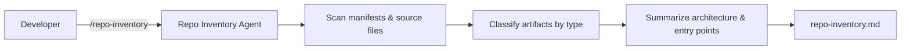

# B1 — Repo Artifact Inventory

> **Evaluation-grade agent deliverable.** Source-verified catalog of controllers, services, repositories, schedulers, configs, and architecture patterns — nothing inferred from README alone.

Scan an unfamiliar repository and produce a complete **artifact inventory** from source code. Every row must cite a verified file on disk with a classified type, responsibility, and dependencies.

```bash
/repo-inventory ~/Downloads/bo-migration-service
```

| | |
| --- | --- |
| **Project** | B1 — Repo Artifact Inventory |
| **Agent** | [`agent.md`](agent.md) · slash command `/repo-inventory` |
| **Cursor skill** | `.cursor/skills/repo-inventory/SKILL.md` |
| **Location** | `Basic-repo-reader-and-builder/B1_Repo_Artifact_Inventory` |
| **Latest report** | [`repo-inventory.md`](repo-inventory.md) · 2026-06-17 |
| **Latest target** | `~/Downloads/bo-migration-service` — Spring Boot migration service |
| **Mode** | Analysis only — no target-repo edits |

---

## Executive Summary (Latest Run)

| Metric | Result |
| ------ | ------ |
| **Stack** | Spring Boot 3.2 · Java 17 · Maven |
| **Source files analyzed** | **29** (`src/main/java`) |
| **Verified artifacts** | **29** |
| **Controllers** | **4** |
| **Services** | **5** |
| **Repositories** | **3** |
| **Schedulers** | **2** |
| **Consumers / Jobs** | **0** |

```
┌──────────────────────────────────────────────────────────────┐
│  REPO ARTIFACT INVENTORY — bo-migration-service              │
├──────────────────────────────────────────────────────────────┤
│  Layered architecture        Verified Yes                    │
│  Controllers                 4  (Migration, Status, Config)  │
│  Services + cache            5  (Migration, Bulk, Status…)  │
│  JPA repositories            3                               │
│  Entities + DTOs             10                              │
│  Schedulers                  2  (Redis cache refresh)      │
│  External integrations       MySQL, Redis, Flyway, Prometheus│
└──────────────────────────────────────────────────────────────┘
```

### Sample verified artifacts

| Type | Name | File Path |
| ---- | ---- | --------- |
| Main Application | `MigrationServiceApplication` | `src/main/java/.../MigrationServiceApplication.java` |
| Controllers | `MigrationController` | `src/main/java/.../controller/MigrationController.java` |
| Services | `MigrationService` | `src/main/java/.../service/MigrationService.java` |
| Repositories | `MigrationStatusRepository` | `src/main/java/.../repository/MigrationStatusRepository.java` |
| Schedulers | `CacheRefreshScheduler` | `src/main/java/.../scheduler/CacheRefreshScheduler.java` |

Full inventory and architecture summary: [repo-inventory.md](repo-inventory.md)

---

## Objective

From [`agent.md`](agent.md):

| Goal | Description |
| ---- | ----------- |
| **Primary** | Catalog every verified source artifact in an unfamiliar repository |
| **Role** | Staff Software Architect — repository discovery specialist |
| **Output** | `repo-inventory.md` |
| **Evidence** | Type, name, file path, responsibility, and dependencies per artifact |
| **Code changes** | **None** — analysis and documentation only |

**Success means:** Every row traces to a verified source file, artifact types follow classification rules, architecture patterns are backed by evidence, and every cited file path exists on disk.

---

## Project layout

```
B1_Repo_Artifact_Inventory/
├── README.md              ← you are here
├── agent.md               ← Repo Inventory Agent spec
└── repo-inventory.md      ← latest inventory (overwritten each run)
```

---

## What this agent does

| Step | Action |
| ---- | ------ |
| 1 | Identify repo root and scan build manifests (`pom.xml`, `package.json`, etc.) |
| 2 | Discover source files (exclude `node_modules`, `target`, `build`, `dist`, `.git`) |
| 3 | Classify artifacts from source annotations and package structure |
| 4 | Extract responsibility and dependencies per artifact |
| 5 | Write `repo-inventory.md` with architecture summary and entry points |
| 6 | Verify every file path in the report exists on disk |

---

## Invoke the agent

**Slash command:** `/repo-inventory {repo-path}`

```
/repo-inventory ~/Downloads/bo-migration-service
```

```
/repo-inventory .
```

```
/repo-inventory — scan Backend/ in this MERN repo
```

Full agent spec: [agent.md](./agent.md)

---

## What gets discovered

| Type | Java / Spring | Node / Express | Python |
| ---- | ------------- | -------------- | ------ |
| Main Application | `@SpringBootApplication`, `main()` | `app.listen`, server entry | `if __name__ == '__main__'` |
| Controllers | `@RestController`, `@Controller` | `routes/`, `*Controller.js` | `APIRouter`, `@app.get/post` |
| Services | `@Service` | `services/`, `*Service.js` | `services/`, `service.py` |
| Repositories | `@Repository`, `JpaRepository` | `repositories/`, Mongoose models | `repositories/`, `repository.py` |
| Entities | `@Entity`, `@Table` | Mongoose `Schema` in `models/` | SQLAlchemy/Django models |
| DTOs | `model/dto`, `*Request`, `*Response` | `dto/`, validation schemas | `schemas/`, Pydantic models |
| Schedulers | `@Scheduled` | `node-cron`, `agenda` | Celery beat, APScheduler |
| Consumers | `@KafkaListener`, `@RabbitListener` | `consumers/`, queue handlers | `consumers/`, Celery tasks |
| Configurations | `@Configuration`, `application.yml` | `config/`, `config.js` | `settings.py`, `config/` |
| Exception Handlers | `@RestControllerAdvice`, `@ExceptionHandler` | error middleware | `@app.exception_handler` |
| Utilities | `*Util.java`, `utils/` | `utils/`, `helpers/` | `utils/`, `util.py` |

**Classification priority** (when multiple match): Main Application → Exception Handlers → Controllers → Schedulers → Consumers → Services → Repositories → Entities → DTOs → Configurations → Utilities → Models.

---

## Architecture



---

## Deliverables

| Artifact | Location | Description |
| -------- | -------- | ----------- |
| Agent spec | [agent.md](./agent.md) | Workflow, classification rules, report template |
| Inventory report | [repo-inventory.md](./repo-inventory.md) | Full artifact table, architecture summary, entry points |
| Target repo | User-specified path | Read-only — no files modified |

---

## repo-inventory.md sections

Every agent run must produce a report with:

1. **Verification Summary** — source file count, artifact count, build manifests, git status
2. **Artifact Inventory** — main table: Type, Name, File Path, Responsibility, Dependencies
3. **Architecture Summary** — layered/hexagonal/microservice patterns, external integrations, detected stack
4. **Entry Points** — main application classes, startup config, scheduler and consumer entry points
5. **Artifacts by Type** — grouped tables per artifact category
6. **Not Found / Not Verified** — README-only claims not confirmed in source

Current report: [repo-inventory.md](./repo-inventory.md) (documents `bo-migration-service` run).

---

## Rules

* Only report **verified** artifacts — trace annotations, keywords, and package paths in source.
* Include exact **file paths** for every artifact.
* **Never guess** — confirm type, responsibility, and dependencies from code.
* README claims may **supplement** but must **match** source; list mismatches under Not Found.
* Exclude test files from the main inventory unless the user asks to include them.
* One row per file in the main inventory table (pick the primary artifact type).
* If a category has zero artifacts, write `_None found_`.
* Do not commit unless the user explicitly asks.

---

## Quick reference

| Task | Command |
| ---- | ------- |
| Inventory a local repo | `/repo-inventory ~/Downloads/bo-migration-service` |
| Inventory current workspace | `/repo-inventory .` |
| Read latest report | Open [repo-inventory.md](./repo-inventory.md) |
| Read full agent spec | Open [agent.md](./agent.md) |

---

## Related projects

| Project | Relationship |
| ------- | ------------ |
| [B2 — API Endpoint Map](../B2_API_endpoint_map/README.md) | Run next — map REST/GraphQL/WebSocket routes from controllers |
| [B3 — Test Discovery](../B3_Test_discovery_and_execution/agent.md) | Run after B2 — find test suites for discovered artifacts |
| [I1 — ER Diagram](../../Intermediate-repo%20operator%20and%20polyglot%20builder/I1_ER_diagram_from_repo/README.md) | Derive entity-relationship diagram from entities |
| [I2 — Flow Trace](../../Intermediate-repo%20operator%20and%20polyglot%20builder/I2_End_to_end_flow_trace/README.md) | Deep-dive one endpoint end-to-end |

Recommended analysis chain:

```
/repo-inventory → /api-endpoint-map → /test-discovery
```

---

## Agent catalog

Registered as **B1 — Repo Artifact Inventory** in [docs/agent-catalog.md](../../docs/agent-catalog.md).
