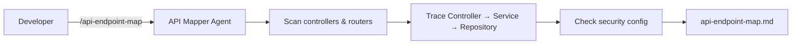

# B2 — API Endpoint Map

> **Evaluation-grade agent deliverable.** Source-verified mapping of every externally exposed API and frontend route with auth, DTOs, and call-chain flow.

Analyze a repository and produce a complete **API endpoint map** from source code. Every route must cite a controller annotation or router registration on disk — nothing is guessed from README or OpenAPI alone.

```bash
/api-endpoint-map ~/Downloads/bo-migration-service
```

| | |
| --- | --- |
| **Project** | B2 — API Endpoint Map |
| **Agent** | [`agent.md`](agent.md) · slash command `/api-endpoint-map` |
| **Cursor skill** | `.cursor/skills/api-endpoint-map/SKILL.md` |
| **Location** | `Basic-repo-reader-and-builder/B2_API_endpoint_map` |
| **Latest report** | [`api-endpoint-map.md`](api-endpoint-map.md) · 2026-06-17 |
| **Latest target** | `~/Downloads/bo-migration-service` — Spring Boot migration service |
| **Mode** | Analysis only — no target-repo edits |

---

## Executive Summary (Latest Run)

| Metric | Result |
| ------ | ------ |
| **Stack** | Spring Boot 3.2 · Java 17 · SpringDoc OpenAPI |
| **Total endpoints verified** | **16** |
| **Application REST** | **10** |
| **Actuator / docs** | **6** |
| **GraphQL / WebSocket** | **0** |
| **Frontend routes** | **0** |
| **Authenticated endpoints** | **0** (no security config verified) |

```
┌──────────────────────────────────────────────────────────────┐
│  API ENDPOINT MAP — bo-migration-service                     │
├──────────────────────────────────────────────────────────────┤
│  MigrationController          2 endpoints (POST)             │
│  MigrationStatusController    4 endpoints (GET/POST)         │
│  DefaultMigrationConfigCtrl   3 endpoints (GET/PUT/POST)     │
│  HealthController             1 endpoint  (GET /health)      │
│  Actuator + SpringDoc         6 endpoints (auto-config)        │
│  Route flow traced            10 application routes          │
└──────────────────────────────────────────────────────────────┘
```

### Sample verified endpoints

| Method | Route | Controller |
| ------ | ----- | ---------- |
| POST | `/bo-migration/v1/migrateUser` | `MigrationController` |
| GET | `/bo-migration/v1/getMigrationStatus/byUserId/{userId}` | `MigrationStatusController` |
| PUT | `/bo-migration/v1/migrationDefaultConfig` | `DefaultMigrationConfigController` |
| GET | `/health` | `HealthController` |
| GET | `/swagger-ui.html` | SpringDoc (auto-config) |

Full table and route flows: [api-endpoint-map.md](api-endpoint-map.md)

---

## Objective

From [`agent.md`](agent.md):

| Goal | Description |
| ---- | ----------- |
| **Primary** | Map every externally exposed API and frontend route from **verified source** |
| **Role** | API discovery specialist |
| **Output** | `api-endpoint-map.md` |
| **Evidence** | Method, path, handler, DTOs, auth, and file path per endpoint |
| **Code changes** | **None** — analysis and documentation only |

**Success means:** Every row traces to a verified annotation or router registration, route flows document Controller → Service → Repository, endpoint statistics are accurate, and every cited file path exists on disk.

---

## Project layout

```
B2_API_endpoint_map/
├── README.md              ← you are here
├── agent.md               ← API Mapper Agent spec
└── api-endpoint-map.md    ← latest endpoint map (overwritten each run)
```

---

## What this agent does

| Step | Action |
| ---- | ------ |
| 1 | Identify repo root and stack (Spring, Express, FastAPI, etc.) |
| 2 | Discover backend API registrations (REST, GraphQL, WebSocket, internal) |
| 3 | Discover frontend route registrations (React, Angular, Vue, Next.js) |
| 4 | Trace handler → service → repository per backend route |
| 5 | Determine auth requirements from security config and annotations |
| 6 | Write `api-endpoint-map.md` with statistics and route flows |
| 7 | Verify every file path in the report exists on disk |

---

## Invoke the agent

**Slash command:** `/api-endpoint-map {repo-path}`

```
/api-endpoint-map ~/Downloads/bo-migration-service
```

```
/api-endpoint-map .
```

```
/api-endpoint-map — map all REST endpoints in Backend/
```

Full agent spec: [agent.md](./agent.md)

---

## What gets discovered

### Backend

| Type | Java / Spring | Node / Express | Python |
| ---- | ------------- | -------------- | ------ |
| REST | `@GetMapping`, `@PostMapping`, `@RestController` | `router.get/post`, NestJS `@Controller` | `@app.get`, `APIRouter` |
| GraphQL | `@QueryMapping`, `@MutationMapping` | Apollo resolvers | Strawberry, Graphene |
| WebSocket | `@MessageMapping`, STOMP config | `socket.io`, NestJS `@WebSocketGateway` | FastAPI WebSocket |
| Internal | `/internal` routes, admin controllers | `app.use('/internal', ...)` | Internal blueprints |

### Frontend

| Framework | Source evidence |
| --------- | --------------- |
| React Router | `<Route path=`, `createBrowserRouter` |
| Angular | `RouterModule.forRoot`, standalone `routes` |
| Vue | `createRouter({ routes: [...] })` |
| Next.js | `app/**/page.tsx`, `pages/**/*.tsx`, `route.ts` |

---

## Architecture



---

## Deliverables

| Artifact | Location | Description |
| -------- | -------- | ----------- |
| Agent spec | [agent.md](./agent.md) | Workflow, discovery rules, report template |
| Endpoint map | [api-endpoint-map.md](./api-endpoint-map.md) | Full endpoint table, statistics, route flows |
| Target repo | User-specified path | Read-only — no files modified |

---

## api-endpoint-map.md sections

Every agent run must produce a report with:

1. **Verification Summary** — counts by type (REST, GraphQL, WebSocket, frontend)
2. **Endpoint Map** — main table: Method, Route, Controller, Handler, Request/Response DTO, Auth, File Path
3. **Endpoint Statistics** — total, public, authenticated, deprecated
4. **Route Flow** — `Request → Controller → Service → Repository` per backend route
5. **Endpoints by Type** — grouped tables (REST, GraphQL, WebSocket, React, etc.)
6. **Not Found / Not Verified** — README/OpenAPI-only routes not confirmed in source

Current report: [api-endpoint-map.md](./api-endpoint-map.md) (documents `bo-migration-service` run).

---

## Route flow example

From the latest report — `POST /bo-migration/v1/migrateUser`:

```
Request → MigrationController.migrateUser
       → MigrationService.migrateUser
       → MigrationStatusRepository.findByUserId / findByUcc / save
       → MigrationAuditLogRepository.save
       → MigrationCacheManager.put / update
```

---

## Rules

* Only report **verified** routes — trace annotations and router registrations in source.
* Include exact **file paths** for every endpoint.
* **Never guess** — confirm method, path, handler, and DTOs from code.
* OpenAPI/README may **supplement** but must **match** source; list mismatches under Not Found.
* Exclude test-only routes unless the user asks to include them.
* One row per distinct endpoint (method + full route path).
* If a category has zero endpoints, write `_None found_`.
* Do not commit unless the user explicitly asks.

---

## Quick reference

| Task | Command |
| ---- | ------- |
| Map endpoints in a local repo | `/api-endpoint-map ~/Downloads/bo-migration-service` |
| Map current workspace | `/api-endpoint-map .` |
| Read latest report | Open [api-endpoint-map.md](./api-endpoint-map.md) |
| Read full agent spec | Open [agent.md](./agent.md) |

---

## Related projects

| Project | Relationship |
| ------- | ------------ |
| [B1 — Repo Artifact Inventory](../B1_Repo_Artifact_Inventory/agent.md) | Run first — catalog controllers, services, repos |
| [B3 — Test Discovery](../B3_Test_discovery_and_execution/agent.md) | Run after — find test suites for mapped endpoints |
| [I2 — Flow Trace](../../Intermediate-repo%20operator%20and%20polyglot%20builder/I2_End_to_end_flow_trace/README.md) | Deep-dive one endpoint end-to-end |
| [B4 — FastAPI Builder](../B4_FastAPI_greenfield_service/README.md) | Greenfield API to map after building |

Recommended analysis chain:

```
/repo-inventory → /api-endpoint-map → /test-discovery
```

---

## Agent catalog

Registered as **B2 — API Endpoint Map** in [docs/agent-catalog.md](../../docs/agent-catalog.md).
