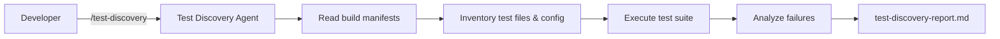

# B3 — Test Discovery & Execution

> **Evaluation-grade agent deliverable.** Source-verified test framework discovery, test file inventory, executed test runs with terminal evidence — never claim pass/fail without running tests.

Discover a repository's testing strategy, inventory unit/integration/E2E tests, run the test suite, and produce a **test discovery report** with execution output and failure analysis.

```bash
/test-discovery ~/Downloads/bo-migration-service
```

| | |
| --- | --- |
| **Project** | B3 — Test Discovery & Execution |
| **Agent** | [`agent.md`](agent.md) · slash command `/test-discovery` |
| **Cursor skill** | `.cursor/skills/test-discovery/SKILL.md` |
| **Location** | `Basic-repo-reader-and-builder/B3_Test_discovery_and_execution` |
| **Latest report** | [`test-discovery-report.md`](test-discovery-report.md) · 2026-06-17 |
| **Latest target** | `~/Downloads/bo-migration-service` — Spring Boot migration service |
| **Mode** | Analysis + test execution — no target-repo edits |

---

## Executive Summary (Latest Run)

| Metric | Result |
| ------ | ------ |
| **Stack** | Maven 3.x · JUnit 5 · Spring Boot Test · Mockito |
| **Total test files** | **16** |
| **Unit test files** | **14** |
| **Integration test files** | **2** (`@WebMvcTest` slice tests) |
| **E2E test files** | **0** |
| **Tests executed** | **27** |
| **Result** | **PASSED** (exit code 0) |

```
┌──────────────────────────────────────────────────────────────┐
│  TEST DISCOVERY — bo-migration-service                       │
├──────────────────────────────────────────────────────────────┤
│  Build tool                  Maven (pom.xml)                 │
│  Test framework              JUnit 5 + Spring Boot Test        │
│  Unit tests                  14 files (services, DTOs, enums)│
│  Integration tests           2  (@WebMvcTest controllers)    │
│  E2E tests                   0                               │
│  Execution                   mvn test → 27/27 passed         │
└──────────────────────────────────────────────────────────────┘
```

### Sample verified test files

| Type | File Path |
| ---- | --------- |
| Unit | `src/test/java/.../service/BulkMigrationServiceTest.java` |
| Unit | `src/test/java/.../scheduler/CacheRefreshSchedulerTest.java` |
| Integration | `src/test/java/.../controller/HealthControllerTest.java` |
| Integration | `src/test/java/.../controller/DefaultMigrationConfigControllerTest.java` |
| Config | `src/test/resources/application.properties` |

Full inventory, commands, and execution output: [test-discovery-report.md](test-discovery-report.md)

---

## Objective

From [`agent.md`](agent.md):

| Goal | Description |
| ---- | ----------- |
| **Primary** | Discover testing strategy and execute tests with verified terminal evidence |
| **Role** | QA automation engineer |
| **Output** | `test-discovery-report.md` |
| **Evidence** | Build tool, framework, config files, test inventory, run commands, terminal output |
| **Code changes** | **None** — discovery, execution, and documentation only |

**Success means:** Test framework is confirmed from build manifests, every listed test file exists on disk, tests are actually executed, pass/fail is backed by terminal output and exit code, and failures include root-cause analysis.

---

## Project layout

```
B3_Test_discovery_and_execution/
├── README.md                  ← you are here
├── agent.md                   ← Test Discovery Agent spec
└── test-discovery-report.md   ← latest report (overwritten each run)
```

---

## What this agent does

| Step | Action |
| ---- | ------ |
| 1 | Identify build tool and test framework from manifests |
| 2 | Locate test configuration files |
| 3 | Inventory unit, integration, and E2E test files |
| 4 | Derive exact run commands from build tool config |
| 5 | Execute tests and capture output + exit code |
| 6 | Analyze failures (root cause + fix suggestion) |
| 7 | Write `test-discovery-report.md` with summary metrics |

---

## Invoke the agent

**Slash command:** `/test-discovery {repo-path}`

```
/test-discovery ~/Downloads/bo-migration-service
```

```
/test-discovery .
```

```
/test-discovery — discover and run tests in Backend/
```

Full agent spec: [agent.md](./agent.md)

---

## What gets discovered

### Build tools & frameworks

| Build Tool | Manifest | Common test frameworks |
| ---------- | -------- | ---------------------- |
| Maven | `pom.xml` | JUnit 5, TestNG, Mockito, Spring Boot Test |
| Gradle | `build.gradle`, `build.gradle.kts` | JUnit 5, Kotest, Spock |
| npm/yarn/pnpm | `package.json` | Jest, Vitest, Mocha, Cypress, Playwright |
| Python | `pyproject.toml`, `requirements.txt` | pytest, unittest |
| Go | `go.mod` | `testing` package, testify |

### Test classification

| Type | Java / Spring | Node | Python |
| ---- | ------------- | ---- | ------ |
| Unit | `src/test/**` without `@SpringBootTest`; mocks only | `*.test.js`, `*.spec.ts` in `__tests__/` | `test_*.py` with mocked I/O |
| Integration | `@SpringBootTest`, `@WebMvcTest`, `@DataJpaTest`, Testcontainers | Supertest, `tests/integration/` | pytest with real DB/fixtures |
| E2E | Selenium, Cucumber, full-stack `@SpringBootTest` | Cypress, Playwright in `e2e/` | pytest + browser automation |

### Config files searched

| Stack | Config paths |
| ----- | ------------ |
| Java | `src/test/resources/application.properties`, `application-test.yml`, Surefire/Failsafe in `pom.xml` |
| Node | `jest.config.js`, `vitest.config.ts`, `cypress.config.ts`, `playwright.config.ts` |
| Python | `pytest.ini`, `conftest.py`, `tox.ini` |
| CI | `.github/workflows/*.yml` (supplementary evidence for run commands) |

---

## Architecture



---

## Deliverables

| Artifact | Location | Description |
| -------- | -------- | ----------- |
| Agent spec | [agent.md](./agent.md) | Workflow, classification rules, report template |
| Discovery report | [test-discovery-report.md](./test-discovery-report.md) | Framework, inventory, commands, execution output |
| Target repo | User-specified path | Read-only — tests executed but not modified |

---

## test-discovery-report.md sections

Every agent run must produce a report with:

1. **Test Framework** — build tool, framework, evidence from manifests
2. **Config Files** — every verified test config path and purpose
3. **Relevant Test Files** — grouped by unit, integration, E2E
4. **Commands** — run all, module, single class, single method
5. **Execution** — command, exit code, terminal output, result (`PASSED` / `FAILED` / `BLOCKED`)
6. **Failure Analysis** — root cause and fix suggestion per failure
7. **Summary** — test file counts, tests run, passed/failed/skipped
8. **Not Found / Not Verified** — missing frameworks, blocked runs, unscanned CI

Current report: [test-discovery-report.md](./test-discovery-report.md) (documents `bo-migration-service` run).

---

## Run commands example

From the latest report — Maven single-module project:

```bash
# Run all tests
cd ~/Downloads/bo-migration-service && mvn test

# Run single test class
mvn test -Dtest=HealthControllerTest

# Run single test method
mvn test -Dtest=HealthControllerTest#healthReturnsOk
```

---

## Rules

* **Never claim tests passed** without execution evidence (terminal output + exit code).
* Derive run commands from build manifests — **do not guess**.
* Only list test files and config paths **verified on disk**.
* Actually **execute tests** before marking pass/fail.
* If tests cannot run (missing JDK, dependencies), document the blocker with terminal evidence.
* If a category has zero tests, write `_None found_`.
* Do not infer test framework from README alone — confirm in build files and source.
* Do not commit unless the user explicitly asks.

---

## Quick reference

| Task | Command |
| ---- | ------- |
| Discover and run tests in a local repo | `/test-discovery ~/Downloads/bo-migration-service` |
| Discover tests in current workspace | `/test-discovery .` |
| Read latest report | Open [test-discovery-report.md](./test-discovery-report.md) |
| Read full agent spec | Open [agent.md](./agent.md) |

---

## Related projects

| Project | Relationship |
| ------- | ------------ |
| [B1 — Repo Artifact Inventory](../B1_Repo_Artifact_Inventory/README.md) | Run first — catalog services, controllers, schedulers |
| [B2 — API Endpoint Map](../B2_API_endpoint_map/README.md) | Run before B3 — map endpoints to test against |
| [I3 — Small Safe Change](../../Intermediate-repo%20operator%20and%20polyglot%20builder/I3_Small_safe_change/README.md) | Use test commands before/after code changes |
| [I4 — Validation](../../Intermediate-repo%20operator%20and%20polyglot%20builder/I4/README.md) | Extended validation beyond test discovery |

Recommended analysis chain:

```
/repo-inventory → /api-endpoint-map → /test-discovery
```

---

## Agent catalog

Registered as **B3 — Test Discovery & Execution** in [docs/agent-catalog.md](../../docs/agent-catalog.md).
