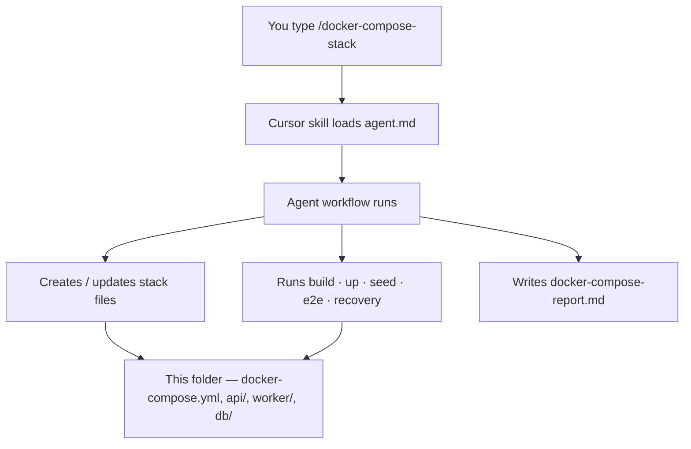
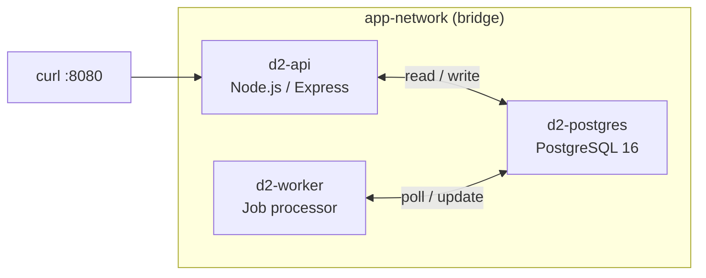

# D2 Docker Compose Stack — Guide & Verification Status

| | |
| --- | --- |
| **Project** | D2 — Docker Compose Stack |
| **Agent** | `docker-compose-stack` · [`agent.md`](../agent.md) |
| **Slash command** | `/docker-compose-stack [{target-path}] [{stack-hint}]` |
| **Location** | `Infra-and-DevOps/D2_Docker-Compose_Stack` |
| **Last verified** | 2026-06-21 · rohitverma · PMLMBT4677 |
| **Environment** | Local · Colima · `docker-compose` |

---

## How the Agent Connects to This Stack



| Component | Path | Purpose |
| --------- | ---- | ------- |
| Agent spec | [`agent.md`](../agent.md) | Workflow, deliverables, success criteria |
| Cursor skill | `.cursor/skills/docker-compose-stack/SKILL.md` | Entry point for slash command |
| Stack output | This folder | Runnable Docker Compose application |
| Agent report | [`docker-compose-report.md`](docker-compose-report.md) | Evidence from agent-run verification |
| This document | [`run-status.md`](run-status.md) | How-to guide + latest manual verification |

---

## Starting D2 with the Agent

### Step 1 — Open Cursor chat

In the repo workspace, open **Agent chat** and run one of:

| Scenario | Command |
| -------- | ------- |
| **Use this existing stack** | `/docker-compose-stack Infra-and-DevOps/D2_Docker-Compose_Stack` |
| **Greenfield in current folder** | `/docker-compose-stack . — greenfield API + Postgres + worker` |
| **Another project** | `/docker-compose-stack ~/path/to/your-service` |

### Step 2 — What the agent does automatically

The agent reads [`agent.md`](../agent.md) and executes this workflow:

| Step | Agent action |
| ---- | ------------ |
| 1 | Identify target path and service boundaries |
| 2 | Design compose topology (networks, volumes, env) |
| 3 | Write `docker-compose.yml`, Dockerfiles, source, scripts, README |
| 4 | Run `docker-compose build` |
| 5 | Run `docker-compose up -d` |
| 6 | Run `./scripts/seed-data.sh` |
| 7 | Run `./scripts/run-e2e-tests.sh` |
| 8 | Capture logs (API → DB, Worker → DB proof) |
| 9 | Recovery test (`down -v` → `up -d` → re-seed → re-test) |
| 10 | Write [`docker-compose-report.md`](docker-compose-report.md) with evidence |

> The agent **does not** run `terraform apply` or commit unless you explicitly ask.

### Step 3 — Manual start (without re-running the agent)

If the stack already exists and you only want to run it:

```bash
cd Infra-and-DevOps/D2_Docker-Compose_Stack

docker-compose build
docker-compose up -d
./scripts/seed-data.sh
./scripts/run-e2e-tests.sh
```

---

## Expected Results

Use this table to confirm everything is working.

### Agent workflow — expected outcomes

| Step | Command | Expected exit code | Expected result |
| ---- | ------- | ------------------ | --------------- |
| Build | `docker-compose build` | `0` | API and worker images built successfully |
| Start | `docker-compose up -d` | `0` | 3 containers created and running |
| Seed | `./scripts/seed-data.sh` | `0` | `INSERT 0 3` · total jobs = 3 |
| E2E | `./scripts/run-e2e-tests.sh` | `0` | **7 passed · 0 failed** |
| Logs | `docker-compose logs api worker` | — | `[api] connected to PostgreSQL` · `[worker] completed job` |
| Recovery | `docker-compose down -v` then `up -d` + seed + e2e | `0` | Same test results after full reset |

### Container status — `docker-compose ps`

| Container | Expected status | Expected ports |
| --------- | --------------- | -------------- |
| `d2-api` | Up **(healthy)** | `0.0.0.0:8080→8080/tcp` |
| `d2-postgres` | Up **(healthy)** | `5432/tcp` (internal only) |
| `d2-worker` | Up | — |

### Health check — `curl http://localhost:8080/health`

**Expected response:**

```json
{
  "status": "ok",
  "database": "connected"
}
```

| Check | Expected |
| ----- | -------- |
| HTTP status | `200` |
| `status` field | `"ok"` |
| `database` field | `"connected"` |

### E2E tests — `./scripts/run-e2e-tests.sh`

**Expected output (summary):**

```
--- Test 1: API health check ---
PASS: GET /health returns status ok
PASS: GET /health confirms database connected

--- Test 2: List jobs (API reads from database) ---
PASS: GET /jobs returns jobs array

--- Test 3: Create job via API (API writes to database) ---
PASS: POST /jobs created job id=<N>

--- Test 4: Worker processes job (Worker reads/writes database) ---
PASS: Worker completed job id=<N> within 30s
PASS: Job result contains processed payload

--- Test 5: Seed jobs processed by worker ---
PASS: At least one seed job completed (completed count: ≥1)

========================================
Test Summary: 7 passed, 0 failed
========================================
```

| Metric | Expected |
| ------ | -------- |
| Tests passed | **7** |
| Tests failed | **0** |
| Exit code | **0** |

### Communication — expected log lines

| Path | Expected log pattern |
| ---- | -------------------- |
| API → Database | `[api] connected to PostgreSQL at db` |
| API → Database | `[api] POST /jobs — created job id=... in database` |
| Worker → Database | `[worker] claimed job id=... from database` |
| Worker → Database | `[worker] completed job id=... result="processed:..."` |

---

## Latest Verification — Executive Summary

| Metric | Result |
| ------ | ------ |
| **Overall status** | ✅ **PASS** |
| **Services running** | 3 / 3 |
| **Health checks** | 2 / 2 passing (api, db) |
| **E2E tests** | **7 passed · 0 failed** |
| **Exit code** | `0` |

The multi-service stack is **operational**. API, PostgreSQL, and Worker communicate successfully on the shared `app-network`.

---

## Architecture Under Test



---

## Latest Run — Detailed Results

### 1 · Container Status

**Command:** `docker-compose ps`

| Container | Service | Image | Status | Ports |
| --------- | ------- | ----- | ------ | ----- |
| `d2-api` | api | `d2_docker-compose_stack-api` | ✅ Up · **healthy** | `8080 → 8080` |
| `d2-postgres` | db | `postgres:16-alpine` | ✅ Up · **healthy** | `5432` (internal) |
| `d2-worker` | worker | `d2_docker-compose_stack-worker` | ✅ Up | — |

### 2 · API Health Check

**Command:** `curl http://localhost:8080/health`

**Actual response:**

```json
{
  "status": "ok",
  "database": "connected"
}
```

| Check | Result |
| ----- | ------ |
| API reachable on port 8080 | ✅ Pass |
| Database connectivity confirmed | ✅ Pass |

### 3 · End-to-End Test Suite

**Command:** `./scripts/run-e2e-tests.sh` · **Target:** `http://localhost:8080`

| # | Category | Test case | Result |
| - | -------- | --------- | ------ |
| 1 | Health | `GET /health` returns `status: ok` | ✅ Pass |
| 2 | Health | `GET /health` confirms database connected | ✅ Pass |
| 3 | API → DB | `GET /jobs` returns jobs array | ✅ Pass |
| 4 | API → DB | `POST /jobs` creates job **id=5** | ✅ Pass |
| 5 | Worker → DB | Worker completes job **id=5** within 30s | ✅ Pass |
| 6 | Worker → DB | Job result contains processed payload | ✅ Pass |
| 7 | Integration | Seed jobs completed (**5 total** in DB) | ✅ Pass |

```
┌─────────────────────────────────────┐
│  E2E TEST SUMMARY                   │
├─────────────────────────────────────┤
│  Passed   7                         │
│  Failed   0                         │
│  Exit     0                         │
└─────────────────────────────────────┘
```

### 4 · Communication Evidence

| Data path | What was proven | How |
| --------- | --------------- | --- |
| **API → Database** | Read and write operations succeed | Health check + `GET /jobs` + `POST /jobs` |
| **Worker → Database** | Jobs polled, updated, and completed | Job id=5 → `completed` with processed result |
| **Worker → API** | N/A | Worker uses DB-backed queue only (by design) |

### 5 · Sign-off Checklist

| Requirement | Status |
| ----------- | ------ |
| Stack builds and starts | ✅ Verified |
| All containers running | ✅ Verified |
| API health endpoint responds | ✅ Verified |
| Database connected | ✅ Verified |
| Seed / existing jobs processed | ✅ Verified |
| Automated e2e suite passes | ✅ Verified |

---

## Quick Reference

| Goal | Command |
| ---- | ------- |
| Start with agent | `/docker-compose-stack Infra-and-DevOps/D2_Docker-Compose_Stack` |
| Build manually | `docker-compose build` |
| Start manually | `docker-compose up -d` |
| Seed database | `./scripts/seed-data.sh` |
| Run tests | `./scripts/run-e2e-tests.sh` |
| View logs | `docker-compose logs api worker db` |
| Tear down | `./scripts/teardown.sh` |

---

## Related Documentation

| Document | Description |
| -------- | ----------- |
| [agent.md](../agent.md) | Full D2 agent spec and workflow |
| [README.md](../README.md) | Build, start, seed, test, teardown instructions |
| [docker-compose-report.md](docker-compose-report.md) | Agent verification report with recovery test evidence |

---

<p align="center"><sub>D2 Docker Compose Stack · Guide & Verification Status · 2026-06-21</sub></p>
