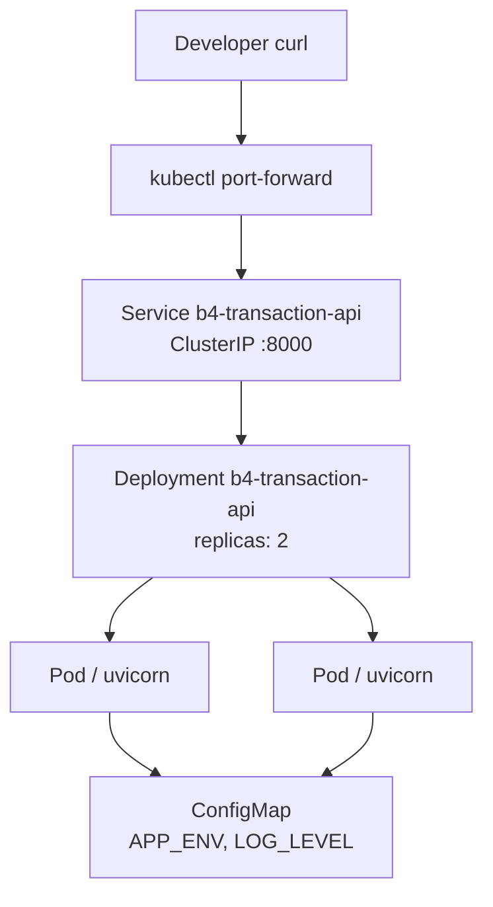

# Kubernetes Deployment Report

> **Target:** `Basic-repo-reader-and-builder/B4_FastAPI_greenfield_service`  
> **Cluster type:** kind (`d4-b4`)  
> **Generated:** 2026-06-21  
> **Agent:** D4 — Kubernetes Deployment  
> **Local verification:** [`run-status.md`](run-status.md)  
> **Setup guide:** [`README.md`](../README.md)

---

## Target Repository

| Field | Value |
| ----- | ----- |
| Application | Transaction API (FastAPI) |
| Container image | `b4-transaction-api:local` |
| Container port | **8000** |
| Service port | **8000** (ClusterIP) |
| Health endpoint | `GET /health` → `{"status":"ok"}` |
| Readiness probe | `GET /health:8000` |
| Liveness probe | `GET /health:8000` |
| Namespace | `b4` |
| Replicas | 2 |

---

## Repository Discovery

| Item | Source | Value |
| ---- | ------ | ----- |
| Application name | `app/main.py` | Transaction API |
| Startup command | `README.md` | `uvicorn app.main:app --host 0.0.0.0 --port 8000` |
| Health route | `app/main.py` | `/health` |
| Dependencies | `requirements.txt` | fastapi, uvicorn, pydantic (runtime) |
| Dockerfile | **Created** | `Dockerfile` (was missing) |
| External DB | None | In-memory store — no DB manifests required |

---

## Architecture Diagram



---

## Manifest Inventory

| File | Kind | Purpose |
| ---- | ---- | ------- |
| `k8s/namespace.yaml` | Namespace | Isolated `b4` environment |
| `k8s/configmap.yaml` | ConfigMap | Non-secret configuration |
| `k8s/deployment.yaml` | Deployment | 2 replicas, probes, resource limits |
| `k8s/service.yaml` | Service | ClusterIP port 8000 |
| `k8s/README.md` | Docs | Deploy / verify / teardown instructions |
| `Dockerfile` | Container | Python 3.11-slim + uvicorn |

Ingress and HPA **not generated** — not required for local kind verification; no ingress controller assumed.

---

## Validation Results

### Dry run — `kubectl apply --dry-run=client -f k8s/`

| Field | Value |
| ----- | ----- |
| Command | `kubectl apply --dry-run=client -f k8s/` |
| Exit code | **0** |
| Output | |

```
configmap/b4-transaction-api-config created (dry run)
deployment.apps/b4-transaction-api created (dry run)
namespace/b4 created (dry run)
service/b4-transaction-api created (dry run)
```

> **Note:** Dry-run requires a reachable cluster API. First attempt failed with no cluster; succeeded after `kind create cluster`.

---

## Cluster Verification

### kind

| Field | Value |
| ----- | ----- |
| Command | `kind create cluster --name d4-b4` |
| Exit code | **0** |
| Node image | `kindest/node:v1.36.1` |
| Context | `kind-d4-b4` |

```
Set kubectl context to "kind-d4-b4"
```

---

## Deployment Results

### Docker build

| Field | Value |
| ----- | ----- |
| Command | `docker build -t b4-transaction-api:local .` |
| Exit code | **0** |
| Image ID | `sha256:3fde92e042b6...` |

### kind load

| Field | Value |
| ----- | ----- |
| Command | `kind load docker-image b4-transaction-api:local --name d4-b4` |
| Exit code | **0** |

### kubectl apply

| Field | Value |
| ----- | ----- |
| Command | `kubectl apply -f k8s/` |
| Exit code | **0** |
| Output | |

```
namespace/b4 created
configmap/b4-transaction-api-config created
deployment.apps/b4-transaction-api created
service/b4-transaction-api created
```

> First apply had a transient namespace race; second `kubectl apply -f k8s/` succeeded.

### kubectl get pods

| Pod | Ready | Status |
| --- | ----- | ------ |
| `b4-transaction-api-6dc46f7b7c-bj2r8` | 1/1 | Running |
| `b4-transaction-api-6dc46f7b7c-gfntz` | 1/1 | Running |

### Rollout status

| Field | Value |
| ----- | ----- |
| Command | `kubectl rollout status deployment/b4-transaction-api -n b4` |
| Exit code | **0** |
| Output | `deployment "b4-transaction-api" successfully rolled out` |

---

## Service Verification

### kubectl get svc

| Name | Type | Cluster-IP | Port |
| ---- | ---- | ---------- | ---- |
| b4-transaction-api | ClusterIP | 10.96.120.220 | 8000/TCP |

### kubectl get endpoints

| Service | Endpoints |
| ------- | --------- |
| b4-transaction-api | `10.244.0.5:8000`, `10.244.0.6:8000` |

Two healthy pod endpoints registered.

---

## Runtime Verification

### Port forward

| Field | Value |
| ----- | ----- |
| Command | `kubectl port-forward svc/b4-transaction-api 18080:8000 -n b4` |
| Local port | **18080** (8000 was occupied by local Python on host) |

### Curl — health

| Field | Value |
| ----- | ----- |
| Command | `curl -i http://127.0.0.1:18080/health` |
| HTTP status | **200 OK** |
| Body | `{"status":"ok"}` |

### Curl — balance

| Field | Value |
| ----- | ----- |
| Command | `curl http://127.0.0.1:18080/balance` |
| HTTP status | **200** |
| Body | `{"balance":0.0,"transaction_count":0}` |

### Curl — root

| Field | Value |
| ----- | ----- |
| Body | `{"service":"Transaction API","docs":"/docs",...}` |

Runtime proof **verified** — FastAPI Transaction API responding from Kubernetes pods.

---

## Teardown

| Step | Command | Exit code |
| ---- | ------- | --------- |
| Delete resources | `kubectl delete -f k8s/` | **0** |
| Delete cluster | `kind delete cluster --name d4-b4` | **0** |

```
configmap "b4-transaction-api-config" deleted
deployment.apps "b4-transaction-api" deleted
namespace "b4" deleted
service "b4-transaction-api" deleted
Deleted nodes: ["d4-b4-control-plane"]
No kind clusters found.
```

---

## Verification Matrix

| Requirement | Evidence | Status |
| ----------- | -------- | ------ |
| Namespace exists | `namespace.yaml` applied | **PASS** |
| Deployment exists | `deployment.yaml` applied | **PASS** |
| Service exists | `service.yaml` applied | **PASS** |
| ConfigMap exists | `configmap.yaml` applied | **PASS** |
| Validation passed | dry-run exit 0 | **PASS** |
| Apply successful | kubectl apply exit 0 | **PASS** |
| Pods running | 2/2 Running, Ready | **PASS** |
| Rollout successful | rollout status exit 0 | **PASS** |
| Endpoints ready | 2 pod IPs on :8000 | **PASS** |
| Runtime response | curl /health 200, /balance 200 | **PASS** |
| Teardown successful | delete + kind delete exit 0 | **PASS** |

---

## Risks and Assumptions

### Verified

- All required manifests created under `B4_FastAPI_greenfield_service/k8s/`.
- Dockerfile created and image builds successfully.
- kind cluster `d4-b4` created and destroyed cleanly.
- Deployment rolled out with 2 healthy replicas.
- Service endpoints route to both pods.
- curl proof captured via port-forward on port **18080**.
- Teardown removes all resources and cluster.

### Inferred

- Same manifests would work on minikube with `minikube image load b4-transaction-api:local`.
- Production deployment would require a real registry, `imagePullPolicy`, and secrets management.

### Unknown

- Ingress-based routing not tested (no ingress controller on default kind cluster).
- HPA not tested (metrics-server not installed).
- Persistent storage not required (in-memory app).

---

## Manual Re-run

```bash
cd Basic-repo-reader-and-builder/B4_FastAPI_greenfield_service

kind create cluster --name d4-b4
docker build -t b4-transaction-api:local .
kind load docker-image b4-transaction-api:local --name d4-b4
kubectl apply -f k8s/
kubectl rollout status deployment/b4-transaction-api -n b4
kubectl port-forward svc/b4-transaction-api 18080:8000 -n b4
curl http://127.0.0.1:18080/health

kubectl delete -f k8s/
kind delete cluster --name d4-b4
```

Use port **18080** if local port 8000 is already in use.

---

## Local Verification (manual run)

A presentable record of the latest local deploy + curl run is in [`run-status.md`](run-status.md).

| Field | Value |
| ----- | ----- |
| Verified by | rohitverma · PMLMBT4677 |
| Cluster | kind `d4-b4` |
| Rollout | 2/2 pods Running |
| Port-forward | `18080:8000` |
| curl `/health` | `{"status":"ok"}` |
