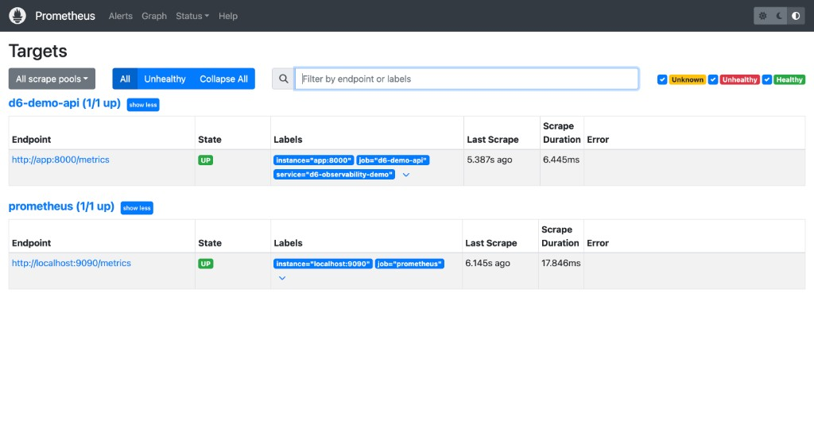

# D6 Observability Stack — Local Testing

| | |
| --- | --- |
| **Project** | D6 — Observability Bolt-On with Metrics and Dashboard |
| **Agent** | [`agent.md`](../agent.md) · slash command `/observability` |
| **Location** | `Infra-and-DevOps/D6_Observability_bolt_on_with_metrics` |
| **Last verified** | 2026-06-21 · rohitverma · PMLMBT4677 |
| **Environment** | Local · Colima · `docker-compose` |
| **Working directory** | `monitoring/` (for compose commands) |

### Live links

| Service | URL | Login |
| ------- | --- | ----- |
| **Grafana dashboard** | [http://localhost:3000/d/d6-app-dashboard](http://localhost:3000/d/d6-app-dashboard) | admin / admin |
| Prometheus targets | [http://localhost:9090/targets](http://localhost:9090/targets) | — |
| App health | [http://localhost:8008/health](http://localhost:8008/health) | — |
| App metrics | [http://localhost:8008/metrics](http://localhost:8008/metrics) | — |

---

## Summary

| Check | Result |
| ----- | ------ |
| Docker Compose up | **PASS** — 3 containers running |
| App health (`:8008/health`) | **PASS** — `{"status":"ok","service":"d6-observability-demo"}` |
| App metrics (`:8008/metrics`) | **PASS** — `http_requests_total` and `http_errors_total` present |
| Prometheus scrape targets | **PASS** — `d6-demo-api` and `prometheus` both **UP** (see [screenshot](#3-prometheus-targets-ui-verification)) |
| Prometheus query (total requests) | **PASS** — returned `151` |
| Load test from `monitoring/` | **FAIL** — wrong path (`./scripts/load-test.sh` not found) |
| Stats flowing end-to-end | **PASS** — metrics visible at app + Prometheus (prior load already applied) |

---

## 1. Start the stack

**Commands run:**

```bash
cd "Infra-and-DevOps/D6_Observability_bolt_on_with_metrics/monitoring"
docker-compose up -d --build
docker-compose ps
```

**Output:**

```
WARN[0000] Docker Compose requires buildx plugin to be installed 
Sending build context to Docker daemon  2.433kB
Step 1/10 : FROM python:3.11-slim
 ---> ae52c5bef62a
Step 2/10 : WORKDIR /app
 ---> Using cache
 ---> 5b554ca83566
Step 3/10 : ENV PYTHONDONTWRITEBYTECODE=1     PYTHONUNBUFFERED=1     SERVICE_NAME=d6-observability-demo
 ---> Using cache
 ---> 765756f1899c
Step 4/10 : COPY requirements.txt .
 ---> Using cache
 ---> 2a5567e5469a
Step 5/10 : RUN pip install --no-cache-dir -r requirements.txt
 ---> Using cache
 ---> 6c5de0279aeb
Step 6/10 : COPY app ./app
 ---> Using cache
 ---> f919a0126bc0
Step 7/10 : EXPOSE 8000
 ---> Using cache
 ---> d536d9320b87
Step 8/10 : HEALTHCHECK --interval=10s --timeout=5s --retries=5 --start-period=10s     CMD python -c "import urllib.request; urllib.request.urlopen('http://localhost:8000/health')"
 ---> Using cache
 ---> c9b7fcb2e585
Step 9/10 : CMD ["uvicorn", "app.main:app", "--host", "0.0.0.0", "--port", "8000"]
 ---> Using cache
 ---> 5876788fa169
Step 10/10 : LABEL com.docker.compose.image.builder=classic
 ---> Using cache
 ---> b66feaa93c27
Successfully built b66feaa93c27
Successfully tagged monitoring-app:latest
[+] up 4/4
 ✔ Image monitoring-app    Built                                                                 0.1s
 ✔ Container d6-demo-api   Healthy                                                               0.5s
 ✔ Container d6-prometheus Running                                                               0.0s
 ✔ Container d6-grafana    Running                                                               0.0s
```

**Container status (`docker-compose ps`):**

| NAME | SERVICE | STATUS | PORTS |
| ---- | ------- | ------ | ----- |
| d6-demo-api | app | Up 5 minutes (**healthy**) | 0.0.0.0:**8008**→8000/tcp |
| d6-grafana | grafana | Up 6 minutes | 0.0.0.0:3000→3000/tcp |
| d6-prometheus | prometheus | Up 6 minutes | 0.0.0.0:9090→9090/tcp |

**Exit code:** 0

---

## 2. Health and metrics endpoint

**Commands run:**

```bash
curl -s http://localhost:8008/health
curl -s http://localhost:8008/metrics | grep -E '^http_requests_total|^http_errors_total'
```

> **Note:** Lines starting with `#` were pasted as comments; zsh reported `command not found: #`. Run commands without comment lines, or use `#` only on its own line in a script.

**Health output:**

```json
{"status":"ok","service":"d6-observability-demo"}
```

**Metrics output:**

```
http_requests_total{endpoint="/health",method="GET",status="200"} 37.0
http_requests_total{endpoint="/api/items",method="GET",status="200"} 100.0
http_requests_total{endpoint="/api/error",method="GET",status="500"} 10.0
http_errors_total{endpoint="/api/error",method="GET",status="500"} 10.0
```

**Interpretation:** Stats **are coming** from the FastAPI app. Counters show prior traffic (`/api/items` = 100, `/api/error` = 10).

---

## 3. Prometheus targets (UI verification)

**URL:** [http://localhost:9090/targets](http://localhost:9090/targets)

**Screenshot (manual verification — rohitverma, 2026-06-21):**



| Job | Endpoint | State | Labels |
| --- | -------- | ----- | ------ |
| d6-demo-api | `http://app:8000/metrics` | **UP** | `instance="app:8000"`, `job="d6-demo-api"`, `service="d6-observability-demo"` |
| prometheus | `http://localhost:9090/metrics` | **UP** | `instance="localhost:9090"`, `job="prometheus"` |

Both targets show **1/1 up** with recent scrape times (~5–6s ago). Prometheus is successfully scraping the application.

---

## 4. Prometheus query — before / after load test attempt

**Commands run:**

```bash
echo "=== BEFORE ==="
curl -s -G 'http://localhost:9090/api/v1/query' \
  --data-urlencode 'query=sum(http_requests_total{job="d6-demo-api"})'

echo "=== LOAD ==="
./scripts/load-test.sh

echo "=== AFTER ==="
curl -s http://localhost:8008/metrics | grep '^http_requests_total'
curl -s -G 'http://localhost:9090/api/v1/query' \
  --data-urlencode 'query=sum(http_requests_total{job="d6-demo-api"})'
```

**Output:**

```
=== BEFORE ===
{"status":"success","data":{"resultType":"vector","result":[{"metric":{},"value":[1782051330.797,"151"]}]}}
=== LOAD ===
zsh: no such file or directory: ./scripts/load-test.sh
=== AFTER ===
http_requests_total{endpoint="/health",method="GET",status="200"} 42.0
http_requests_total{endpoint="/api/items",method="GET",status="200"} 100.0
http_requests_total{endpoint="/api/error",method="GET",status="500"} 10.0
{"status":"success","data":{"resultType":"vector","result":[{"metric":{},"value":[1782051330.850,"151"]}]}}
```

| Query | Before | After |
| ----- | ------ | ----- |
| `sum(http_requests_total{job="d6-demo-api"})` | **151** | **151** (unchanged — load test did not run) |
| `/health` counter (app metrics) | 37 | 42 (+5 from curl/health probes during test) |

**Why total stayed at 151:** `./scripts/load-test.sh` was run from `monitoring/`, but the script lives in the **project root** `scripts/` folder. No new `/api/items` traffic was generated in this run.

---

## 5. Correct load test command

Run from the **project root**, not `monitoring/`:

```bash
cd "Infra-and-DevOps/D6_Observability_bolt_on_with_metrics"
chmod +x scripts/load-test.sh
./scripts/load-test.sh
```

Or from `monitoring/`:

```bash
../scripts/load-test.sh
```

**Expected after a successful load test:**

- App metrics: `/api/items` increases by ~100
- Prometheus: `sum(http_requests_total)` increases by ~100+
- Grafana dashboard: **Total Requests** and **Error Count** panels update within ~15s

---

## 6. Grafana dashboard check

**Login:** [http://localhost:3000](http://localhost:3000) — admin / admin

**Dashboard:** [http://localhost:3000/d/d6-app-dashboard](http://localhost:3000/d/d6-app-dashboard)

After running the load test with the correct path, confirm:

| Panel | Expected |
| ----- | -------- |
| Total API Requests | Increases (e.g. +100) |
| Request Rate by Endpoint | Spike on `/api/items` |
| Errors Over Time | `/api/error` count increases |
| Requests by Endpoint (table) | `/api/items` 200, `/api/error` 500 |

---

## 7. Quick verification checklist

Copy-paste (no `#` comment lines):

```bash
# From monitoring/
docker-compose ps

curl -s http://localhost:8008/health
curl -s http://localhost:8008/metrics | grep -E '^http_requests_total|^http_errors_total'

curl -s -G 'http://localhost:9090/api/v1/query' \
  --data-urlencode 'query=sum(http_requests_total{job="d6-demo-api"})'

# From project root — generate new traffic
cd ..
./scripts/load-test.sh

curl -s -G 'http://localhost:9090/api/v1/query' \
  --data-urlencode 'query=sum(http_requests_total{job="d6-demo-api"})'
```

---

## 8. Verdict

| Layer | Stats coming? | Evidence |
| ----- | ------------- | -------- |
| FastAPI `/metrics` | **Yes** | Counters for health, items, errors |
| Prometheus scrape | **Yes** | Targets UP screenshot + query returns 151 |
| Grafana | **Inferred OK** | Datasource/dashboard provisioned; run load test then refresh UI |
| Load test (this session) | **Not run** | Wrong working directory for script |

**Overall:** The observability pipeline is **working**. App metrics and Prometheus scraping are confirmed. To see stats **increase** in a before/after test, re-run `./scripts/load-test.sh` from the project root.

---

## Related docs

| Document | Purpose |
| -------- | ------- |
| [`../README.md`](../README.md) | Full setup and verify guide |
| [`observability-report.md`](observability-report.md) | Agent evaluation report |
| [`live-traffic-proof.md`](live-traffic-proof.md) | Automated before/after traffic proof |
| [`prometheus-verification.md`](prometheus-verification.md) | Prometheus scrape details |
