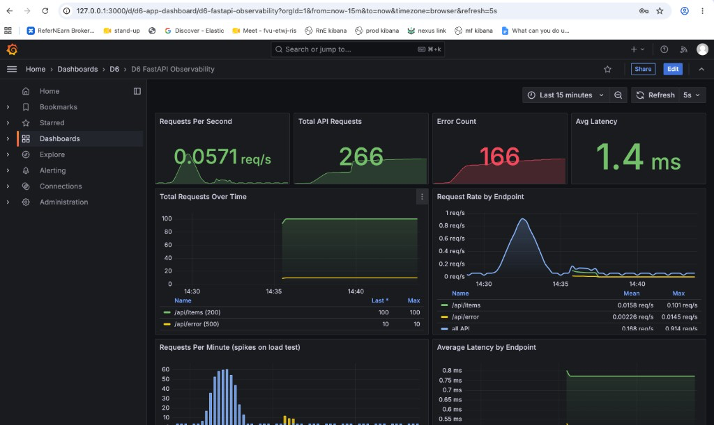

# Infra & DevOps

> **Fourth skill track** in the [AI Agent Tasks](https://github.com/Rohitverma9569/AI-Agent-Tasks_Rohit_Verma) monorepo. Six Cursor agents for Terraform IaC, Docker Compose stacks, CI pipelines, Kubernetes deployment, reproducible dev environments, and observability with Prometheus and Grafana.

| | |
| --- | --- |
| **Agents** | **6** (D1–D6) — all complete |
| **Folder** | `Infra-and-DevOps/` |
| **Docs hub** | [`docs/README.md`](../docs/README.md) |
| **Catalog** | [agent-catalog.vercel.app](https://agent-catalog.vercel.app) |

---

## Table of Contents

1. [Learning Objectives](#1-learning-objectives)
2. [Content Categories](#2-content-categories)
3. [Task Overview](#3-task-overview)
4. [Cursor Commands](#4-cursor-commands)
5. [Infrastructure Projects (D1–D6)](#5-infrastructure-projects-d1d6)
6. [Reference Stack Specifications](#6-reference-stack-specifications)
7. [Requirements & Environment Setup](#7-requirements--environment-setup)
8. [Agent Workflow Guidelines](#8-agent-workflow-guidelines)
9. [Task Folder Structure](#9-task-folder-structure)
10. [Quick Start Guide](#10-quick-start-guide)
11. [Next Steps](#11-next-steps)

---

## 1. Learning Objectives

By the end of this track you should be able to provision infrastructure as code, run multi-container stacks locally, gate merges with CI, deploy to Kubernetes, bootstrap unfamiliar repos, and bolt on metrics and dashboards with proof.

| Outcome | Agent | What you gain |
| ------- | ----- | ------------- |
| Design and validate Terraform for a small service | D1 | `terraform/` module + `docs/terraform-report.md` with fmt/validate/plan evidence |
| Run API + database + worker on Docker Compose | D2 | `docker-compose.yml`, E2E scripts, `docs/docker-compose-report.md` |
| Add lint → test → build CI pipeline | D3 | `.github/workflows/build.yml` + `docs/ci-pipeline-report.md` |
| Deploy containerized apps to kind/minikube | D4 | `k8s/` manifests + `docs/kubernetes-deployment-report.md` |
| One-command bootstrap for any repo | D5 | Bootstrap files in target repo + `docs/dev-bootstrap-report.md` |
| Add logging, metrics, Prometheus, Grafana | D6 | Observability stack + `docs/observability-report.md` |

Golden reports in this folder were verified between **2026-06-21** and **2026-06-22**. D6 is the only D-tier project with a full local runnable observability stack.

---

## 2. Content Categories

Infra work groups into three modes.

### Infrastructure as code (D1)

**Terraform module in-repo** — AWS edge health service (S3 + Lambda + API Gateway + IAM + CloudWatch). Validates against LocalStack or real AWS credentials.

| Path | Purpose |
| ---- | ------- |
| `D1_Terraform_Plan_For_a_small_service/terraform/` | `.tf` modules, `lambda/`, `terraform.tfvars.example` |
| `D1_.../docs/terraform-report.md` | Plan evidence and resource summary |

### Container orchestration (D2, D4)

| Agent | Scope | Where artifacts live |
| ----- | ----- | -------------------- |
| **D2** | Local Compose stack — API + PostgreSQL + worker | `D2_Docker-Compose_Stack/` |
| **D4** | Kubernetes manifests for a containerized app | `k8s/` beside the target service (reference: B4 FastAPI) |

### Pipeline, bootstrap & observability (D3, D5, D6)

| Agent | Scope | Output |
| ----- | ----- | ------ |
| **D3** | GitHub Actions — lint, test, Docker build | Workflow under `D3_Ci_pipiline_that_lints/.github/workflows/` |
| **D5** | Reproducible dev environment for any target repo | Bootstrap files in **target repo**; report in D5 folder |
| **D6** | FastAPI + Prometheus + Grafana | Full stack under `D6_Observability_bolt_on_with_metrics/` |

---

## 3. Task Overview

| ID | Mode | Output / proof | Where to read more |
| -- | ---- | -------------- | ------------------ |
| **D1** | IaC + report | `terraform/` module · [`docs/terraform-report.md`](D1_Terraform_Plan_For_a_small_service/docs/terraform-report.md) | [D1 terraform README](D1_Terraform_Plan_For_a_small_service/terraform/README.md) |
| **D2** | Compose stack | `docker-compose.yml` · E2E **7/7** · [`docs/docker-compose-report.md`](D2_Docker-Compose_Stack/docs/docker-compose-report.md) | [D2 README](D2_Docker-Compose_Stack/README.md) |
| **D3** | CI pipeline | [`.github/workflows/build.yml`](D3_Ci_pipiline_that_lints/.github/workflows/build.yml) · [`docs/ci-pipeline-report.md`](D3_Ci_pipiline_that_lints/docs/ci-pipeline-report.md) | [D3 README](D3_Ci_pipiline_that_lints/README.md) |
| **D4** | K8s deploy | `k8s/` manifests · [`docs/kubernetes-deployment-report.md`](D4_Kubernetes_Deployment/docs/kubernetes-deployment-report.md) | [D4 README](D4_Kubernetes_Deployment/README.md) |
| **D5** | Bootstrap | Target-repo setup files · [`docs/dev-bootstrap-report.md`](D5_Reproducible_dev_environment/docs/dev-bootstrap-report.md) | [D5 README](D5_Reproducible_dev_environment/README.md) |
| **D6** | Observability | Prometheus + Grafana · [`docs/observability-report.md`](D6_Observability_bolt_on_with_metrics/docs/observability-report.md) | [D6 README](D6_Observability_bolt_on_with_metrics/README.md) |

---

## 4. Cursor Commands

Type **`/`** in Cursor Agent chat to invoke any Infra agent.

| ID | Project | Cursor command | Mode | Example invocation |
| -- | ------- | -------------- | ---- | ------------------ |
| **D1** | Terraform Plan | `/terraform-plan` | IaC | `/terraform-plan Infra-and-DevOps/D1_Terraform_Plan_For_a_small_service` |
| **D2** | Docker Compose Stack | `/docker-compose-stack` | Compose | `/docker-compose-stack Infra-and-DevOps/D2_Docker-Compose_Stack` |
| **D3** | CI Pipeline | `/ci-pipeline` | CI | `/ci-pipeline Infra-and-DevOps/D3_Ci_pipiline_that_lints github` |
| **D4** | Kubernetes Deployment | `/kubernetes-deployment` | K8s | `/kubernetes-deployment Basic-repo-reader-and-builder/B4_FastAPI_greenfield_service kind` |
| **D5** | Reproducible Dev Environment | `/reproducible-dev-environment` | Bootstrap | `/reproducible-dev-environment ~/Downloads/bo-migration-service asdf` |
| **D6** | Observability | `/observability` | Metrics | `/observability Infra-and-DevOps/D6_Observability_bolt_on_with_metrics` |

| Command | Primary output |
| ------- | -------------- |
| `/terraform-plan` | [`docs/terraform-report.md`](D1_Terraform_Plan_For_a_small_service/docs/terraform-report.md) |
| `/docker-compose-stack` | [`docs/docker-compose-report.md`](D2_Docker-Compose_Stack/docs/docker-compose-report.md) |
| `/ci-pipeline` | [`docs/ci-pipeline-report.md`](D3_Ci_pipiline_that_lints/docs/ci-pipeline-report.md) |
| `/kubernetes-deployment` | [`docs/kubernetes-deployment-report.md`](D4_Kubernetes_Deployment/docs/kubernetes-deployment-report.md) |
| `/reproducible-dev-environment` | [`docs/dev-bootstrap-report.md`](D5_Reproducible_dev_environment/docs/dev-bootstrap-report.md) |
| `/observability` | [`docs/observability-report.md`](D6_Observability_bolt_on_with_metrics/docs/observability-report.md) |

Browse all **24** agents: [agent-catalog.vercel.app](https://agent-catalog.vercel.app)

---

## 5. Infrastructure Projects (D1–D6)

### D1 — Terraform Plan for a Small Service

**Purpose:** Design, implement, and document Terraform for a small AWS edge health service with evidence-backed `fmt`, `validate`, and `plan`.

**Architecture:**

```
Client → API Gateway HTTP API (GET /health) → Lambda (Node.js 20) → CloudWatch Logs
S3 artifacts bucket ← Lambda deployment package
```

**Deliverables:**

1. `terraform/` — `main.tf`, `variables.tf`, `outputs.tf`, `lambda/index.js`
2. [`docs/terraform-report.md`](D1_Terraform_Plan_For_a_small_service/docs/terraform-report.md) — resource table, security controls, plan output
3. Optional LocalStack validation — no AWS account required

| Doc | Path |
| --- | ---- |
| Module README | [terraform/README.md](D1_Terraform_Plan_For_a_small_service/terraform/README.md) |
| Workflow | [agent.md](D1_Terraform_Plan_For_a_small_service/agent.md) |

### D2 — Docker Compose Stack

**Purpose:** Multi-service local stack — Express API, PostgreSQL, and a background worker that polls and processes jobs.

**Architecture:**

```
Client → API (:8080) → PostgreSQL ← Worker (polls pending jobs)
```

**Golden run:** `docker-compose up` · `GET /health` returns database connected · E2E **7 passed · 0 failed**

| Doc | Path |
| --- | ---- |
| Overview | [D2/README.md](D2_Docker-Compose_Stack/README.md) |
| Run status | [docs/run-status.md](D2_Docker-Compose_Stack/docs/run-status.md) |
| Workflow | [agent.md](D2_Docker-Compose_Stack/agent.md) |

### D3 — CI Pipeline (Lint + Test)

**Purpose:** GitHub Actions workflow — ESLint → unit tests → Docker image build with commit SHA tags.

**Pipeline:**

```
push / pull_request → lint → test → build (docker, push: false)
```

**App:** `d3-ci-demo-app` Node.js service in [`D3_Ci_pipiline_that_lints/app/`](D3_Ci_pipiline_that_lints/app/)

| Doc | Path |
| --- | ---- |
| Overview | [D3/README.md](D3_Ci_pipiline_that_lints/README.md) |
| Workflow file | [.github/workflows/build.yml](D3_Ci_pipiline_that_lints/.github/workflows/build.yml) |
| Workflow | [agent.md](D3_Ci_pipiline_that_lints/agent.md) |

### D4 — Kubernetes Deployment

**Purpose:** Deploy a containerized application to a local **kind** or **minikube** cluster with rollout proof and curl verification.

**Reference target:** `B4_FastAPI_greenfield_service` — Deployment (2 replicas), Service, ConfigMap under `k8s/`

| Doc | Path |
| --- | ---- |
| Overview | [D4/README.md](D4_Kubernetes_Deployment/README.md) |
| Workflow | [agent.md](D4_Kubernetes_Deployment/agent.md) |

### D5 — Reproducible Dev Environment

**Purpose:** Make any repository runnable from a fresh clone with a **single bootstrap command**.

**Supported approaches:** devcontainer · Nix flake · Makefile + asdf · Makefile + mise

Bootstrap files are written in the **target repository**; the report stays in this folder.

| Doc | Path |
| --- | ---- |
| Overview | [D5/README.md](D5_Reproducible_dev_environment/README.md) |
| Golden report | [docs/dev-bootstrap-report.md](D5_Reproducible_dev_environment/docs/dev-bootstrap-report.md) |
| Workflow | [agent.md](D5_Reproducible_dev_environment/agent.md) |

### D6 — Observability Bolt-On with Metrics

**Purpose:** Add structured JSON logging, Prometheus `/metrics`, Grafana dashboards, and load-test proof to a FastAPI service.

**Stack:** FastAPI app (**8008** host) · Prometheus (**9090**) · Grafana (**3000**)

| Doc | Path |
| --- | ---- |
| Overview | [D6/README.md](D6_Observability_bolt_on_with_metrics/README.md) |
| Local testing | [docs/local-testing.md](D6_Observability_bolt_on_with_metrics/docs/local-testing.md) |
| Workflow | [agent.md](D6_Observability_bolt_on_with_metrics/agent.md) |

---

## 6. Reference Stack Specifications

### D2 — Compose API (port 8080)

| HTTP | Path | Behavior |
| ---- | ---- | -------- |
| GET | `/health` | Liveness — `{"status":"ok","database":"connected"}` |
| GET | `/jobs` | List jobs from PostgreSQL |
| POST | `/jobs` | Create a new pending job (worker processes it) |

**Containers:**

| Name | Port | Role |
| ---- | ---- | ---- |
| `d2-api` | **8080** | Express API |
| `d2-postgres` | 5432 (internal) | PostgreSQL with seed schema |
| `d2-worker` | — | Polls and completes pending jobs |

```bash
curl http://localhost:8080/health
cd Infra-and-DevOps/D2_Docker-Compose_Stack && ./scripts/run-e2e-tests.sh
```

### D6 — Observability endpoints (port 8008)

| HTTP | Path | Behavior |
| ---- | ---- | -------- |
| GET | `/health` | App liveness |
| GET | `/metrics` | Prometheus scrape target |
| GET | `/api/items` | Demo traffic endpoint |
| GET | `/api/error` | Demo error path for error-rate panels |
| GET | `/docs` | FastAPI Swagger UI |

**Evidence screenshots** (open in editor if preview does not render):

| Screenshot | File |
| ---------- | ---- |
| Grafana dashboard overview | [`grafana-d6-fastapi-dashboard-overview.png`](D6_Observability_bolt_on_with_metrics/docs/evidence/grafana-d6-fastapi-dashboard-overview.png) |
| RPM, latency, errors panels | [`grafana-d6-dashboard-rpm-latency-errors.png`](D6_Observability_bolt_on_with_metrics/docs/evidence/grafana-d6-dashboard-rpm-latency-errors.png) |
| Errors + endpoints table | [`grafana-d6-dashboard-errors-endpoints-table.png`](D6_Observability_bolt_on_with_metrics/docs/evidence/grafana-d6-dashboard-errors-endpoints-table.png) |
| Prometheus targets UP | [`prometheus-targets-up.png`](D6_Observability_bolt_on_with_metrics/docs/evidence/prometheus-targets-up.png) |
| App `/metrics` on port 8008 | [`prometheus-metrics-endpoint-8008.png`](D6_Observability_bolt_on_with_metrics/docs/evidence/prometheus-metrics-endpoint-8008.png) |

**Local URLs (stack running):**

| Service | URL |
| ------- | --- |
| Grafana dashboard | [http://127.0.0.1:3000/d/d6-app-dashboard](http://127.0.0.1:3000/d/d6-app-dashboard) |
| Prometheus targets | [http://127.0.0.1:9090/targets](http://127.0.0.1:9090/targets) |
| App metrics | [http://127.0.0.1:8008/metrics](http://127.0.0.1:8008/metrics) |

> Grafana uses port **3000**. Stop B5 or agent-catalog on that port first, then run `docker-compose restart grafana` in `monitoring/`. Use **127.0.0.1:3000** if `localhost` hits the wrong service.



```bash
cd Infra-and-DevOps/D6_Observability_bolt_on_with_metrics/monitoring
docker-compose up -d --build
```

---

## 7. Requirements & Environment Setup

### Tooling by agent

| Tool | Version | Agents |
| ---- | ------- | ------ |
| [Terraform](https://www.terraform.io/downloads) | >= 1.5.0 | D1 |
| [Docker](https://docs.docker.com/get-docker/) + Compose | recent | D2, D3, D4, D6 |
| [Node.js](https://nodejs.org/) | 18+ | D2, D3 |
| [kubectl](https://kubernetes.io/docs/tasks/tools/) | recent | D4 |
| [kind](https://kind.sigs.k8s.io/) or [minikube](https://minikube.sigs.k8s.io/) | recent | D4 |
| Python | 3.9+ | D6 FastAPI app |
| asdf / mise / Nix / devcontainer | optional | D5 (per approach) |

### External target (D4, D5)

D4 and D5 point at a service or repo you provide:

```text
/kubernetes-deployment Basic-repo-reader-and-builder/B4_FastAPI_greenfield_service kind
/reproducible-dev-environment ~/Downloads/bo-migration-service asdf
```

**Monorepo setup:** [`docs/complete-setup.md`](../docs/complete-setup.md) · [`docs/getting-started.md`](../docs/getting-started.md) · [`docs/runnable-projects.md`](../docs/runnable-projects.md)

---

## 8. Agent Workflow Guidelines

Each D1–D6 task defines behaviour in **`agent.md`**. Cursor registers matching skills under **`.cursor/skills/`** at the repository root.

| ID | Workflow file | Slash command |
| -- | ------------- | ------------- |
| D1 | [D1/agent.md](D1_Terraform_Plan_For_a_small_service/agent.md) | `/terraform-plan` |
| D2 | [D2/agent.md](D2_Docker-Compose_Stack/agent.md) | `/docker-compose-stack` |
| D3 | [D3/agent.md](D3_Ci_pipiline_that_lints/agent.md) | `/ci-pipeline` |
| D4 | [D4/agent.md](D4_Kubernetes_Deployment/agent.md) | `/kubernetes-deployment` |
| D5 | [D5/agent.md](D5_Reproducible_dev_environment/agent.md) | `/reproducible-dev-environment` |
| D6 | [D6/agent.md](D6_Observability_bolt_on_with_metrics/agent.md) | `/observability` |

**Session checklist:**

1. Read the project `README.md` and `docs/run-status.md` (where present) for last verification
2. Follow the step list in `agent.md`
3. For **D1** — capture `terraform fmt`, `validate`, and `plan` output in the report
4. For **D2/D6** — run `docker-compose up`, smoke-test endpoints, capture logs
5. For **D3** — run lint, test, and Docker build locally before pushing workflow
6. For **D4** — apply `k8s/` manifests, port-forward, curl `/health`
7. For **D5** — bootstrap files go in the **target repo**; report stays here

---

## 9. Task Folder Structure

```
Infra-and-DevOps/
├── README.md
│
├── D1_Terraform_Plan_For_a_small_service/
│   ├── agent.md · terraform/ · docs/terraform-report.md
│
├── D2_Docker-Compose_Stack/
│   ├── agent.md · docker-compose.yml · api/ · worker/ · db/
│   ├── scripts/ · docs/docker-compose-report.md · docs/run-status.md
│
├── D3_Ci_pipiline_that_lints/
│   ├── agent.md · app/ · .github/workflows/build.yml
│   └── docs/ci-pipeline-report.md · docs/run-status.md
│
├── D4_Kubernetes_Deployment/
│   ├── agent.md · docs/kubernetes-deployment-report.md · docs/run-status.md
│
├── D5_Reproducible_dev_environment/
│   ├── agent.md · docs/dev-bootstrap-report.md
│
└── D6_Observability_bolt_on_with_metrics/
    ├── agent.md · app/ · monitoring/ · scripts/load-test.sh · tests/
    └── docs/observability-report.md · local-testing.md · evidence/
```

| File | Role |
| ---- | ---- |
| `README.md` | Task summary, invoke examples, live URLs |
| `agent.md` | Workflow steps and output schema |
| `docs/*-report.md` | Deliverable written per agent run |
| `docs/run-status.md` | Dated verification captures (D2, D3, D4) |
| `docker-compose.yml` | D2 stack · D6 monitoring stack |
| `k8s/` | Lives beside the deployed service (D4 reference: B4) |

---

## 10. Quick Start Guide

Pick one path to validate the Infra track locally.

### Path 1 — Terraform (D1)

```bash
cd Infra-and-DevOps/D1_Terraform_Plan_For_a_small_service/terraform
terraform init && terraform validate && terraform plan
```

Compare output to [`docs/terraform-report.md`](D1_Terraform_Plan_For_a_small_service/docs/terraform-report.md). For cloud-free validation, use LocalStack — see [terraform/README.md](D1_Terraform_Plan_For_a_small_service/terraform/README.md).

### Path 2 — Docker Compose stack (D2)

```bash
cd Infra-and-DevOps/D2_Docker-Compose_Stack
docker-compose up -d --build
./scripts/seed-data.sh && ./scripts/run-e2e-tests.sh
curl http://localhost:8080/health
```

Expected: **7 passed · 0 failed** from E2E script.

### Path 3 — CI pipeline (D3)

```bash
cd Infra-and-DevOps/D3_Ci_pipiline_that_lints/app
npm ci && npm run lint && npm test
```

Or invoke `/ci-pipeline Infra-and-DevOps/D3_Ci_pipiline_that_lints github` in Cursor.

### Path 4 — Observability stack (D6)

```bash
cd Infra-and-DevOps/D6_Observability_bolt_on_with_metrics/monitoring
docker-compose up -d --build

cd .. && ./scripts/load-test.sh
```

Open [Grafana dashboard](http://localhost:3000/d/d6-app-dashboard) (admin / admin). Full runbook: [`docs/local-testing.md`](D6_Observability_bolt_on_with_metrics/docs/local-testing.md).

### Path 5 — Bootstrap or Kubernetes (D5 · D4)

```text
/reproducible-dev-environment ~/Downloads/bo-migration-service asdf
/kubernetes-deployment Basic-repo-reader-and-builder/B4_FastAPI_greenfield_service kind
```

Reports land in [`D5_Reproducible_dev_environment/docs/`](D5_Reproducible_dev_environment/docs/) and [`D4_Kubernetes_Deployment/docs/`](D4_Kubernetes_Deployment/docs/) respectively.

Full command reference: [§4 Cursor Commands](#4-cursor-commands) · runnable index: [`docs/runnable-projects.md`](../docs/runnable-projects.md)

---

## 11. Next Steps

When D1–D6 are complete, you have finished all **four skill tracks** in this monorepo.

| Resource | Purpose |
| -------- | ------- |
| [`docs/project-status.md`](../docs/project-status.md) | Assignment progress and grader checklist |
| [`docs/README.md`](../docs/README.md) | Full platform map — all 24 agents |
| [agent-catalog.vercel.app](https://agent-catalog.vercel.app) | Browse agents, slash commands, and tier progress |
| [`docs/runnable-projects.md`](../docs/runnable-projects.md) | Run every local demo in one place |

**Central docs:** [`docs/README.md`](../docs/README.md) · [`docs/getting-started.md`](../docs/getting-started.md) · [`docs/complete-setup.md`](../docs/complete-setup.md)
