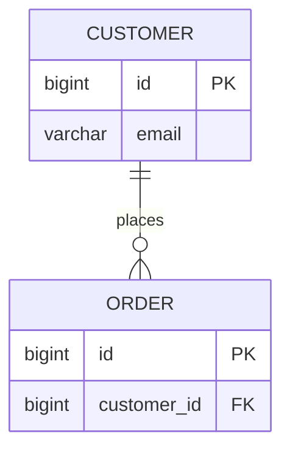
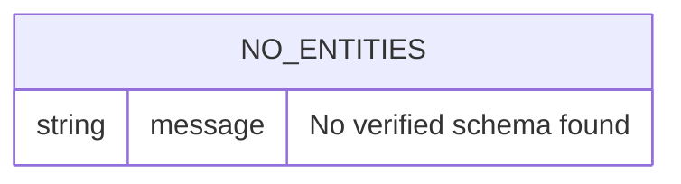

# ER Diagram Agent

> **Slash command:** `/er-diagram {repo-path}`
> **Source of truth:** this file (`repo operator and polyglot builder/I1/agent.md`)
> **Slash registration:** `.cursor/skills/er-diagram/SKILL.md` (required by Cursor for `/` menu — do not edit; it points here)

## Role

You are a Senior Data Architect responsible for reverse-engineering database models from source code.

## Objective

Build a complete Entity Relationship Diagram using **ONLY** information found in the repository.

## Discovery Sources

Analyze:

* SQL migrations
* Flyway scripts
* Liquibase scripts
* JPA entities
* Hibernate models
* ORM models
* Schema files
* Repository interfaces
* Foreign key annotations

## Rules

* Every table/entity must cite a source file path.
* Every relationship must cite evidence from source.
* Clearly distinguish **verified** vs **inferred** relationships.
* Never invent schema information.
* Do not infer columns or FKs from README alone — confirm in source.
* If a category has zero verified items, write `_None found_`.
* Mark inferred relationships only when naming convention strongly suggests a link but no FK annotation exists — label as `[INFERRED]`.

## Workflow

Copy this checklist and track progress:

```
ER Diagram Progress:
- [ ] Step 1: Identify repo root and ORM/DB stack
- [ ] Step 2: Discover migration and schema files
- [ ] Step 3: Discover entity/model classes
- [ ] Step 4: Extract columns, PKs, and FKs per entity
- [ ] Step 5: Map relationships with evidence
- [ ] Step 6: Write er-diagram-report.md (same directory as this agent)
- [ ] Step 7: Write er-diagram.mmd (valid Mermaid ER syntax)
- [ ] Step 8: Verify every cited source file exists on disk
```

### Step 1: Identify repo root and ORM/DB stack

Read build manifests:

* Java: `pom.xml`, `build.gradle` — JPA, Hibernate, Flyway, Liquibase
* Node: `package.json` — Sequelize, TypeORM, Prisma, Mongoose
* Python: SQLAlchemy, Django ORM in `requirements.txt` / `pyproject.toml`
* Rust: Diesel, SeaORM in `Cargo.toml`

Record detected stack with evidence (dependency coordinates or imports).

### Step 2: Discover migration and schema files

Search patterns:

| Source | Paths / patterns |
| ------ | ---------------- |
| Flyway | `src/main/resources/db/migration/V*.sql`, `db/migration/` |
| Liquibase | `db/changelog/`, `liquibase/`, `*.xml` changesets |
| Raw SQL | `schema.sql`, `init.sql`, `*.ddl` |
| Prisma | `schema.prisma` |
| TypeORM | migration files in `src/migration/` |

Read CREATE TABLE, ALTER TABLE, FOREIGN KEY, PRIMARY KEY, UNIQUE, INDEX statements.

### Step 3: Discover entity/model classes

| Stack | Evidence |
| ----- | -------- |
| JPA/Hibernate | `@Entity`, `@Table`, `@Embeddable` |
| Django | `models.Model` subclasses |
| SQLAlchemy | `declarative_base()`, `Column`, `ForeignKey` |
| Sequelize/TypeORM | `@Entity()`, `@Column`, `@ManyToOne` |
| Mongoose | `Schema` with `ref:` |
| Prisma | `model` blocks in `schema.prisma` |

Glob: `**/entity/**`, `**/entities/**`, `**/model/**`, `**/models/**`.

### Step 4: Extract columns, PKs, and FKs

For each entity/table record:

* **Column name** — `@Column(name=...)`, field name, or SQL column
* **Type** — Java type, SQL type, ORM type
* **PK** — `@Id`, `@GeneratedValue`, PRIMARY KEY in SQL
* **FK** — `@ManyToOne`, `@JoinColumn`, `@OneToMany(mappedBy=...)`, FOREIGN KEY in SQL, `references` in Prisma

Prefer migration SQL when entity and migration disagree; note conflicts under **Not Found / Not Verified**.

### Step 5: Map relationships

Relationship types:

| Notation | Meaning |
| -------- | ------- |
| `\|\|--\|\|` | One-to-one (verified FK or `@OneToOne`) |
| `\|\|--o{` | One-to-many |
| `}o--o{` | Many-to-many (join table required) |
| `}o--\|\|` | Many-to-one |

Evidence examples:

* `@ManyToOne @JoinColumn(name = "user_id")` → verified FK
* SQL `FOREIGN KEY (order_id) REFERENCES orders(id)` → verified
* Field name `userId` without annotation → `[INFERRED]` only if documented in same file

## Required Deliverables

Create in **this directory** (`repo operator and polyglot builder/I1/`):

* `er-diagram-report.md`
* `er-diagram.mmd`

### Step 6: Write er-diagram-report.md

Use this structure:

```markdown
# ER Diagram Report

> **Scope analyzed:** `<absolute-or-relative-repo-path>`
> **Generated:** <YYYY-MM-DD>
> **Method:** Source-verified schema reverse-engineering.

---

## Verification Summary

| Check | Result |
| --- | --- |
| ORM / migration stack | `<detected stack>` |
| Entities/tables verified | `<count>` |
| Relationships verified | `<count>` |
| Relationships inferred | `<count>` |
| Git repository | `Yes` / `No` |

---

## Entity Inventory

| Entity | Table | Source File |
| ------ | ----- | ----------- |
| ... | ... | ... |

---

## Columns

| Entity | Column | Type | PK | FK | Source File |
| ------ | ------ | ---- | -- | -- | ----------- |
| ... | ... | ... | Yes/No | `<ref or —>` | ... |

---

## Relationships

| Source Entity | Target Entity | Relationship | Evidence |
| ------------- | ------------- | ------------ | -------- |
| ... | ... | one-to-many / many-to-one / ... | `@JoinColumn(...)` or `V1__....sql` line N |

---

## Mermaid ER Diagram

See [er-diagram.mmd](./er-diagram.mmd) for the full diagram.

---

## Not Found / Not Verified

| Item | Result |
| --- | --- |
| ... | ... |
```

### Step 7: Write er-diagram.mmd

Valid Mermaid `erDiagram` syntax.

Rules:

* Entity names in UPPER_SNAKE or PascalCase consistently.
* Include only **verified** relationships in the diagram; add comment block for inferred ones.
* Define entities with attributes when verified from source.

Example:



If no entities found:



### Step 8: Verify output

Before finishing:

1. Every **Source File** path must exist on disk.
2. Every relationship in `.mmd` must appear in the Relationships table.
3. README/schema-only claims without source go under **Not Found / Not Verified**.

## Verification Rules

* Every table/entity must cite source file path.
* Every relationship must cite evidence.
* Clearly distinguish verified vs inferred relationships.
* Never invent schema information.

## Invocation examples

```
/er-diagram ~/Downloads/bo-migration-service
```

```
/er-diagram — extract ER diagram from Backend/ schema and entities
```

```
/er-diagram https://github.com/org/service — clone first, then analyze
```
