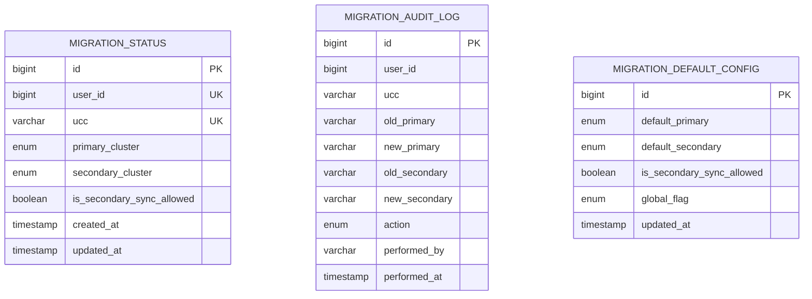
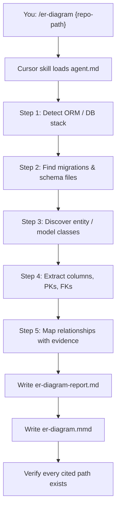

# I1 — ER Diagram from Repository

> **Evaluation-grade agent deliverable.** Source-verified schema reverse-engineering with cited entities, columns, relationships, and a Mermaid ER diagram.

Reverse-engineer database models from source code and produce a **verified** Entity Relationship Diagram. Every table, column, and relationship must cite evidence on disk — nothing is invented.

```bash
/er-diagram ~/Downloads/bo-migration-service
```

| | |
| --- | --- |
| **Project** | I1 — ER Diagram from Repository |
| **Agent** | [`agent.md`](agent.md) · slash command `/er-diagram` |
| **Cursor skill** | `.cursor/skills/er-diagram/SKILL.md` |
| **Location** | `Intermediate-repo operator and polyglot builder/I1_ER_diagram_from_repo` |
| **Latest report** | [`er-diagram-report.md`](er-diagram-report.md) · 2026-06-17 |
| **Latest diagram** | [`er-diagram.mmd`](er-diagram.mmd) |
| **Latest target** | `~/Downloads/bo-migration-service` — Spring Boot migration service |
| **Mode** | Analysis only — no target-repo edits |

---

## Executive Summary (Latest Run)

| Metric | Result |
| ------ | ------ |
| **ORM / migration stack** | Spring Boot Data JPA · Hibernate (MySQL) · Flyway |
| **Entities / tables verified** | **3** |
| **Relationships verified** | **0** |
| **Relationships inferred** | **1** |
| **Entity / migration conflicts** | **None** |

```
┌──────────────────────────────────────────────────────┐
│  ER DIAGRAM SUMMARY — bo-migration-service           │
├──────────────────────────────────────────────────────┤
│  migration_status          8 columns · PK id         │
│  migration_audit_log      10 columns · PK id         │
│  migration_default_config  6 columns · PK id         │
│  Verified FK relationships     0                     │
│  Inferred links                1 (user_id pattern)   │
└──────────────────────────────────────────────────────┘
```

### Latest schema at a glance



> **Note:** The three tables are **standalone** in source — no SQL `FOREIGN KEY` constraints and no JPA association mappings. A `user_id` link between `migration_status` and `migration_audit_log` is documented as `[INFERRED]` only.

---

## Objective

From [`agent.md`](agent.md):

| Goal | Description |
| ---- | ----------- |
| **Primary** | Build a complete ER diagram using **only** information found in the repository |
| **Role** | Senior Data Architect — reverse-engineer models from code |
| **Output** | `er-diagram-report.md` + `er-diagram.mmd` |
| **Evidence** | Every entity, column, and relationship cites a source file path |
| **Code changes** | **None** — analysis and documentation only |

**Success means:** All tables are inventoried with columns and types, relationships are classified verified vs inferred, every cited path exists on disk, and the Mermaid diagram matches the report.

---

## Requirement Mapping

Maps agent requirements → deliverables → evidence location.

| # | Requirement | Deliverable | Evidence |
| - | ----------- | ----------- | -------- |
| R1 | Discover ORM / migration stack | Stack table with dependency evidence | [`er-diagram-report.md`](er-diagram-report.md) § Verification Summary |
| R2 | Discover entities / tables | Entity inventory table | § Entity Inventory |
| R3 | Extract columns, PKs, FKs | Per-entity column tables | § Columns |
| R4 | Map relationships with evidence | Relationships table | § Relationships |
| R5 | Distinguish verified vs inferred | `[INFERRED]` labels | Relationships table + Not Found section |
| R6 | Cite source file per item | Source File column on every row | All tables in report |
| R7 | Mermaid ER diagram | `er-diagram.mmd` | Verified entities + attributes |
| R8 | Document gaps | Not Found / Not Verified section | § Not Found / Not Verified |
| R9 | Verify cited paths exist | Step 8 checklist | Agent workflow |
| R10 | No invented schema | Rules in `agent.md` | Zero undocumented columns |

---

## Architecture

### Agent workflow



| Step | Action | Output |
| ---- | ------ | ------ |
| 1 | Read build manifests (`pom.xml`, `package.json`, etc.) | Detected stack |
| 2 | Glob Flyway, Liquibase, Prisma, raw SQL | DDL evidence |
| 3 | Find `@Entity`, `models.Model`, `schema.prisma`, etc. | Entity list |
| 4 | Extract columns, types, PKs, FKs per entity | Column inventory |
| 5 | Map `@JoinColumn`, SQL FK, join tables | Relationship table |
| 6 | Write structured report | `er-diagram-report.md` |
| 7 | Write Mermaid `erDiagram` | `er-diagram.mmd` |
| 8 | Verify cited files exist; align diagram ↔ report | Pass / fix gaps |

### I1 folder layout

```
I1_ER_diagram_from_repo/
├── README.md              ← you are here (evaluation-grade guide)
├── agent.md               ← agent spec, workflow, report template
├── er-diagram-report.md   ← latest analysis (overwritten each run)
└── er-diagram.mmd         ← latest Mermaid ER diagram
```

### Discovery sources

The agent searches these categories in the target repository:

| Category | Examples |
| -------- | -------- |
| **SQL migrations** | Flyway `V*.sql`, Liquibase changelogs, `schema.sql`, `init.sql` |
| **ORM entities** | JPA `@Entity`, Django `models.Model`, SQLAlchemy models |
| **Schema files** | `schema.prisma`, TypeORM migrations, Sequelize models |
| **Annotations** | `@JoinColumn`, `@ManyToOne`, `@OneToMany`, Mongoose `ref:` |
| **Repositories** | JPA repository interfaces (entity mapping, not schema) |
| **Build manifests** | `pom.xml`, `build.gradle`, `package.json`, `Cargo.toml` |

| Stack | Detection signals |
| ----- | ----------------- |
| **Java** | `spring-boot-starter-data-jpa`, Hibernate, Flyway, Liquibase |
| **Node** | Sequelize, TypeORM, Prisma, Mongoose in `package.json` |
| **Python** | SQLAlchemy, Django ORM in `requirements.txt` / `pyproject.toml` |
| **Rust** | Diesel, SeaORM in `Cargo.toml` |

### Relationship notation

| Mermaid | Meaning | Evidence required |
| ------- | ------- | ----------------- |
| `\|\|--\|\|` | One-to-one | Verified FK or `@OneToOne` |
| `\|\|--o{` | One-to-many | Verified FK or `@OneToMany` |
| `}o--o{` | Many-to-many | Join table in source |
| `}o--\|\|` | Many-to-one | `@ManyToOne` or SQL FK |

Inferred links (naming convention only) are labeled `[INFERRED]` in the report and **not** drawn in the diagram unless a verified FK exists.

---

## Rules

| Rule | Detail |
| ---- | ------ |
| **Cite everything** | Every table/entity and relationship must include a source file path |
| **Verified vs inferred** | FK annotations or SQL constraints = verified; naming patterns alone = `[INFERRED]` |
| **Never invent** | No columns, tables, or relationships without source evidence |
| **README is not schema** | Do not infer from docs — confirm in migration or entity files |
| **Prefer migrations** | When entity and migration disagree, note conflict under Not Found |
| **Empty categories** | Write `_None found_` when a category has zero verified items |

---

## Run Steps

### Step 1 — Invoke the agent

Open **Cursor Agent chat**:

| Scenario | Command |
| -------- | ------- |
| **Local repo** | `/er-diagram ~/Downloads/bo-migration-service` |
| **Scoped path** | `/er-diagram — extract ER diagram from Backend/ schema and entities` |
| **Remote repo** | `/er-diagram https://github.com/org/service` — clone first, then analyze |
| **No path** | `/er-diagram` — agent asks or uses open workspace context |

### Step 2 — Agent executes discovery

The agent follows the checklist in [`agent.md`](agent.md):

```
ER Diagram Progress:
- [ ] Step 1: Identify repo root and ORM/DB stack
- [ ] Step 2: Discover migration and schema files
- [ ] Step 3: Discover entity/model classes
- [ ] Step 4: Extract columns, PKs, and FKs per entity
- [ ] Step 5: Map relationships with evidence
- [ ] Step 6: Write er-diagram-report.md
- [ ] Step 7: Write er-diagram.mmd
- [ ] Step 8: Verify every cited source file exists on disk
```

### Step 3 — Read the deliverables

| File | What to review |
| ---- | -------------- |
| [`er-diagram-report.md`](er-diagram-report.md) | Stack, entity inventory, columns, relationships, gaps |
| [`er-diagram.mmd`](er-diagram.mmd) | Mermaid ER diagram (verified entities only) |

### Step 4 — View the diagram

**In Cursor / VS Code** — open `er-diagram.mmd` and use Markdown preview or a Mermaid extension.

**In GitHub** — paste the `.mmd` contents into a fenced `mermaid` code block in any markdown file.

**Online** — paste into [Mermaid Live Editor](https://mermaid.live).

---

## Latest Run — Detailed Evidence

### Analysis target

| Field | Value |
| ----- | ----- |
| Repository | `bo-migration-service` |
| Path | `/Users/rohitverma/Downloads/bo-migration-service` |
| Generated | 2026-06-17 |
| Git repository | Yes |

### Stack detected

| Component | Evidence |
| --------- | -------- |
| JPA / Hibernate | `pom.xml` — `spring-boot-starter-data-jpa`; `application.yml` — MySQL dialect |
| Flyway | `pom.xml` — `flyway-core`, `flyway-mysql` |
| MySQL | `pom.xml` — `mysql-connector-j` |

### Entity inventory

| Entity | Table | Source |
| ------ | ----- | ------ |
| `MigrationStatus` | `migration_status` | `model/entity/MigrationStatus.java` |
| `MigrationAuditLog` | `migration_audit_log` | `model/entity/MigrationAuditLog.java` |
| `DefaultMigrationConfig` | `migration_default_config` | `model/entity/DefaultMigrationConfig.java` |

### Migration scripts

| Script | Tables |
| ------ | ------ |
| `V1__create_migration_tables.sql` | `migration_status`, `migration_audit_log` |
| `V2__create_default_migration_config.sql` | `migration_default_config` |
| `V3__add_global_flag_to_default_config.sql` | `global_flag` column ALTER |

### Relationships

| Source | Target | Type | Status |
| ------ | ------ | ---- | ------ |
| `MigrationStatus` | `MigrationAuditLog` | one-to-many | `[INFERRED]` — shared `user_id` index, no FK |

**Verified relationships:** _None found._

### Gaps documented

| Item | Result |
| ---- | ------ |
| Liquibase changelogs | _None found_ |
| SQL `FOREIGN KEY` constraints | _None found_ in V1–V3 |
| JPA association mappings | _None found_ — standalone entities |
| Entity / migration conflicts | _None found_ |

Full column-level detail is in [`er-diagram-report.md`](er-diagram-report.md).

---

## Verification Steps

Confirm the agent run meets quality bar.

### Report completeness

| Step | Procedure | Expected |
| ---- | --------- | -------- |
| 1 | Open `er-diagram-report.md` | Verification Summary populated |
| 2 | Check Entity Inventory | Every row has Source File |
| 3 | Check Columns tables | PK/FK columns marked; types cited |
| 4 | Check Relationships | Verified vs `[INFERRED]` distinguished |
| 5 | Open `er-diagram.mmd` | Valid Mermaid; entities match report |
| 6 | Spot-check cited paths | Files exist in target repo |

### Reproduce on a new repo

```bash
# Invoke agent on any repo with a database layer
/er-diagram /path/to/your-service

# Manually verify a cited entity file exists
ls /path/to/your-service/src/main/java/**/entity/

# Manually verify a cited migration exists
ls /path/to/your-service/src/main/resources/db/migration/
```

---

## Success Checklist

Use this checklist to evaluate an I1 agent run.

### Agent process

| # | Requirement | Status (latest run) |
| - | ----------- | ------------------- |
| 1 | Repo path and stack identified | ✅ bo-migration-service · JPA · Flyway · MySQL |
| 2 | Migration / schema files discovered | ✅ V1, V2, V3 Flyway scripts |
| 3 | Entity classes discovered | ✅ 3 JPA entities |
| 4 | Columns extracted with types | ✅ 24 columns across 3 tables |
| 5 | Relationships mapped with evidence | ✅ 0 verified · 1 inferred |
| 6 | Verified vs inferred distinguished | ✅ `[INFERRED]` on user_id link |
| 7 | Gaps documented | ✅ No FK, no Liquibase, no conflicts |
| 8 | `er-diagram-report.md` written | ✅ Complete |
| 9 | `er-diagram.mmd` written | ✅ 3 entities with attributes |
| 10 | Cited source paths verified | ✅ All paths in target repo |
| 11 | Target repo unchanged | ✅ No agent commits |

---

## Related Agents

| Agent | When to use |
| ----- | ----------- |
| **I1** (this) | Map database schema and entity relationships |
| **I2** `/flow-trace` | Trace how data flows through API endpoints |
| **B1** `/repo-inventory` | Broader repo structure before deep schema dive |
| **A5** `/adversarial-code-review` | Review data-layer correctness after understanding schema |
| **A4** `/repository-modernization` | Add missing migrations or ORM consistency |

Typical flow:

```
I1 ER diagram  →  I2 flow trace  →  A5 review  →  fix data-layer issues
```

---

## Documentation

| Document | Description |
| -------- | ----------- |
| [`agent.md`](agent.md) | Full I1 spec — workflow, discovery patterns, report template |
| [`er-diagram-report.md`](er-diagram-report.md) | Latest source-verified ER analysis |
| [`er-diagram.mmd`](er-diagram.mmd) | Latest Mermaid ER diagram |
| `.cursor/skills/er-diagram/SKILL.md` | Slash command entry point |
| [`docs/agent-catalog.md`](../../docs/agent-catalog.md) | Full agent catalog reference |

---

<p align="center"><sub>I1 — ER Diagram from Repository · Source-verified · Evidence-backed · No invented schema</sub></p>
