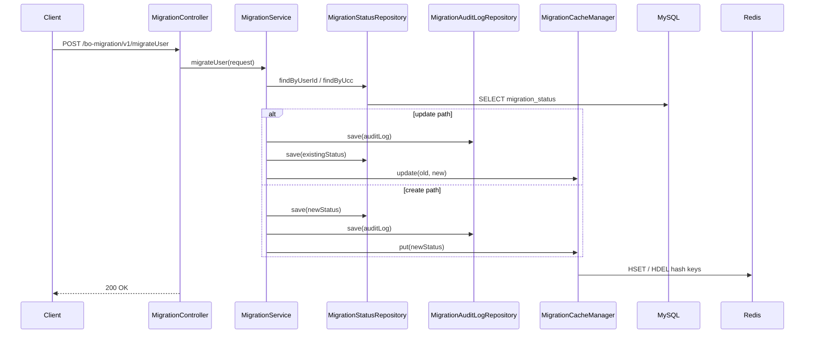
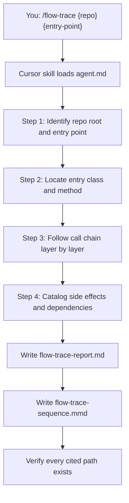

# I2 — End-to-End Flow Trace

> **Evaluation-grade agent deliverable.** Source-verified call-chain tracing with cited hops, external dependencies, side effects, and a Mermaid sequence diagram.

Trace **one** endpoint, event, queue consumer, or cron job end-to-end through verified source code. Every hop must cite a file path on disk — nothing is invented.

```bash
/flow-trace ~/Downloads/bo-migration-service POST /v1/migrateUser
```

| | |
| --- | --- |
| **Project** | I2 — End-to-End Flow Trace |
| **Agent** | [`agent.md`](agent.md) · slash command `/flow-trace` |
| **Cursor skill** | `.cursor/skills/flow-trace/SKILL.md` |
| **Location** | `Intermediate-repo operator and polyglot builder/I2_End_to_end_flow_trace` |
| **Latest report** | [`flow-trace-report.md`](flow-trace-report.md) · 2026-06-17 |
| **Latest diagram** | [`flow-trace-sequence.mmd`](flow-trace-sequence.mmd) |
| **Latest target** | `~/Downloads/bo-migration-service` — Spring Boot migration service |
| **Latest entry point** | `POST /bo-migration/v1/migrateUser` |
| **Mode** | Analysis only — no target-repo edits |

---

## Executive Summary (Latest Run)

| Metric | Result |
| ------ | ------ |
| **Stack** | Spring Boot · JPA · MySQL · Redis |
| **Entry point** | `POST /bo-migration/v1/migrateUser` |
| **Trace steps (happy path)** | **10** verified hops |
| **External dependencies** | MySQL (`bo_common`), Redis (`bo-redis.equity:6379`) |
| **Outbound HTTP / queues** | _None found_ |
| **Error paths documented** | **3** (validation, illegal argument, runtime) |

```
┌──────────────────────────────────────────────────────────────┐
│  FLOW TRACE SUMMARY — POST /v1/migrateUser                 │
├──────────────────────────────────────────────────────────────┤
│  Controller     MigrationController.migrateUser            │
│  Service        MigrationService.migrateUser (@Transactional)│
│  Repositories   MigrationStatusRepository · AuditLogRepo   │
│  Cache          MigrationCacheManager → Redis hashes       │
│  DB reads       migration_status (by userId or ucc)        │
│  DB writes      migration_status · migration_audit_log     │
│  Cache writes   migration:user-id · migration:ucc          │
│  Response       200 OK — ApiResponse.success               │
└──────────────────────────────────────────────────────────────┘
```

### Latest flow at a glance



> **Note:** Update vs create branch is a **runtime decision** based on the step-3 DB read. Both branches are verified in source. See [flow-trace-report.md](flow-trace-report.md) for full step table and error paths.

---

## Objective

From [`agent.md`](agent.md):

| Goal | Description |
| ---- | ----------- |
| **Primary** | Trace one entry point through **verified** call chains in source code |
| **Role** | Senior Software Architect — application flow tracing |
| **Output** | `flow-trace-report.md` + `flow-trace-sequence.mmd` |
| **Evidence** | Every hop cites file path, class, and method |
| **Code changes** | **None** — analysis and documentation only |

**Success means:** Entry point is located and cited, call chain is walked layer-by-layer, side effects are cataloged with verification status, sequence diagram maps to trace steps, and every cited path exists on disk.

---

## Requirement Mapping

Maps agent requirements → deliverables → evidence location.

| # | Requirement | Deliverable | Evidence |
| - | ----------- | ----------- | -------- |
| R1 | Identify entry point (route, cron, consumer) | Entry Point table | [`flow-trace-report.md`](flow-trace-report.md) § Entry Point |
| R2 | Walk controller → service → repository chain | Step-by-Step Trace table | § Step-by-Step Trace |
| R3 | Catalog external dependencies | External Dependencies table | § External Dependencies |
| R4 | Catalog DB reads, writes, HTTP, queues, cache | Side Effects table | § Side Effects |
| R5 | Distinguish verified vs inferred | `[INFERRED]` labels | § Known Uncertainties |
| R6 | Cite source file per hop | File column on every trace row | All tables in report |
| R7 | Mermaid sequence diagram | `flow-trace-sequence.mmd` | Verified participants + arrows |
| R8 | Document error paths | Error paths table | § Step-by-Step Trace (error paths) |
| R9 | Document gaps | Not Found / Not Verified section | § Not Found / Not Verified |
| R10 | One trace per report | Single entry point per run | Agent rules |
| R11 | Verify cited paths exist | Step 7 checklist | Agent workflow |

---

## Architecture

### Agent workflow



| Step | Action | Output |
| ---- | ------ | ------ |
| 1 | Read build manifests; confirm entry point exists | Stack + entry point type |
| 2 | Locate handler class, method, route annotation | Entry Point table |
| 3 | Walk method invocations in order | Step-by-Step Trace table |
| 4 | Catalog DB, HTTP, queue, cache side effects | Side Effects + Dependencies tables |
| 5 | Write structured report | `flow-trace-report.md` |
| 6 | Write Mermaid `sequenceDiagram` | `flow-trace-sequence.mmd` |
| 7 | Verify cited files exist; align diagram ↔ trace | Pass / fix gaps |

### I2 folder layout

```
I2_End_to_end_flow_trace/
├── README.md                ← you are here (evaluation-grade guide)
├── agent.md                 ← agent spec, workflow, report template
├── flow-trace-report.md     ← latest analysis (overwritten each run)
└── flow-trace-sequence.mmd  ← latest Mermaid sequence diagram
```

### Entry point types

The agent traces exactly **one** of these per run:

| Type | Examples | Detection signals |
| ---- | -------- | ----------------- |
| **HTTP endpoint** | `POST /api/migrate`, `GET /transactions/{id}` | `@RestController`, `router.post`, `@app.get` |
| **Event listener** | `@EventListener`, domain event handler | Spring events, NestJS `@OnEvent` |
| **Queue consumer** | `@KafkaListener`, `@RabbitListener` | Consumer annotations, handler methods |
| **Cron / scheduler** | `@Scheduled`, Quartz job | Cron expressions, job classes |
| **CLI / main** | `main()` with args, `clap` subcommand | Entry `main`, CLI parsers |

If only a repo path is provided, the agent lists discovered entry points and asks which one to trace.

### Side effect categories

| Side effect | How to verify |
| ----------- | ------------- |
| **DB read** | `find*`, `get*`, `@Query` SELECT, `JpaRepository` read methods |
| **DB write** | `save`, `insert`, `update`, `delete`, `@Modifying` |
| **HTTP outbound** | RestTemplate, WebClient, Feign, axios, fetch, requests |
| **Queue publish** | `RabbitTemplate`, `KafkaTemplate`, `send`, `publish` |
| **Queue consume** | Only when entry point **is** the consumer |
| **Cache** | `@Cacheable`, Redis client get/set in traced path |

### Stack detection signals

| Stack | Detection signals |
| ----- | ----------------- |
| **Java / Spring** | `@RestController`, `@Service`, `@Repository`, `@Scheduled` |
| **Node / Express** | `router.get/post`, `app.use`, middleware chain |
| **Python / FastAPI** | `@app.get/post`, `APIRouter` |
| **Rust** | `actix_web`, `axum` handlers |

---

## Rules

| Rule | Detail |
| ---- | ------ |
| **Cite everything** | Every hop must include file path, class, and method |
| **Verified vs inferred** | Follow actual method calls; label unverified hops `[INFERRED]` |
| **Never invent** | No hops, dependencies, or side effects without source evidence |
| **README is not flow** | Do not infer from docs — confirm in source files |
| **One trace per report** | Do not merge multiple endpoints or consumers |
| **Exclude tests** | Test files excluded unless user requests test-path tracing |
| **Empty categories** | Write `_None found_` when a category has zero verified items |
| **Unresolved → uncertainties** | Unverified branches go under Known Uncertainties, not main trace |

---

## Run Steps

### Step 1 — Invoke the agent

Open **Cursor Agent chat**:

| Scenario | Command |
| -------- | ------- |
| **HTTP endpoint** | `/flow-trace ~/Downloads/bo-migration-service POST /v1/migrateUser` |
| **List endpoints first** | `/flow-trace ~/Downloads/bo-migration-service` — agent lists routes, then you pick one |
| **Cron job** | `/flow-trace ~/my-app @Scheduled cleanupExpiredSessions` |
| **Queue consumer** | `/flow-trace ~/my-app KafkaConsumer#handleOrderEvent` |
| **Remote repo** | Clone first, then `/flow-trace /path/to/cloned-repo GET /health` |

### Step 2 — Agent executes trace

The agent follows the checklist in [`agent.md`](agent.md):

```
Flow Trace Progress:
- [ ] Step 1: Identify repo root and entry point
- [ ] Step 2: Locate entry class and method
- [ ] Step 3: Follow call chain (controller → service → repository → external)
- [ ] Step 4: Catalog DB reads, DB writes, HTTP calls, queue publish/consume
- [ ] Step 5: Write flow-trace-report.md
- [ ] Step 6: Write flow-trace-sequence.mmd
- [ ] Step 7: Verify every cited file path exists on disk
```

### Step 3 — Read the deliverables

| File | What to review |
| ---- | -------------- |
| [`flow-trace-report.md`](flow-trace-report.md) | Entry point, trace table, dependencies, side effects, gaps |
| [`flow-trace-sequence.mmd`](flow-trace-sequence.mmd) | Mermaid sequence diagram (verified participants only) |

### Step 4 — View the sequence diagram

**In Cursor / VS Code** — open `flow-trace-sequence.mmd` and use Markdown preview or a Mermaid extension.

**In GitHub** — paste the `.mmd` contents into a fenced `mermaid` code block in any markdown file.

**Online** — paste into [Mermaid Live Editor](https://mermaid.live).

---

## Latest Run — Detailed Evidence

### Analysis target

| Field | Value |
| ----- | ----- |
| Repository | `bo-migration-service` |
| Path | `/Users/rohitverma/Downloads/bo-migration-service` |
| Entry point | `POST /bo-migration/v1/migrateUser` |
| Generated | 2026-06-17 |
| Method | Source-verified end-to-end call-chain tracing |

### Call chain (happy path)

| Layer | Class | Method | Responsibility |
| ----- | ----- | ------ | -------------- |
| Controller | `MigrationController` | `migrateUser` | Receives request, `@Valid` validation, delegates to service |
| Service | `MigrationService` | `migrateUser` | `@Transactional` boundary; update or create branch |
| Repository | `MigrationStatusRepository` | `findByUserId` / `findByUcc` | DB read — lookup existing status |
| Repository | `MigrationStatusRepository` | `save` | DB write — INSERT or UPDATE `migration_status` |
| Repository | `MigrationAuditLogRepository` | `save` | DB write — INSERT `migration_audit_log` |
| Cache | `MigrationCacheManager` | `update` / `put` | Redis hash writes for `migration:user-id`, `migration:ucc` |
| Response | `ApiResponse` | `success` | `200 OK` with `{ status: "SUCCESS", message: "..." }` |

### External dependencies

| Dependency | Type | Evidence |
| ---------- | ---- | -------- |
| MySQL (`bo_common`) | Database | `application.yml` — `jdbc:mysql://bo-logs-db.equity:3306/bo_common` |
| Redis (`bo-redis.equity:6379`) | Cache | `application.yml`; `MigrationCacheManager` hash keys |

### Side effects verified

| Effect | Target | Verified |
| ------ | ------ | -------- |
| DB read | `migration_status` (SELECT by `user_id` or `ucc`) | Yes |
| DB write | `migration_status` (INSERT or UPDATE) | Yes |
| DB write | `migration_audit_log` (INSERT) | Yes |
| Cache write | Redis hash `migration:user-id` | Yes |
| Cache write | Redis hash `migration:ucc` | Yes |

### Error paths

| Condition | Handler | Response |
| --------- | ------- | -------- |
| Bean Validation failure | `GlobalExceptionHandler.handleValidationExceptions` | `400 BAD_REQUEST` |
| Both `userId` and `ucc` null | `GlobalExceptionHandler.handleIllegalArgumentException` | `400 BAD_REQUEST` |
| Unchecked runtime errors | `GlobalExceptionHandler.handleRuntimeException` | `500 INTERNAL_SERVER_ERROR` |

### Known uncertainties

| Item | Status |
| ---- | ------ |
| Auth / security filters | **Not found** — no Spring Security config in `src/main/java` |
| `performedBy` audit field | **Verified constant** — hardcoded `"SYSTEM"` |
| Transaction rollback on cache failure | **Unresolved** — Redis failure could roll back DB via `@Transactional` |

### Gaps documented

| Item | Result |
| ---- | ------ |
| Outbound HTTP clients | _None found_ |
| Kafka / RabbitMQ / SQS | _None found_ |
| Servlet filters / interceptors | _None found_ |
| Spring Security | _None found_ |

Full step-level detail is in [`flow-trace-report.md`](flow-trace-report.md).

---

## Verification Steps

Confirm the agent run meets quality bar.

### Report completeness

| Step | Procedure | Expected |
| ---- | --------- | -------- |
| 1 | Open `flow-trace-report.md` | Scope, entry point, and generation date populated |
| 2 | Check Entry Point table | File, class, function, route all cited |
| 3 | Check Step-by-Step Trace | Every row has File, Class, Function, Responsibility |
| 4 | Check Side Effects | DB/cache/HTTP/queue items marked Verified or `_None found_` |
| 5 | Open `flow-trace-sequence.mmd` | Valid Mermaid; participants match trace steps |
| 6 | Spot-check cited paths | Files exist in target repo |
| 7 | Check error paths | Validation and exception handlers documented |

### Reproduce on a new repo

```bash
# Invoke agent on any repo with a traceable entry point
/flow-trace /path/to/your-service POST /api/orders

# Manually verify a cited controller exists
ls /path/to/your-service/src/main/java/**/controller/

# Manually verify a cited service method
grep -r "migrateUser" /path/to/your-service/src/main/java/
```

---

## Success Checklist

Use this checklist to evaluate an I2 agent run.

### Agent process

| # | Requirement | Status (latest run) |
| - | ----------- | ------------------- |
| 1 | Repo path and entry point identified | ✅ bo-migration-service · `POST /v1/migrateUser` |
| 2 | Entry class and method located | ✅ `MigrationController.migrateUser` |
| 3 | Call chain walked layer by layer | ✅ Controller → Service → Repository → Cache |
| 4 | External dependencies cataloged | ✅ MySQL + Redis |
| 5 | Side effects cataloged with verification | ✅ 2 DB reads/writes + 2 cache writes |
| 6 | Error paths documented | ✅ 400 validation + 500 runtime |
| 7 | Verified vs inferred distinguished | ✅ Uncertainties section populated |
| 8 | Gaps documented | ✅ No HTTP, queues, or security |
| 9 | `flow-trace-report.md` written | ✅ Complete |
| 10 | `flow-trace-sequence.mmd` written | ✅ 8 participants, alt branches |
| 11 | Cited source paths verified | ✅ All paths in target repo |
| 12 | Target repo unchanged | ✅ No agent commits |

---

## Related Agents

| Agent | When to use |
| ----- | ----------- |
| **I1** `/er-diagram` | Map database schema before tracing data access |
| **I2** (this) | Trace how a request flows through API layers |
| **B1** `/repo-inventory` | Broader repo structure before picking an entry point |
| **A5** `/adversarial-code-review` | Review correctness after understanding the flow |
| **A4** `/repository-modernization` | Refactor layered architecture after flow analysis |

Typical flow:

```
I1 ER diagram  →  I2 flow trace  →  A5 review  →  fix flow or data-layer issues
```

---

## Documentation

| Document | Description |
| -------- | ----------- |
| [`agent.md`](agent.md) | Full I2 spec — workflow, entry point types, report template |
| [`flow-trace-report.md`](flow-trace-report.md) | Latest source-verified flow trace |
| [`flow-trace-sequence.mmd`](flow-trace-sequence.mmd) | Latest Mermaid sequence diagram |
| `.cursor/skills/flow-trace/SKILL.md` | Slash command entry point |
| [`docs/agent-catalog.md`](../../docs/agent-catalog.md) | Full agent catalog reference |

---

<p align="center"><sub>I2 — End-to-End Flow Trace · Source-verified · Evidence-backed · One trace per report</sub></p>
