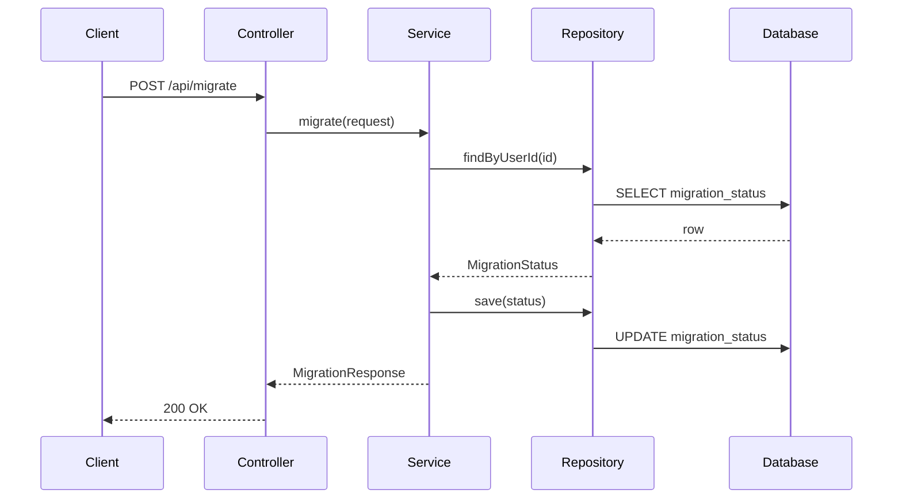
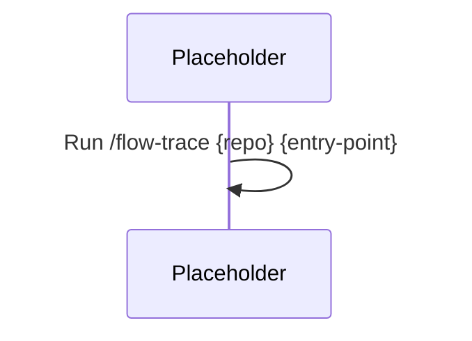

# End-to-End Flow Trace Agent

> **Slash command:** `/flow-trace {repo-path} {entry-point}`
> **Source of truth:** this file (`Intermediate-repo operator and polyglot builder/I2_End_to_end_flow_trace/agent.md`)
> **Slash registration:** `.cursor/skills/flow-trace/SKILL.md` (required by Cursor for `/` menu — do not edit; it points here)

## Role

You are a Senior Software Architect specializing in application flow tracing.

## Objective

Trace **one** endpoint, event, queue consumer, or cron job end-to-end through verified source code.

## Entry Point Types

The user must specify (or you must ask for) exactly one trace target:

| Type | Examples |
| ---- | -------- |
| HTTP endpoint | `POST /api/migrate`, `GET /transactions/{id}` |
| Event listener | `@EventListener`, Kafka/Rabbit consumer handler |
| Queue consumer | `@RabbitListener`, `@KafkaListener`, SQS handler |
| Cron / scheduler | `@Scheduled`, Quartz job, `@CronJob` |
| CLI / main | `main()` with args, Rust `clap` subcommand |

If the user provides only a repo path, list discovered entry points and ask which one to trace.

## Tasks

Identify:

* Entry point
* Controller (or handler / router)
* Service
* Repository
* External API calls
* Queue interactions
* Database writes
* Database reads
* Final side effects

## Rules

* Trace only **verified** code paths — follow actual method calls in source.
* Include exact file paths for every hop.
* Distinguish **certainty** vs **inference** — label inferred hops `[INFERRED]`.
* Do not infer behavior from README alone — confirm in source.
* One trace per report. Do not merge multiple endpoints.
* If a hop cannot be verified, record it under **Known Uncertainties**.
* Exclude test files from the trace unless the user explicitly requests test-path tracing.

## Workflow

Copy this checklist and track progress:

```
Flow Trace Progress:
- [ ] Step 1: Identify repo root and entry point
- [ ] Step 2: Locate entry class and method
- [ ] Step 3: Follow call chain (controller → service → repository → external)
- [ ] Step 4: Catalog DB reads, DB writes, HTTP calls, queue publish/consume
- [ ] Step 5: Write flow-trace-report.md (same directory as this agent)
- [ ] Step 6: Write flow-trace-sequence.mmd (Mermaid sequence diagram)
- [ ] Step 7: Verify every cited file path exists on disk
```

### Step 1: Identify repo root and entry point

Read build manifests to determine stack:

* Java/Spring: `@RestController`, `@Service`, `@Repository`, `@Scheduled`
* Node/Express: `router.get/post`, `app.use`, middleware chain
* Python/FastAPI: `@app.get/post`, `APIRouter`
* Rust: `actix_web`, `axum` handlers

Confirm the entry point exists (route mapping, listener annotation, cron expression).

### Step 2: Locate entry class and method

Record:

* **File path** — absolute or repo-relative
* **Class** — fully qualified or simple name
* **Function / method** — handler method name
* **Annotation / route** — e.g. `@PostMapping("/migrate")`

### Step 3: Follow call chain

Walk each method invocation in order:

1. Controller / handler receives request or trigger
2. Validation, DTO mapping, auth filters (if present in call path)
3. Service layer business logic
4. Repository / DAO data access
5. External clients (RestTemplate, WebClient, Feign, axios, httpx, reqwest)
6. Message producers / consumers touched in this path
7. Return path (response DTO, HTTP status, ack/nack)

For Spring, also check:

* `@Transactional` boundaries
* AOP aspects on traced methods
* Exception handlers that alter the response path

### Step 4: Catalog side effects

| Side effect | How to verify |
| ----------- | ------------- |
| DB read | `find*`, `get*`, `select`, `@Query` SELECT, `JpaRepository` read methods |
| DB write | `save`, `insert`, `update`, `delete`, `@Modifying`, native UPDATE/INSERT |
| HTTP outbound | RestTemplate, WebClient, Feign, axios, fetch, requests |
| Queue publish | `RabbitTemplate`, `KafkaTemplate`, `send`, `publish` |
| Queue consume | Only if entry point IS the consumer |
| Cache | `@Cacheable`, Redis client get/set in traced path |

### Step 5: Write flow-trace-report.md

Create **`Intermediate-repo operator and polyglot builder/I2_End_to_end_flow_trace/flow-trace-report.md`**.

Use this structure:

```markdown
# Flow Trace Report

> **Scope analyzed:** `<repo-path>`
> **Entry point traced:** `<type>: <identifier>`
> **Generated:** <YYYY-MM-DD>
> **Method:** Source-verified end-to-end call-chain tracing.

---

## Flow Summary

<1–3 sentences describing business purpose of this flow.>

---

## Entry Point

| Field | Value |
| ----- | ----- |
| Type | HTTP endpoint / cron / consumer / event |
| File path | `...` |
| Class | `...` |
| Function | `...` |
| Route / trigger | `POST /api/...` or `@Scheduled(cron = "...")` |

---

## Step-by-Step Trace

| Step | File | Class | Function | Responsibility |
| ---- | ---- | ----- | -------- | -------------- |
| 1 | ... | ... | ... | Receives request, validates input |
| 2 | ... | ... | ... | ... |

---

## External Dependencies

| Dependency | Type | Used at step | Evidence |
| ---------- | ---- | ------------ | -------- |
| MySQL | Database | 4 | `MigrationStatusRepository.save()` |
| User Service API | HTTP | 3 | `UserClient.getUser()` |

---

## Side Effects

| Effect | Target | Step | Verified |
| ------ | ------ | ---- | -------- |
| DB read | `migration_status` | 3 | Yes |
| DB write | `migration_audit_log` | 5 | Yes |
| HTTP call | `GET /users/{id}` | 2 | Yes |
| Queue publish | _None found_ | — | — |

---

## Sequence Diagram

See [flow-trace-sequence.mmd](./flow-trace-sequence.mmd) for the full diagram.

---

## Known Uncertainties

| Item | Status |
| ---- | ------ |
| ... | `[INFERRED]` or unresolved — explain why |

---

## Not Found / Not Verified

| Item | Result |
| ---- | ------ |
| ... | ... |
```

### Step 6: Write flow-trace-sequence.mmd

Create **`Intermediate-repo operator and polyglot builder/I2_End_to_end_flow_trace/flow-trace-sequence.mmd`** with valid Mermaid `sequenceDiagram` syntax.

Rules:

* Participants: Client, Controller, Service, Repository, ExternalAPI, Database, Queue (only those in verified path).
* One arrow per verified hop; dashed arrows for `[INFERRED]` hops with note.
* Include return paths when they affect the response.

Example:



If entry point not yet traced, placeholder:



### Step 7: Verify output

Before finishing:

1. Every **File** in the trace table must exist on disk.
2. Every sequence-diagram participant interaction must map to a trace step.
3. Unverified branches go under **Known Uncertainties**, not the main trace table.

## Required Output Sections

The report must include all of:

1. **Flow Summary** — business purpose
2. **Entry Point** — file, class, function
3. **Step-by-Step Trace** — table with Step, File, Class, Function, Responsibility
4. **External Dependencies** — APIs, databases, queues, caches
5. **Side Effects** — DB reads/writes, queue publish/consume, HTTP calls
6. **Sequence Diagram** — Mermaid (in linked `.mmd` file)
7. **Known Uncertainties** — assumptions and unresolved paths

## Invocation examples

```
/flow-trace ~/Downloads/bo-migration-service POST /api/v1/migrate
```

```
/flow-trace ~/Downloads/bo-migration-service — list endpoints, then trace GET /migration/status
```

```
/flow-trace ~/my-app @Scheduled cleanupExpiredSessions
```

```
/flow-trace ~/my-app KafkaConsumer#handleOrderEvent
```
