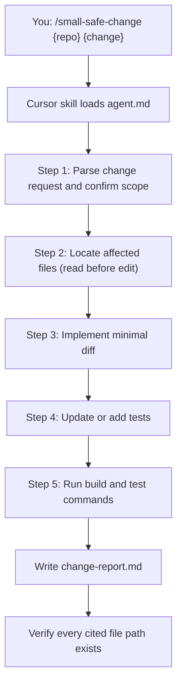

# I3 — Small Safe Change

> **Evaluation-grade agent deliverable.** One focused, low-risk code change with minimal diff, test updates, and build/test execution evidence.

Implement **one** surgical change in an unfamiliar repository. Touch only what the request requires, update or add tests, run real build and test commands, and document everything in a single change report.

```bash
/small-safe-change ~/Downloads/bo-migration-service — return 404 when migration status not found by userId
```

| | |
| --- | --- |
| **Project** | I3 — Small Safe Change |
| **Agent** | [`agent.md`](agent.md) · slash command `/small-safe-change` |
| **Cursor skill** | `.cursor/skills/small-safe-change/SKILL.md` |
| **Location** | `Intermediate-repo operator and polyglot builder/I3_Small_safe_change` |
| **Latest report** | [`change-report.md`](change-report.md) · 2026-06-17 |
| **Latest target** | `~/Downloads/bo-migration-service` — Spring Boot migration service |
| **Latest change** | `GET /v1/getMigrationStatus/byUserId/{userId}` → 404 on cache miss (AUDIT mode) |
| **Mode** | Minimal implementation — edits target repo; no auto-commit |

---

## Executive Summary (Latest Run)

| Metric | Result |
| ------ | ------ |
| **Stack** | Spring Boot · Maven · JUnit 5 · Mockito |
| **Change scope** | Single endpoint behaviour (`byUserId` only) |
| **Production files modified** | **2** |
| **Test files added** | **2** (controller + service) |
| **New tests** | **4** |
| **Build** | `mvn -q compile` — exit **0** |
| **Tests** | `mvn -q test` — exit **0** |
| **Risk classification** | **Low** |

```
┌──────────────────────────────────────────────────────────────┐
│  CHANGE SUMMARY — 404 on not found by userId (AUDIT mode)    │
├──────────────────────────────────────────────────────────────┤
│  Before   200 OK + synthetic default values on cache miss  │
│  After    404 Not Found when user absent from cache          │
│  Service  MigrationStatusService.getByUserId → null on miss  │
│  Control  MigrationStatusController → notFound() when null   │
│  Scope    byUserId only · AUDIT global flag only           │
│  Unchanged byUcc · byUserIdList · non-AUDIT modes           │
└──────────────────────────────────────────────────────────────┘
```

### Before vs after

| Scenario | Before | After |
| -------- | ------ | ----- |
| AUDIT mode + user in cache | `200 OK` + status body | `200 OK` + status body _(unchanged)_ |
| AUDIT mode + user **not** in cache | `200 OK` + default cluster values | **`404 Not Found`** + empty body |
| Non-AUDIT global flag modes | Default values returned | Default values returned _(unchanged)_ |
| `byUcc` / `byUserIdList` endpoints | Existing behaviour | Existing behaviour _(unchanged)_ |

---

## Objective

From [`agent.md`](agent.md):

| Goal | Description |
| ---- | ----------- |
| **Primary** | Implement one focused change with the **smallest possible diff** |
| **Role** | Senior Engineer — low-risk change in an unfamiliar repo |
| **Output** | Code changes in target repo + `change-report.md` |
| **Evidence** | Build/test commands with real output and exit codes |
| **Commits** | **None** unless user explicitly requests |

**Success means:** Change matches the request, only necessary files are touched, tests cover the new behaviour, build and tests pass with documented evidence, and risk is classified with a verification matrix.

---

## Requirement Mapping

Maps agent requirements → deliverables → evidence location.

| # | Requirement | Deliverable | Evidence |
| - | ----------- | ----------- | -------- |
| R1 | Restate change request (before vs after) | Change Request section | [`change-report.md`](change-report.md) § Change Request |
| R2 | List every modified file with reason | Files Modified table | § Files Modified |
| R3 | Explain diff concisely | Diff Summary section | § Diff Summary |
| R4 | Update or add tests | Tests section | § Tests |
| R5 | Run build with captured output | Execution → Build | § Execution |
| R6 | Run tests with captured output | Execution → Tests | § Execution |
| R7 | Classify risk (Low / Medium / High) | Risk Assessment | § Risk Assessment |
| R8 | Agent + manual verification matrix | Verification Matrix | § Verification Matrix |
| R9 | Document out-of-scope items | Not Done / Deferred | § Not Done / Deferred |
| R10 | One change per report | Single scoped request | Agent rules |
| R11 | No unrelated refactoring | No unrelated files changed | Verification Matrix |
| R12 | No auto-commit | Deferred unless requested | Agent rules |

---

## Architecture

### Agent workflow



| Step | Action | Output |
| ---- | ------ | ------ |
| 1 | Restate behaviour; mark ambiguities `[NEEDS CLARIFICATION]` | Scoped change description |
| 2 | Find implementation + test files; read surrounding code | Files Modified list (planned) |
| 3 | Apply smallest possible diff; match existing style | Production code changes |
| 4 | Update existing tests or add new ones | Test code changes |
| 5 | Run stack-appropriate build and test commands | Exit codes + output |
| 6 | Write structured report | `change-report.md` |
| 7 | Verify cited paths exist; align report ↔ diff | Pass / fix gaps |

### I3 folder layout

```
I3_Small_safe_change/
├── README.md          ← you are here (evaluation-grade guide)
├── agent.md           ← agent spec, workflow, report template
└── change-report.md   ← latest run (overwritten each invocation)
```

Unlike I1 and I2, I3 produces **no separate diagram file**. All output lives in a single `change-report.md`. Code changes are written directly into the **target repository**.

### Stack commands

The agent detects the project stack and runs appropriate verification:

| Stack | Build | Test |
| ----- | ----- | ---- |
| **Java / Maven** | `mvn -q compile` | `mvn -q test` |
| **Java / Gradle** | `./gradlew compileJava` | `./gradlew test` |
| **Node** | `npm run build` (if defined) | `npm test` |
| **Python** | `pip install -r requirements.txt` (if needed) | `pytest` |
| **Rust** | `cargo build` | `cargo test` |

### What counts as a "small safe change"

| Good fit | Poor fit |
| -------- | -------- |
| Fix a single endpoint response code | Multi-service refactor |
| Add one validation rule + test | Schema migration + data backfill |
| Update error message or header | New feature with multiple endpoints |
| Narrow bug fix with existing test patterns | Dependency upgrade across the repo |

---

## Rules

| Rule | Detail |
| ---- | ------ |
| **Smallest possible change** | Touch only what the request requires |
| **No unrelated refactoring** | Do not reformat, rename, or clean up adjacent code |
| **No speculative improvements** | Do not add features beyond the request |
| **One change per report** | Do not bundle unrelated fixes |
| **Every file explained** | Each modified file appears in Files Modified with a reason |
| **Real verification** | Run actual build/test commands; capture command, output, exit code |
| **Match conventions** | Read surrounding code; follow naming, style, test patterns |
| **No auto-commit** | Commit only when user explicitly asks |
| **Unresolved scope** | Mark `[NEEDS CLARIFICATION]` — do not guess |

---

## Run Steps

### Step 1 — Invoke the agent

Open **Cursor Agent chat**:

| Scenario | Command |
| -------- | ------- |
| **Specific change** | `/small-safe-change ~/Downloads/bo-migration-service — return 404 instead of null when user not found on GET /v1/getMigrationStatus/byUserId/{userId}` |
| **Short description** | `/small-safe-change ~/my-app Add validation message when cluster is missing on migrateUser` |
| **Repo only** | `/small-safe-change ~/my-app` — agent asks what single change to implement |
| **Follow-up detail** | `/small-safe-change ~/my-app — user will describe change in follow-up message` |

### Step 2 — Agent executes change

The agent follows the checklist in [`agent.md`](agent.md):

```
Small Safe Change Progress:
- [ ] Step 1: Parse change request and confirm scope
- [ ] Step 2: Locate affected files (read before edit)
- [ ] Step 3: Implement minimal diff
- [ ] Step 4: Update or add tests (TDD where project convention requires)
- [ ] Step 5: Run build and test commands
- [ ] Step 6: Write change-report.md
- [ ] Step 7: Verify every cited file path exists
```

### Step 3 — Review deliverables

| Artifact | Location | What to review |
| -------- | -------- | -------------- |
| **Change report** | [`change-report.md`](change-report.md) | Before/after, files, diff, tests, execution, risk |
| **Production code** | Target repo | Minimal diff in cited files only |
| **Tests** | Target repo `src/test/` | New or updated tests cover the change |

### Step 4 — Manually verify (optional)

Complete the **Manually Verified** section in the report:

- Live HTTP call against a running service
- Client impact review (breaking change assessment)
- Staging smoke test

### Step 5 — Commit (when ready)

The agent does **not** commit by default. When satisfied:

```bash
cd /path/to/target-repo
git diff                    # review changes
git add <files>
git commit -m "fix: return 404 when migration status not found by userId"
```

---

## Latest Run — Detailed Evidence

### Analysis target

| Field | Value |
| ----- | ----- |
| Repository | `bo-migration-service` |
| Path | `/Users/rohitverma/Downloads/bo-migration-service` |
| Change request | Return 404 when migration status not found by userId |
| Generated | 2026-06-17 |
| Method | Minimal-diff implementation with build/test evidence |

### Files modified

| File | Reason |
| ---- | ------ |
| `MigrationStatusService.java` | Return `null` from `getByUserId` on AUDIT mode + cache miss |
| `MigrationStatusController.java` | Map `null` service result to `ResponseEntity.notFound()` |
| `MigrationStatusControllerTest.java` | **New** — WebMvcTest for 404 and 200 paths |
| `MigrationStatusServiceTest.java` | **New** — unit tests for cache miss and cache hit |

### Key diff

**Service:** In the AUDIT branch, when `cacheManager.getByUserId(userId)` returns `null`, return `null` immediately instead of falling through to `getDefaultResponse()`.

**Controller:** After calling the service, if the response is `null`, return `404 Not Found`. Otherwise return `200 OK`.

### Tests added

| Test file | Test name | Covers |
| --------- | --------- | ------ |
| `MigrationStatusControllerTest.java` | `getByUserIdReturns404WhenNotFound` | HTTP 404 when service returns null |
| `MigrationStatusControllerTest.java` | `getByUserIdReturns200WhenFound` | HTTP 200 with body when service returns status |
| `MigrationStatusServiceTest.java` | `getByUserIdReturnsNullWhenAuditModeAndUserNotInCache` | Service returns null on AUDIT + cache miss |
| `MigrationStatusServiceTest.java` | `getByUserIdReturnsStatusWhenAuditModeAndUserInCache` | Service returns mapped response on cache hit |

### Execution evidence

| Check | Command | Exit code | Result |
| ----- | ------- | --------- | ------ |
| Build | `mvn -q compile` | `0` | Compile succeeded |
| Tests | `mvn -q test` | `0` | All tests passed including 4 new tests |

### Risk assessment

**Classification:** **Low**

- Two production files, narrow branch (AUDIT + cache miss only)
- No schema, config, or dependency changes
- Intentionally breaking for clients that relied on `200` + defaults for unknown users in AUDIT mode
- `byUcc`, bulk endpoints, and non-AUDIT modes untouched

### Deferred items

| Item | Reason |
| ---- | ------ |
| 404 for `byUcc` when not found | Out of scope — request specified userId only |
| 404 in non-AUDIT global flag modes | Out of scope — those modes skip cache lookup by design |
| Git commit | Not requested |

Full detail is in [`change-report.md`](change-report.md).

---

## Verification Steps

Confirm the agent run meets quality bar.

### Report completeness

| Step | Procedure | Expected |
| ---- | --------- | -------- |
| 1 | Open `change-report.md` | Repository, change request, and date populated |
| 2 | Check Change Request | Clear before vs after behaviour |
| 3 | Check Files Modified | Every changed file listed with reason |
| 4 | Check Diff Summary | Concise explanation; key hunks if helpful |
| 5 | Check Tests | Updated and new tests documented |
| 6 | Check Execution | Real commands, exit codes, and output |
| 7 | Check Risk Assessment | Low / Medium / High with explanation |
| 8 | Spot-check target repo | Only cited files changed; diff is minimal |

### Reproduce on a new repo

```bash
# Invoke agent with a single scoped change
/small-safe-change /path/to/your-service "Add X-Request-Id response header"

# Review the diff in the target repo
cd /path/to/your-service && git diff

# Re-run tests independently
mvn -q test          # Java/Maven
npm test             # Node
pytest               # Python
cargo test           # Rust
```

---

## Success Checklist

Use this checklist to evaluate an I3 agent run.

### Agent process

| # | Requirement | Status (latest run) |
| - | ----------- | ------------------- |
| 1 | Change request parsed and scoped | ✅ 404 on byUserId cache miss (AUDIT only) |
| 2 | Affected files located before edit | ✅ Service + controller + 2 test files |
| 3 | Minimal diff applied | ✅ 2 production files, narrow branch |
| 4 | Tests updated or added | ✅ 4 new tests (controller + service) |
| 5 | Build executed with evidence | ✅ `mvn compile` exit 0 |
| 6 | Tests executed with evidence | ✅ `mvn test` exit 0 |
| 7 | Risk classified | ✅ Low — no schema/deps; intentional API change |
| 8 | Verification matrix populated | ✅ Agent suggested all Pass |
| 9 | Out-of-scope items documented | ✅ byUcc, non-AUDIT, commit deferred |
| 10 | `change-report.md` written | ✅ Complete single-file report |
| 11 | No unrelated files changed | ✅ 4 files only |
| 12 | No auto-commit | ✅ Deferred per agent rules |

---

## Related Agents

| Agent | When to use |
| ----- | ----------- |
| **I1** `/er-diagram` | Understand schema before data-layer changes |
| **I2** `/flow-trace` | Trace endpoint flow before modifying behaviour |
| **I3** (this) | Implement one minimal, tested code change |
| **B1** `/repo-inventory` | Orient in an unfamiliar repo before editing |
| **A5** `/adversarial-code-review` | Review the patch after implementation |
| **I4** `/polyglot-service-pair` | Build new services (vs. surgical edit) |

Typical flow:

```
B1 repo inventory  →  I2 flow trace  →  I3 small safe change  →  A5 review  →  commit
```

---

## Documentation

| Document | Description |
| -------- | ----------- |
| [`agent.md`](agent.md) | Full I3 spec — workflow, rules, report template |
| [`change-report.md`](change-report.md) | Latest implementation run with build/test evidence |
| `.cursor/skills/small-safe-change/SKILL.md` | Slash command entry point |
| [`docs/agent-catalog.md`](../../docs/agent-catalog.md) | Full agent catalog reference |

---

<p align="center"><sub>I3 — Small Safe Change · Minimal diff · Test evidence · One change per report</sub></p>
