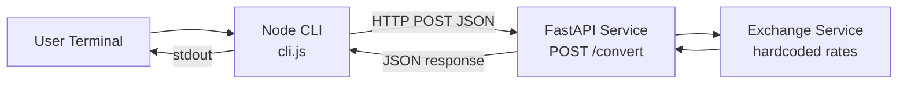

# I4 — Polyglot Service Pair (Currency Conversion)

Two-component system: a **FastAPI** conversion service and a **Node.js CLI** client.

```
┌─────────────┐     POST /convert      ┌──────────────────┐
│  Node CLI   │ ─────────────────────► │  FastAPI Service │
│  cli.js     │ ◄───────────────────── │  (port 8000)     │
└─────────────┘   { convertedAmount }  └──────────────────┘
```

## Project layout

```
I4/
├── README.md                 ← this file
├── validation-results.md     ← captured test & CLI output
├── agent.md                  ← Polyglot Service Pair Agent spec
├── services/fastapi/         ← Python conversion API
└── clients/node-cli/         ← Node CLI client
```

## Architecture diagram



## Request flow

1. User runs `node cli.js 100 USD INR` in the CLI terminal.
2. CLI parses and validates arguments (`amount`, `from`, `to`).
3. CLI sends `POST http://127.0.0.1:8000/convert` with JSON body.
4. FastAPI validates the request (Pydantic) and calls `convert_amount()`.
5. Service applies hardcoded rates (100 USD × 83 = **8300 INR**).
6. API returns `{ "convertedAmount": 8300 }`.
7. CLI prints `8300` to stdout (or an error message on failure).

## Hardcoded rates (per 1 USD)

| Currency | Rate |
| -------- | ---- |
| USD | 1.0 |
| INR | 83.0 |
| EUR | 0.92 |
| GBP | 0.79 |
| JPY | 156.0 |

## Two-terminal setup

### Terminal 1 — Start FastAPI

```bash
cd "repo operator and polyglot builder/I4/services/fastapi"
python3 -m venv .venv
source .venv/bin/activate
pip install -r requirements.txt
uvicorn app.main:app --reload --host 127.0.0.1 --port 8000
```

Wait for: `Uvicorn running on http://127.0.0.1:8000`

### Terminal 2 — Run Node CLI

```bash
cd "repo operator and polyglot builder/I4/clients/node-cli"
node cli.js 100 USD INR
```

Expected output:

```
8300
```

## Run instructions (quick reference)

| Task | Command | Directory |
| ---- | ------- | --------- |
| Install API deps | `pip install -r requirements.txt` | `services/fastapi` |
| Run API | `uvicorn app.main:app --reload --port 8000` | `services/fastapi` |
| Run tests | `pytest -v` | `services/fastapi` |
| Run CLI | `node cli.js 100 USD INR` | `clients/node-cli` |
| API docs | Open `http://127.0.0.1:8000/docs` | browser |

## Verification

See [validation-results.md](./validation-results.md) for captured `pytest` and `node cli.js` output.

## API contract

**Request**

```json
{
  "amount": 100,
  "from": "USD",
  "to": "INR"
}
```

**Response**

```json
{
  "convertedAmount": 8300
}
```
