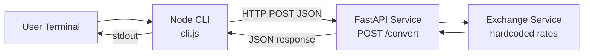

# I4 — Polyglot Service Pair (Currency Conversion)

Two-component system: a **FastAPI** conversion service and a **Node.js CLI** client.

```
┌─────────────┐     POST /convert      ┌──────────────────┐
│  Node CLI   │ ─────────────────────► │  FastAPI Service │
│  cli.js     │ ◄───────────────────── │  (port 8000)     │
└─────────────┘   { convertedAmount }  └──────────────────┘
```

## Project layout

```
I4/
├── README.md                 ← this file
├── STATUS.md                 ← project & running status (live health, PIDs)
├── local-testing.md          ← Swagger UI + curl manual test guide & captured results
├── validation-results.md     ← captured pytest, CLI & Swagger output
├── agent.md                  ← Polyglot Service Pair Agent spec
├── services/fastapi/         ← Python conversion API
└── clients/node-cli/         ← Node CLI client
```

## Architecture diagram



## Request flow

1. User runs `node cli.js 100 USD INR` in the CLI terminal.
2. CLI parses and validates arguments (`amount`, `from`, `to`).
3. CLI sends `POST http://127.0.0.1:8000/convert` with JSON body.
4. FastAPI validates the request (Pydantic) and calls `convert_amount()`.
5. Service applies hardcoded rates (100 USD × 83 = **8300 INR**).
6. API returns `{ "convertedAmount": 8300 }`.
7. CLI prints `8300` to stdout (or an error message on failure).

## Hardcoded rates (per 1 USD)

| Currency | Rate |
| -------- | ---- |
| USD | 1.0 |
| INR | 83.0 |
| EUR | 0.92 |
| GBP | 0.79 |
| JPY | 156.0 |

## Two-terminal setup

### Terminal 1 — Start FastAPI

```bash
cd "Intermediate-repo operator and polyglot builder/I4/services/fastapi"
python3 -m venv .venv
source .venv/bin/activate
pip install -r requirements.txt
uvicorn app.main:app --reload --host 127.0.0.1 --port 8000
```

Wait for: `Uvicorn running on http://127.0.0.1:8000`

> **Port conflict:** If port 8000 is already in use, run `lsof -i :8000 -sTCP:LISTEN` and kill the numeric PID if shown. Confirm I4 with `curl -s http://127.0.0.1:8000/ | grep service` — must say **Currency Conversion API**, not Transaction API (B4). See [local-testing.md](./local-testing.md#1-start-i4-fastapi-server).

### Option B — Swagger UI (single terminal)

1. Start the API as above.
2. Open [http://127.0.0.1:8000/docs](http://127.0.0.1:8000/docs) — title should be **Currency Conversion API**.
3. Try **GET /health**, **GET /**, then **POST /convert** with:

```json
{
  "amount": 100,
  "from": "USD",
  "to": "INR"
}
```

Expected response: `{ "convertedAmount": 8300 }`

Full Swagger and curl test cases with captured responses: [local-testing.md](./local-testing.md#2-i4-swagger-ui-tests-port-8000) · [curl session](./local-testing.md#3-curl-session-capture-2026-06-22).

### Terminal 2 — Run Node CLI

```bash
cd "Intermediate-repo operator and polyglot builder/I4/clients/node-cli"
node cli.js 100 USD INR
```

Expected output:

```
8300
```

## Run instructions (quick reference)

| Task | Command | Directory |
| ---- | ------- | --------- |
| Install API deps | `pip install -r requirements.txt` | `services/fastapi` |
| Run API | `uvicorn app.main:app --reload --port 8000` | `services/fastapi` |
| Run tests | `pytest -v` | `services/fastapi` |
| Run CLI | `node cli.js 100 USD INR` | `clients/node-cli` |
| Swagger UI | Open `http://127.0.0.1:8000/docs` | browser |

## Verification

| Method | Doc | What it covers |
| ------ | --- | -------------- |
| Project status | [STATUS.md](./STATUS.md) | Running status, health checks, start/stop commands |
| Automated tests | [validation-results.md](./validation-results.md#pytest) | `pytest -v` (9 tests) |
| Manual curl | [validation-results.md](./validation-results.md#manual-curl-2026-06-22-session) | 5 happy-path + 2 error cases on port 8000 |
| Node CLI | [validation-results.md](./validation-results.md#node-clijs) | End-to-end CLI → API |
| Swagger UI | [validation-results.md](./validation-results.md#swagger-ui-manual) | Manual API checks via `/docs` |
| Full test guide | [local-testing.md](./local-testing.md) | Step-by-step Swagger cases, curl commands, server startup |

**Last verified:** 2026-06-22 · I4 curl session on port 8000 (`Currency Conversion API`)

## API contract

**Request**

```json
{
  "amount": 100,
  "from": "USD",
  "to": "INR"
}
```

**Response**

```json
{
  "convertedAmount": 8300
}
```
