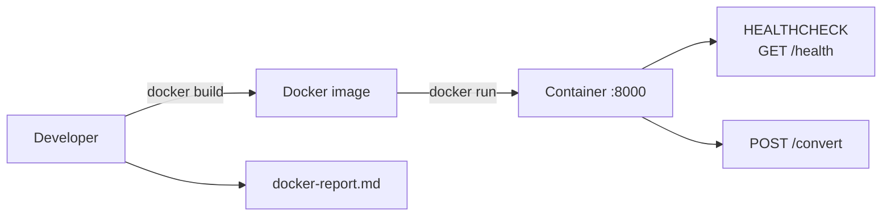

# I5 — Dockerization

Agent-driven workflow to **containerize an existing service** with a multi-stage Dockerfile, `.dockerignore`, built-in health check, and a verified `docker-report.md`.

```
┌──────────────────┐     /dockerization      ┌─────────────────────┐
│  Existing        │ ───────────────────────► │  Container image    │
│  service (e.g.   │     Dockerfile +         │  + docker-report.md │
│  I4 FastAPI)     │     .dockerignore        │                     │
└──────────────────┘                          └─────────────────────┘
```

## Project layout

```
I5_Polyglot_service_pair/
├── README.md           ← this file
├── agent.md            ← Dockerization Agent spec
└── docker-report.md    ← build/run/health verification report
```

Docker files are written **next to the service being containerized**, not inside I5. For example, the in-repo reference implementation lives at:

```
I4/services/fastapi/
├── Dockerfile
├── .dockerignore
├── requirements-prod.txt   ← production deps only (no pytest)
└── app/
```

## What this agent does

| Step | Action |
| ---- | ------ |
| 1 | Identify the target service path |
| 2 | Create multi-stage `Dockerfile` + `.dockerignore` |
| 3 | Add `HEALTHCHECK` and production requirements if needed |
| 4 | `docker build` — capture output |
| 5 | `docker run` — capture startup logs |
| 6 | Verify `/health` and main API endpoint |
| 7 | Record image size and write `docker-report.md` |

## Invoke the agent

**Slash command:** `/dockerization {service-path}`

```
/dockerization Intermediate-repo operator and polyglot builder/I4/services/fastapi
```

```
/dockerization — containerize the FastAPI currency service in I4
```

Full agent spec: [agent.md](./agent.md)

---

## Reference implementation — I4 FastAPI (in-repo)

The I4 currency conversion API is the reference service for this agent.

### Dockerfile overview

| Stage | Base | Purpose |
| ----- | ---- | ------- |
| **builder** | `python:3.12-slim` | Install prod deps into `/opt/venv` |
| **runtime** | `python:3.12-slim` | Copy venv + app code only; run as non-root `appuser` |

| Feature | Detail |
| ------- | ------ |
| Port | `8000` |
| Health | `GET /health` → `{"status":"ok"}` |
| User | Non-root uid/gid `1000` |
| Prod deps | `requirements-prod.txt` (FastAPI, uvicorn, pydantic — no pytest) |

### docker build

```bash
cd "Intermediate-repo operator and polyglot builder/I4/services/fastapi"
docker build -t currency-convert-api:latest .
```

### docker run

```bash
docker run -d --name currency-api -p 8000:8000 currency-convert-api:latest
```

### Verify health

```bash
curl -s http://127.0.0.1:8000/health
# {"status":"ok"}
```

### Verify convert

```bash
curl -s -X POST http://127.0.0.1:8000/convert \
  -H "Content-Type: application/json" \
  -d '{"amount":100,"from":"USD","to":"INR"}'
# {"convertedAmount":8300.0}
```

### docker stop

```bash
docker stop currency-api
docker rm currency-api
```

### Swagger UI (container)

With the container running, open [http://127.0.0.1:8000/docs](http://127.0.0.1:8000/docs).

---

## Architecture



---

## Deliverables

| Artifact | Location | Description |
| -------- | -------- | ----------- |
| Agent spec | [agent.md](./agent.md) | Workflow, rules, required report sections |
| Docker report | [docker-report.md](./docker-report.md) | Layer breakdown, build/run evidence, performance notes |
| Dockerfile | Next to target service | Multi-stage build (e.g. `I4/services/fastapi/Dockerfile`) |
| `.dockerignore` | Next to target service | Excludes tests, venv, docs from build context |

---

## docker-report.md sections

Every agent run must produce a report with:

1. **Dockerfile** — explain every layer
2. **Build Verification** — `docker build` command and output
3. **Runtime Verification** — `docker run`, container logs
4. **Health Check** — `curl` endpoint and captured response
5. **Performance Notes** — image size, startup behaviour
6. **README** — `docker build`, `docker run`, `docker stop` commands

Current report: [docker-report.md](./docker-report.md) (documents `bo-migration-service` containerization run).

---

## Quick reference

| Task | Command | Directory |
| ---- | ------- | --------- |
| Build image | `docker build -t currency-convert-api:latest .` | `I4/services/fastapi` |
| Run container | `docker run -d --name currency-api -p 8000:8000 currency-convert-api:latest` | — |
| View logs | `docker logs -f currency-api` | — |
| Health check | `curl -s http://127.0.0.1:8000/health` | — |
| Stop & remove | `docker stop currency-api && docker rm currency-api` | — |
| Image size | `docker images currency-convert-api` | — |

---

## Rules

* Multi-stage build preferred — keep runtime image minimal.
* No test dependencies in production image (`requirements-prod.txt` vs `requirements.txt`).
* Non-root user in runtime stage.
* Built-in `HEALTHCHECK` probing `/health`.
* Verify with real `docker build` / `docker run` / `curl` output in the report.
* Docker requires **Docker Desktop** (or Docker Engine) on the host — not available in the agent sandbox.

---

## Related projects

| Project | Relationship |
| ------- | ------------ |
| [I4](../I4/README.md) | Source service + reference Dockerfile |
| [I6](../I6_Dockerize_and_run/agent.md) | Bug diagnosis agent (separate workflow) |

## Agent catalog

Registered as **I5 — Dockerization** in [docs/agent-catalog.md](../../docs/agent-catalog.md).
