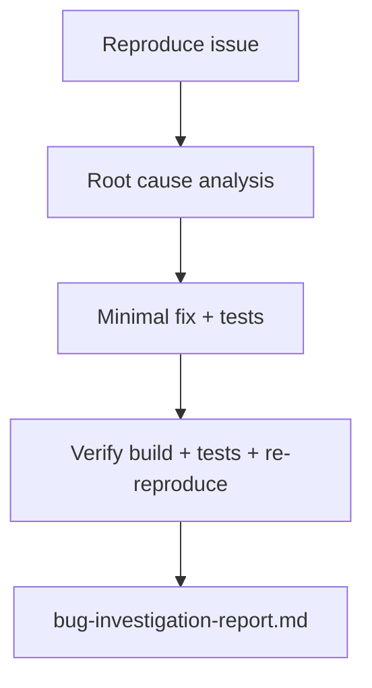

# I6 — Bug Diagnosis

Agent-driven workflow to **reproduce, diagnose, fix, and verify** a bug in an unfamiliar repository — with root-cause analysis, minimal code changes, and build/test evidence in `bug-investigation-report.md`.

```
┌──────────────────┐     /bug-diagnosis      ┌──────────────────────────┐
│  Target repo     │ ───────────────────────► │  bug-investigation-      │
│  (any stack)     │     reproduce → RCA →     │  report.md + minimal fix  │
│                  │     fix → verify          │  in target repo           │
└──────────────────┘                          └──────────────────────────┘
```

## Project layout

```
I6_Dockerize_and_run/
├── README.md                    ← this file
├── STATUS.md                    ← project & investigation status
├── agent.md                     ← Bug Diagnosis Agent spec
└── bug-investigation-report.md  ← RCA, fix summary, verification evidence
```

Code fixes are applied in the **target repository** the user specifies — not inside I6.

## What this agent does

| Step | Action |
| ---- | ------ |
| 1 | **Reproduce** — run exact steps; capture expected vs actual |
| 2 | **Root cause** — trace symptom to file/function before any fix |
| 3 | **Fix** — minimal change + tests that would have caught the bug |
| 4 | **Verify** — re-run reproduction, build, and test suite with proof |
| 5 | **Report** — write `bug-investigation-report.md` with evidence |

## Invoke the agent

**Slash command:** `/bug-diagnosis {repo-path} {bug-description}`

```
/bug-diagnosis ~/Downloads/bo-migration-service GET byUserId returns 200 with defaults instead of 404 for missing user
```

```
/bug-diagnosis ~/my-app NullPointerException when cluster is null on migrateUser
```

```
/bug-diagnosis ~/my-app — user describes bug in follow-up message
```

If only a repo path is given, the agent asks for the bug description and reproduction steps.

Full agent spec: [agent.md](./agent.md)

---

## Process



### Step 1 — Reproduce

* Run commands or steps that trigger the bug.
* Capture inputs, stdout/stderr, HTTP status, stack traces.
* Record **expected** vs **actual** result.
* If reproduction fails, document under **Known Uncertainties** — do not invent a fix.

### Step 2 — Root cause

* Trace from symptom to source file and function.
* Use logs, tests, stack traces, and code reading — not guesses.
* Complete the **Root Cause Analysis** table before writing any fix.

### Step 3 — Minimal fix

* Smallest change that addresses the root cause.
* Add or update tests that would have caught the bug.
* No unrelated refactoring.

### Step 4 — Verify

* Re-run reproduction steps — must show fixed behaviour.
* Run project build and test commands.
* Capture actual command output and exit codes.
* **Never claim fixed without proof.**

---

## Rules

| Rule | Detail |
| ---- | ------ |
| Root cause before fix | No code changes until RCA table is complete |
| Minimal changes | One bug per report |
| Verification mandatory | Build + test + reproduction command |
| Proof required | Paste output or mark as unverified |
| Verified vs inferred | Distinguish in RCA |
| No silent commits | Do not commit unless user explicitly asks |

---

## Deliverables

| Artifact | Location | Description |
| -------- | -------- | ----------- |
| Agent spec | [agent.md](./agent.md) | Workflow, rules, report template |
| Investigation report | [bug-investigation-report.md](./bug-investigation-report.md) | RCA, fix, verification, risk assessment |
| Code fix | Target repository | Minimal patch + new/updated tests |

---

## Report sections (bug-investigation-report.md)

Every agent run must include:

1. **Bug Description** — observed behaviour
2. **Reproduction Steps** — commands, expected vs actual
3. **Root Cause Analysis** — file, function, problem
4. **Fix** — files changed, diff summary
5. **Verification** — build, tests, post-fix reproduction
6. **Agent vs Manual Verification** — what was proven vs pending review
7. **Risk Assessment** — regression, deployment, rollback
8. **Not Done / Blocked** — out-of-scope items

Current report: [bug-investigation-report.md](./bug-investigation-report.md)

---

## Reference case — bo-migration-service

The existing report documents a real bug fix in an external Java/Spring Boot service.

| Field | Value |
| ----- | ----- |
| Repository | `~/Downloads/bo-migration-service` |
| Bug | `GET byUserId` returned **200 + default values** instead of **404** for missing user |
| Status | **Fixed** (verified by unit tests) |
| Stack | Java 17 · Spring Boot · Maven |

### Symptom

`GET /bo-migration/v1/getMigrationStatus/byUserId/999` returned HTTP 200 with synthetic default cluster values when the user was not in cache (AUDIT mode).

### Root cause

| File | Problem |
| ---- | ------- |
| `MigrationStatusService.getByUserId` | Cache miss fell through to `getDefaultResponse()` |
| `MigrationStatusController.getByUserId` | Always wrapped result in `ResponseEntity.ok()` |

### Fix (summary)

* Service returns `null` on AUDIT mode cache miss.
* Controller maps `null` to `404 Not Found`.
* New controller and service unit tests assert the behaviour.

### Verification

```bash
cd ~/Downloads/bo-migration-service
mvn -q compile    # exit 0
mvn -q test       # exit 0 — includes getByUserIdReturns404WhenNotFound
```

Full details: [bug-investigation-report.md](./bug-investigation-report.md)

---

## Detecting build/test commands

| Stack | Build | Test |
| ----- | ----- | ---- |
| Java/Maven | `mvn -q compile` or `./mvnw compile` | `mvn -q test` or `./mvnw test` |
| Java/Gradle | `./gradlew compileJava` | `./gradlew test` |
| Node | `npm run build` (if defined) | `npm test` |
| Python | `pip install -r requirements.txt` | `pytest -v` |
| Rust | `cargo build` | `cargo test` |

---

## Quick reference

| Task | Command / action |
| ---- | ---------------- |
| Project status | [STATUS.md](./STATUS.md) |
| Invoke agent | `/bug-diagnosis {repo-path} {bug-description}` |
| Read latest report | Open [bug-investigation-report.md](./bug-investigation-report.md) |
| Verify Java fix | `mvn -q test` in target repo |
| Verify Python fix | `pytest -v` in target repo |

---

## Relationship to other agents

| Agent | When to use |
| ----- | ----------- |
| [I2 — Flow Trace](../I2_End_to_end_flow_trace/README.md) | Understand call chain before debugging |
| [I3 — Small Safe Change](../I3_Small_safe_change/README.md) | Known small change without full RCA |
| [I5 — Dockerization](../I5_Polyglot_service_pair/README.md) | Containerize a service after fix |
| **I6 — Bug Diagnosis** | Unknown bug — reproduce, RCA, fix, prove |

---

## Agent catalog

Registered as **I6 — Bug Diagnosis** in [docs/agent-catalog.md](../../docs/agent-catalog.md).

**Slash command:** `/bug-diagnosis`

**Cursor skill:** `.cursor/skills/bug-diagnosis/SKILL.md` (points to [agent.md](./agent.md))
