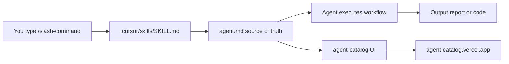

# AI Agent Tasks — Documentation Hub

The **AI Agent Tasks** repository — **24 Cursor agents** across four skill tiers, plus runnable demo projects, validation evidence, and a deployed web catalog.

| | |
| --- | --- |
| **Repository** | [github.com/Rohitverma9569/AI-Agent-Tasks_Rohit_Verma](https://github.com/Rohitverma9569/AI-Agent-Tasks_Rohit_Verma) |
| **Assignment** | [Google Docs — Agent Tasks](https://docs.google.com/document/d/1VurgqAe_qZlMieK8pA4S2yJjWBd7cnoO8cuvh4zmNZs/edit) |
| **Agents** | 24 registered slash commands |
| **Progress** | 24 / 24 complete · [Project Status](./project-status.md) |

---

## Live links

| Resource | URL | Notes |
| -------- | --- | ----- |
| **Agent Catalog (deployed)** | **[https://agent-catalog.vercel.app](https://agent-catalog.vercel.app)** | Browse all 24 agents — no install required |
| Agent Catalog (local) | [http://localhost:3000](http://localhost:3000) | `cd agent-catalog && npm run dev` |

> Runnable APIs and CLIs below are **local-only** — start the service first, then open the link.

| Project | Local URL (when running) | How to start |
| ------- | ------------------------ | ------------ |
| **B4** FastAPI Transaction API | [http://127.0.0.1:8001/docs](http://127.0.0.1:8001/docs) | [local-testing.md](../Basic-repo-reader-and-builder/B4_FastAPI_greenfield_service/local-testing.md) |
| **B5** Node.js Transaction API | [http://localhost:3000/docs](http://localhost:3000/docs) | [local-testing.md](../Basic-repo-reader-and-builder/B5_Node.js_greenfield_API/local-testing.md) |
| **I4** Currency Conversion API | [http://127.0.0.1:8000/docs](http://127.0.0.1:8000/docs) | [local-testing.md](../Intermediate-repo%20operator%20and%20polyglot%20builder/I4/local-testing.md) |
| **A3** Fraud Scoring API | [http://127.0.0.1:8000/docs](http://127.0.0.1:8000/docs) | [A3 README](../Advanced-parallel%20agent%20operator%20and%20system%20builder/A3_Fraud_Score_system/README.md) |
| **A3** Rust risk engine | [http://127.0.0.1:3001/health](http://127.0.0.1:3001/health) | `./scripts/run-all.sh` in A3 folder |

---

## Documentation map

| Document | What you'll learn |
| -------- | ----------------- |
| [**Complete Setup**](./complete-setup.md) | **Start here** — Cursor skills + terminal CLI + local frontend, synced automatically |
| [Project Status & Task Tracker](./project-status.md) | Assignment progress, step-by-step completion, repo status |
| [Getting Started](./getting-started.md) | Prerequisites, Cursor setup, slash commands, agent workflow |
| [Agent Catalog (reference)](./agent-catalog.md) | Full reference for all 24 agents — commands, outputs, specs |
| [Runnable Projects](./runnable-projects.md) | Install, test, and run FastAPI, Node.js, Rust, and polyglot demos |

---

## All projects

### Tier 1 — Basic Repo Reader & Builder

*Folder: [`Basic-repo-reader-and-builder/`](../Basic-repo-reader-and-builder/)*

| ID | Project | Command | Type | Project docs | Live / local link |
| -- | ------- | ------- | ---- | ------------ | ----------------- |
| **B1** | Repo Artifact Inventory | `/repo-inventory` | Report | [README](../Basic-repo-reader-and-builder/B1_Repo_Artifact_Inventory/README.md) · [STATUS](../Basic-repo-reader-and-builder/B1_Repo_Artifact_Inventory/STATUS.md) | — |
| **B2** | API Endpoint Map | `/api-endpoint-map` | Report | [README](../Basic-repo-reader-and-builder/B2_API_endpoint_map/README.md) · [STATUS](../Basic-repo-reader-and-builder/B2_API_endpoint_map/STATUS.md) | — |
| **B3** | Test Discovery & Execution | `/test-discovery` | Report | [README](../Basic-repo-reader-and-builder/B3_Test_discovery_and_execution/README.md) · [STATUS](../Basic-repo-reader-and-builder/B3_Test_discovery_and_execution/STATUS.md) | — |
| **B4** | FastAPI Greenfield Service | `/fastapi-builder` | Runnable API | [README](../Basic-repo-reader-and-builder/B4_FastAPI_greenfield_service/README.md) · [local-testing](../Basic-repo-reader-and-builder/B4_FastAPI_greenfield_service/local-testing.md) | [Swagger :8001](http://127.0.0.1:8001/docs) *(local)* |
| **B5** | Node.js Greenfield API | `/nodejs-builder` | Runnable API | [README](../Basic-repo-reader-and-builder/B5_Node.js_greenfield_API/README.md) · [local-testing](../Basic-repo-reader-and-builder/B5_Node.js_greenfield_API/local-testing.md) | [Swagger :3000](http://localhost:3000/docs) *(local)* |
| **B6** | Rust Log Analyzer CLI | `/rust-log-analyzer` | Runnable CLI | [README](../Basic-repo-reader-and-builder/B6_Rust_greenfield/README.md) · [local-testing](../Basic-repo-reader-and-builder/B6_Rust_greenfield/local-testing.md) | `cargo run -- sample.log` |

---

### Tier 2 — Intermediate Repo Operator & Polyglot Builder

*Folder: [`Intermediate-repo operator and polyglot builder/`](../Intermediate-repo%20operator%20and%20polyglot%20builder/)*

| ID | Project | Command | Type | Project docs | Live / local link |
| -- | ------- | ------- | ---- | ------------ | ----------------- |
| **I1** | ER Diagram from Repo | `/er-diagram` | Report + diagram | [README](../Intermediate-repo%20operator%20and%20polyglot%20builder/I1_ER_diagram_from_repo/README.md) | — |
| **I2** | End-to-End Flow Trace | `/flow-trace` | Report + sequence | [README](../Intermediate-repo%20operator%20and%20polyglot%20builder/I2_End_to_end_flow_trace/README.md) | — |
| **I3** | Small Safe Change | `/small-safe-change` | Code change + report | [README](../Intermediate-repo%20operator%20and%20polyglot%20builder/I3_Small_safe_change/README.md) | — |
| **I4** | Polyglot Service Pair | `/polyglot-service-pair` | FastAPI + Node CLI | [README](../Intermediate-repo%20operator%20and%20polyglot%20builder/I4/README.md) · [local-testing](../Intermediate-repo%20operator%20and%20polyglot%20builder/I4/local-testing.md) | [Swagger :8000](http://127.0.0.1:8000/docs) *(local)* |
| **I5** | Dockerization | `/dockerization` | Dockerfile + report | [README](../Intermediate-repo%20operator%20and%20polyglot%20builder/I5_Polyglot_service_pair/README.md) | — |
| **I6** | Bug Diagnosis | `/bug-diagnosis` | Fix + investigation report | [README](../Intermediate-repo%20operator%20and%20polyglot%20builder/I6_Dockerize_and_run/README.md) · [STATUS](../Intermediate-repo%20operator%20and%20polyglot%20builder/I6_Dockerize_and_run/STATUS.md) | — |

---

### Tier 3 — Advanced Parallel Agent Operator & System Builder

*Folder: [`Advanced-parallel agent operator and system builder/`](../Advanced-parallel%20agent%20operator%20and%20system%20builder/)*

| ID | Project | Command | Type | Project docs | Live / local link |
| -- | ------- | ------- | ---- | ------------ | ----------------- |
| **A1** | Multi-Worktree Parallel Plan | `/multi-worktree-plan` | Report | [README](../Advanced-parallel%20agent%20operator%20and%20system%20builder/A1_Multi-worktree_parallel_plan/README.md) | — |
| **A2** | Execute Parallel Worktrees | `/parallel-worktree-execute` | Report | [README](../Advanced-parallel%20agent%20operator%20and%20system%20builder/A2_Execute_two_parallel_worktrees/README.md) | — |
| **A3** | Fraud Score System | `/fraud-score-system` | Polyglot system | [README](../Advanced-parallel%20agent%20operator%20and%20system%20builder/A3_Fraud_Score_system/README.md) | [API :8000](http://127.0.0.1:8000/docs) · [Engine :3001](http://127.0.0.1:3001/health) *(local)* |
| **A4** | Repository Modernization Plan | `/repository-modernization` | Report | [README](../Advanced-parallel%20agent%20operator%20and%20system%20builder/A4_Repository_Modernization_Plan/README.md) | — |
| **A5** | Adversarial Code Review | `/adversarial-code-review` | Report | [README](../Advanced-parallel%20agent%20operator%20and%20system%20builder/A5_Agent_Code_Review/README.md) | — |
| **A6** | Performance Profiling | `/performance-profiling` | Report | [README](../Advanced-parallel%20agent%20operator%20and%20system%20builder/A6_Performence_Profiling/README.md) | — |

---

### Tier 4 — Infra & DevOps

*Folder: [`Infra-and-DevOps/`](../Infra-and-DevOps/)*

| ID | Project | Command | Type | Project docs | Live / local link |
| -- | ------- | ------- | ---- | ------------ | ----------------- |
| **D1** | Terraform Plan | `/terraform-plan` | IaC + report | [README](../Infra-and-DevOps/D1_Terraform_Plan_For_a_small_service/terraform/README.md) | — |
| **D2** | Docker Compose Stack | `/docker-compose-stack` | Compose + report | [README](../Infra-and-DevOps/D2_Docker-Compose_Stack/README.md) | — |
| **D3** | CI Pipeline (Lint + Test) | `/ci-pipeline` | Pipeline config | [README](../Infra-and-DevOps/D3_Ci_pipiline_that_lints/README.md) | — |
| **D4** | Kubernetes Deployment | `/kubernetes-deployment` | K8s manifests | [README](../Infra-and-DevOps/D4_Kubernetes_Deployment/README.md) | kind/minikube *(local cluster)* |
| **D5** | Reproducible Dev Environment | `/reproducible-dev-environment` | Bootstrap config | [README](../Infra-and-DevOps/D5_Reproducible_dev_environment/README.md) | — |
| **D6** | Observability (Metrics) | `/observability` | Prometheus + Grafana | [README](../Infra-and-DevOps/D6_Observability_bolt_on_with_metrics/README.md) | Grafana *(local, when stack running)* |

---

### Bonus — Agent Catalog Web App

| | |
| --- | --- |
| **Live (deployed)** | **[https://agent-catalog.vercel.app](https://agent-catalog.vercel.app)** |
| **Local** | [http://localhost:3000](http://localhost:3000) |
| **Source** | [`agent-catalog/`](../agent-catalog/) · [README](../agent-catalog/README.md) |

Browse all agents visually — descriptions, slash commands, tiers, and links to each `agent.md` spec. Data auto-regenerates from `**/agent.md` on `npm run dev` and `npm run build`.

```bash
cd agent-catalog
npm install
npm run dev
```

---

## Repository layout

```
AI-Agents-Tasks -PML/
├── .cursor/skills/              # Slash-command registrations (→ agent.md)
├── Basic-repo-reader-and-builder/       # B1–B6
├── Intermediate-repo operator and polyglot builder/  # I1–I6
├── Advanced-parallel agent operator and system builder/ # A1–A6
├── Infra-and-DevOps/            # D1–D6
├── agent-catalog/               # Next.js UI → agent-catalog.vercel.app
└── docs/                        # ← You are here
```

---

## Quick start (30 seconds)

> **Full setup:** [Complete Setup](./complete-setup.md)

1. **Open this repo in Cursor Desktop** (repo root, not `agent-catalog/`).
2. **Browse agents online:** [agent-catalog.vercel.app](https://agent-catalog.vercel.app) — or run locally:
   ```bash
   cd agent-catalog && npm install && npm run dev
   ```
3. **Invoke an agent** in Cursor chat:
   ```
   /repo-inventory /path/to/your/repo
   ```
4. Type `/` in chat to see all registered slash commands.

---

## Runnable projects at a glance

| Project | Stack | Port | Test guide |
| ------- | ----- | ---- | ---------- |
| B4 FastAPI | Python, FastAPI | 8001 | [local-testing](../Basic-repo-reader-and-builder/B4_FastAPI_greenfield_service/local-testing.md) |
| B5 Node.js | Express | 3000 (`localhost`) | [local-testing](../Basic-repo-reader-and-builder/B5_Node.js_greenfield_API/local-testing.md) |
| B6 Rust CLI | Rust, cargo | — | [local-testing](../Basic-repo-reader-and-builder/B6_Rust_greenfield/local-testing.md) |
| I4 Polyglot | FastAPI + Node CLI | 8000 | [local-testing](../Intermediate-repo%20operator%20and%20polyglot%20builder/I4/local-testing.md) |
| A3 Fraud System | FastAPI + Node + Rust | 8000, 3001 | [README](../Advanced-parallel%20agent%20operator%20and%20system%20builder/A3_Fraud_Score_system/README.md) |

Full run instructions: [Runnable Projects](./runnable-projects.md)

---

## How agents are wired



| Layer | Path | Role |
| ----- | ---- | ---- |
| **Agent spec** | `{tier-folder}/{agent-folder}/agent.md` | Full workflow, rules, deliverables |
| **Cursor skill** | `.cursor/skills/{name}/SKILL.md` | Registers slash command in Cursor chat |
| **Output** | Agent folder | Reports (`*.md`) or runnable code |
| **Catalog UI** | `agent-catalog/` | Visual browser — [live](https://agent-catalog.vercel.app) |

---

## Need help?

| Question | Where to look |
| -------- | ------------- |
| How do I run an agent? | [Getting Started](./getting-started.md) |
| Which agent should I use? | [Agent Catalog (live)](https://agent-catalog.vercel.app) · [Reference](./agent-catalog.md) |
| How do I run the APIs / CLI demos? | [Runnable Projects](./runnable-projects.md) |
| What's done vs pending? | [Project Status](./project-status.md) |
| Full agent instructions | `{tier-folder}/{agent-folder}/agent.md` |
