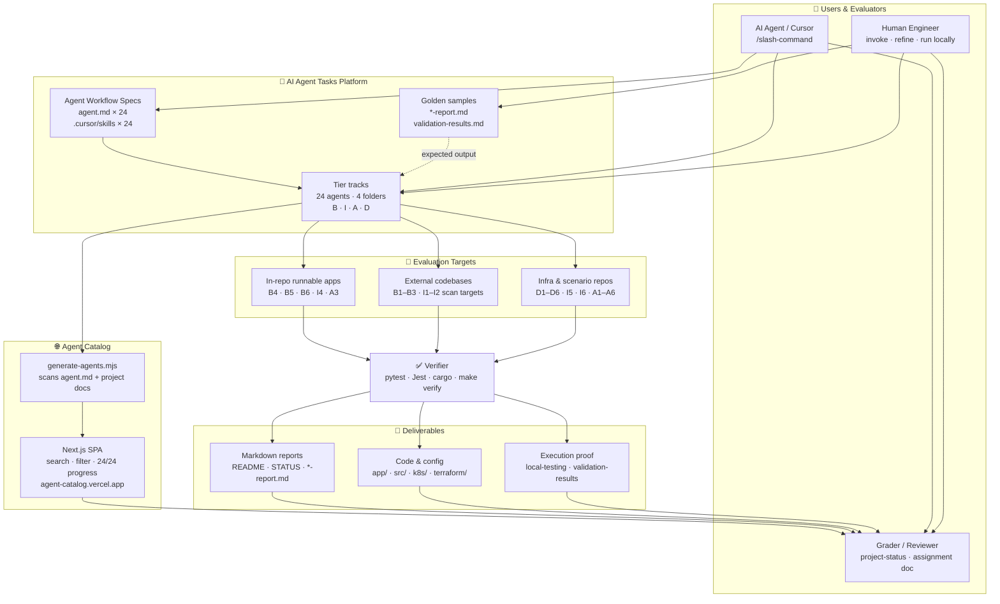
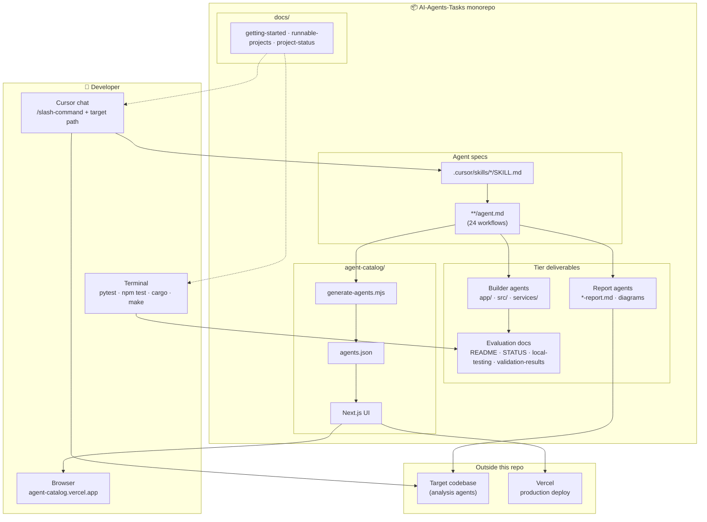
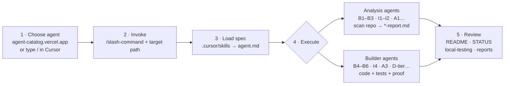
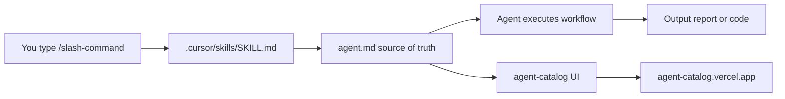

# AI Agent Tasks — Documentation Hub

The **AI Agent Tasks** repository — **24 Cursor agents** across four skill tiers, plus runnable demo projects, validation evidence, and a deployed web catalog.

| | |
| --- | --- |
| **Repository** | [github.com/Rohitverma9569/AI-Agent-Tasks_Rohit_Verma](https://github.com/Rohitverma9569/AI-Agent-Tasks_Rohit_Verma) |
| **Assignment** | [Google Docs — Agent Tasks](https://docs.google.com/document/d/1VurgqAe_qZlMieK8pA4S2yJjWBd7cnoO8cuvh4zmNZs/edit) |
| **Agents** | 24 registered slash commands |
| **Progress** | 24 / 24 complete · [Project Status](./project-status.md) |

---

## Documentation map

| Document | What you'll learn |
| -------- | ----------------- |
| [**Complete Setup**](./complete-setup.md) | **Start here** — Cursor skills + terminal CLI + local frontend, synced automatically |
| [Project Status & Task Tracker](./project-status.md) | Assignment progress, step-by-step completion, repo status |
| [Getting Started](./getting-started.md) | Prerequisites, Cursor setup, slash commands, agent workflow |
| [Live links](#live-links) | Deployed catalog + local Swagger / API URLs |
| [Agent Catalog (reference)](./agent-catalog.md) | Full reference for all 24 agents — commands, outputs, specs |
| [All projects](#all-projects) | Full index — B1–D6 tables, commands, docs, local links |
| [Runnable Projects](./runnable-projects.md) | Install, test, and run FastAPI, Node.js, Rust, and polyglot demos |
| [Observability](#observability) | D6 Prometheus + Grafana stack — dashboards, metrics, local URLs |
| [Repository architecture](#repository-architecture) | High-level platform diagram, monorepo flow |
| [Repository layout](#repository-layout) | Full folder tree and per-agent file conventions |
| [Agent workflow](#agent-workflow) | End-to-end flow — choose, invoke, execute, review |
| [Summary of repo](#summary-of-repo) | What this monorepo contains — tiers, deliverables, status |

---

## Repository architecture

How the monorepo is organized: **four agent tiers**, shared wiring through `agent.md` + Cursor skills, and surfaces where you run or browse agents.

### High-level platform architecture

End-to-end view of the **AI Agent Tasks** evaluation platform — specs and tier tracks drive agent runs against targets, produce deliverables with proof, and feed the catalog and grader.



| Block | This repo | Role |
| ----- | --------- | ---- |
| **Agent Workflow Specs** | `agent.md` + `.cursor/skills/*/SKILL.md` | Defines each agent's workflow, rules, and slash command |
| **Tier tracks** | `Basic-repo-reader-and-builder/` · `Intermediate-repo operator and polyglot builder/` · `Advanced-parallel agent operator and system builder/` · `Infra-and-DevOps/` | 24 exercises across 4 skill tracks |
| **Golden samples** | Per-agent `*-report.md`, `validation-results.md`, sample diagrams | Reference outputs showing what “done” looks like |
| **Agent Catalog** | `agent-catalog/` → [agent-catalog.vercel.app](https://agent-catalog.vercel.app) | Browse, search, and track all 24 agents |
| **Evaluation Targets** | Runnable demos (B4/B5/B6/I4/A3), external repos for analysis agents, infra stacks (D-tier) | What the agent reads, builds against, or deploys |
| **Verifier** | `pytest`, `npm test`, `cargo test`, `make verify`, curl/Swagger checks | Confirms tests pass before evidence is recorded |
| **Deliverables** | Reports, scoped code changes, `local-testing.md` proof | Grading artifacts in each agent folder |
| **Users & Evaluators** | Cursor agent, human engineer, [Project Status](./project-status.md) + assignment doc | Run agents, reproduce locally, sign off completion |

### Monorepo component flow

End-to-end view of how specs, skills, docs, demos, and the catalog connect inside this repo and at runtime.



| Component | Location | Role |
| --------- | -------- | ---- |
| **Agent spec** | `{tier}/{agent}/agent.md` | Source of truth — workflow, rules, deliverables |
| **Cursor skill** | `.cursor/skills/{name}/SKILL.md` | Registers `/slash-command` in chat |
| **Analysis output** | Agent folder `*-report.md` | Inventory, API map, ER diagram, plans |
| **Runnable output** | `app/`, `src/`, `services/`, etc. | APIs, CLIs, infra configs — verified locally |
| **Evaluation docs** | `README.md`, `STATUS.md`, `local-testing.md` | Grading artifacts and reproducible runbooks |
| **Docs hub** | `docs/` | Setup, status, runnable guides — you are here |
| **Catalog generator** | `agent-catalog/scripts/generate-agents.mjs` | Merges `agent.md` + project docs → `agents.json` |
| **Catalog UI** | `agent-catalog/` → [Vercel](https://agent-catalog.vercel.app) | Browse all 24 agents without Cursor |

**Invocation paths**

1. **Report / analysis** — Cursor → skill → `agent.md` → scan **target repo** → write report in agent folder.
2. **Greenfield / builder** — Cursor → skill → `agent.md` → implement in agent folder → run tests → capture `validation-results.md`.
3. **Browse only** — open catalog (local `:3000` or Vercel) — no target repo required.

Wire-up details (predev hooks, local catalog dev): [Complete Setup](./complete-setup.md).

---

## Repository layout

Full monorepo map — **24 agents** in four tier folders, Cursor skill registrations, evaluation docs, and the deployed catalog app.

```
AI-Agents-Tasks -PML/
│
├── .cursor/
│   └── skills/                          # 24 slash-command registrations
│       ├── repo-inventory/SKILL.md      #   each SKILL.md → ../{tier}/{agent}/agent.md
│       ├── api-endpoint-map/SKILL.md
│       ├── fastapi-builder/SKILL.md
│       └── … (21 more skills)
│
├── Basic-repo-reader-and-builder/       # Tier 1 — B1–B6
│   ├── B1_Repo_Artifact_Inventory/
│   │   ├── agent.md                     #   source of truth (workflow + rules)
│   │   ├── README.md · STATUS.md        #   evaluation docs
│   │   └── repo-inventory.md            #   sample report output
│   ├── B2_API_endpoint_map/
│   │   ├── agent.md · README.md · STATUS.md
│   │   └── api-endpoint-map.md
│   ├── B3_Test_discovery_and_execution/
│   │   ├── agent.md · README.md · STATUS.md
│   │   └── test-discovery-report.md
│   ├── B4_FastAPI_greenfield_service/   #   💻 runnable API
│   │   ├── agent.md · README.md · STATUS.md
│   │   ├── local-testing.md · validation-results.md
│   │   ├── app/ · tests/ · requirements.txt
│   │   ├── Dockerfile · k8s/
│   │   └── …
│   ├── B5_Node.js_greenfield_API/       #   💻 runnable API
│   │   ├── agent.md · README.md · STATUS.md
│   │   ├── local-testing.md · validation-results.md
│   │   ├── src/ · tests/ · package.json
│   │   └── …
│   └── B6_Rust_greenfield/              #   💻 runnable CLI
│       ├── agent.md · README.md · STATUS.md
│       ├── local-testing.md · validation-results.md
│       ├── src/ · tests/ · Cargo.toml · sample.log
│       └── …
│
├── Intermediate-repo operator and polyglot builder/   # Tier 2 — I1–I6
│   ├── I1_ER_diagram_from_repo/
│   │   ├── agent.md · README.md
│   │   ├── er-diagram-report.md · er-diagram.mmd
│   │   └── …
│   ├── I2_End_to_end_flow_trace/
│   │   ├── agent.md · README.md
│   │   ├── flow-trace-report.md · flow-trace-sequence.mmd
│   │   └── …
│   ├── I3_Small_safe_change/
│   │   ├── agent.md · README.md · change-report.md
│   │   └── …
│   ├── I4/                              #   💻 runnable polyglot pair
│   │   ├── agent.md · README.md · STATUS.md
│   │   ├── local-testing.md · validation-results.md
│   │   ├── services/ · clients/
│   │   └── …
│   ├── I5_Polyglot_service_pair/
│   │   ├── agent.md · README.md · STATUS.md · docker-report.md
│   │   └── …
│   └── I6_Dockerize_and_run/
│       ├── agent.md · README.md · STATUS.md
│       ├── bug-investigation-report.md
│       └── …
│
├── Advanced-parallel agent operator and system builder/   # Tier 3 — A1–A6
│   ├── A1_Multi-worktree_parallel_plan/
│   │   ├── agent.md · README.md · multi-worktree-plan.md
│   │   └── …
│   ├── A2_Execute_two_parallel_worktrees/
│   │   ├── agent.md · README.md · parallel-execution-report.md
│   │   └── …
│   ├── A3_Fraud_Score_system/           #   💻 runnable polyglot system
│   │   ├── agent.md · README.md
│   │   ├── services/ · workers/ · engines/ · contracts/
│   │   ├── scripts/ · Makefile · docs/
│   │   └── …
│   ├── A4_Repository_Modernization_Plan/
│   │   ├── agent.md · README.md · docs/modernization-report.md
│   │   └── …
│   ├── A5_Agent_Code_Review/
│   │   ├── agent.md · README.md · code-review-report.md
│   │   └── …
│   └── A6_Performence_Profiling/
│       ├── agent.md · README.md · performance-report.md
│       └── …
│
├── Infra-and-DevOps/                    # Tier 4 — D1–D6
│   ├── D1_Terraform_Plan_For_a_small_service/
│   │   ├── agent.md · terraform/ · docs/terraform-report.md
│   │   └── …
│   ├── D2_Docker-Compose_Stack/
│   │   ├── agent.md · README.md · docker-compose.yml · docs/
│   │   └── …
│   ├── D3_Ci_pipiline_that_lints/
│   │   ├── agent.md · README.md · app/ · .github/workflows/ · docs/
│   │   └── …
│   ├── D4_Kubernetes_Deployment/
│   │   ├── agent.md · README.md · k8s/ · docs/
│   │   └── …
│   ├── D5_Reproducible_dev_environment/
│   │   ├── agent.md · README.md · docs/dev-bootstrap-report.md
│   │   └── …
│   └── D6_Observability_bolt_on_with_metrics/
│       ├── agent.md · README.md · docs/local-testing.md · prometheus/ · grafana/
│       └── …
│
├── agent-catalog/                         # Next.js web app → agent-catalog.vercel.app
│   ├── README.md
│   ├── scripts/
│   │   └── generate-agents.mjs          #   scans **/agent.md → agents.json
│   ├── src/
│   │   ├── app/                         #   Next.js pages (/)
│   │   ├── components/                  #   AgentCard · AgentCatalog · AgentDetailPanel
│   │   ├── data/
│   │   │   └── agents.json              #   generated catalog data (committed for Vercel)
│   │   └── types/
│   │       └── agent.ts
│   └── package.json
│
└── docs/                                  # ← You are here — documentation hub
    ├── README.md                          #   this file
    ├── complete-setup.md                  #   Cursor + catalog + CLI setup
    ├── getting-started.md                 #   invoke agents in Cursor
    ├── project-status.md                  #   24/24 task tracker
    ├── runnable-projects.md               #   run B4 · B5 · B6 · I4 · A3 locally
    └── agent-catalog.md                   #   full slash-command reference
```

### Conventions per agent folder

| Artifact | Typical path | Purpose |
| -------- | ------------ | ------- |
| **Agent spec** | `agent.md` | Workflow, rules, deliverables — source of truth |
| **Cursor skill** | `.cursor/skills/{name}/SKILL.md` | Registers `/slash-command` in chat |
| **Evaluation README** | `README.md` | Project overview, endpoints, how to run |
| **Status tracker** | `STATUS.md` | Completion checklist and evidence links |
| **Local run guide** | `local-testing.md` | Step-by-step install, test, curl (runnable agents) |
| **Test evidence** | `validation-results.md` | Terminal output proving tests passed |
| **Report output** | `*-report.md` | Analysis / planning deliverables (report agents) |
| **Runnable code** | `app/`, `src/`, `services/`, etc. | APIs, CLIs, infra configs (builder agents) |

---

## Agent workflow

How a single agent run works — from choosing a command to a verified deliverable in the agent folder.



**Analysis workflow** — point the agent at any codebase (`/repo-inventory`, `/api-endpoint-map`, `/er-diagram`, …). It reads source files and writes a report next to `agent.md`.

**Builder workflow** — the agent implements or extends code inside its project folder (`/fastapi-builder`, `/polyglot-service-pair`, `/observability`, …), runs tests, and records output in `validation-results.md`.

**Browse-only** — open [agent-catalog.vercel.app](https://agent-catalog.vercel.app) to explore all 24 agents, copy slash commands, and jump to project docs without running anything.

Ready to try it? → [Quick start](#quick-start) below.

---

## Quick start

Two paths depending on what you need — **run an agent** in Cursor or **run a project** locally.

**Full guides:** [Complete Setup](./complete-setup.md) · [Getting Started](./getting-started.md) · [Runnable Projects](./runnable-projects.md)

---

### 🖥️ Run an agent

Use **Cursor Desktop** to run any of the **24 agents**. Each slash command maps to an `agent.md` spec in the repo.

#### Steps

1. Open this repository in **Cursor** — repo root, not `agent-catalog/`
2. Type **`/`** in chat to list commands, or browse **[agent-catalog.vercel.app](https://agent-catalog.vercel.app)**
3. Invoke an agent — add a **target path** when needed
4. Check the agent folder for output

#### Try these

```text
/repo-inventory ~/projects/payments-api
/api-endpoint-map .
/test-discovery /path/to/repo
/fastapi-builder
/multi-worktree-plan . Add notifications
```

#### Where output lands

- **Reports** → `{agent-folder}/*-report.md`
- **Code** → `{agent-folder}/app/`, `src/`, `services/`
- **Proof** → `validation-results.md` · `local-testing.md`

---

### 💻 Run a project

**5 runnable demos** with verified tests. Pick one, run the commands, open Swagger or the CLI.

> **Ports:** I4 → **8000** · B4 → **8001** · B5 → **`localhost:3000`**

---

#### 🟢 B4 — FastAPI Transaction API

`Python · FastAPI` · port **8001** · pytest **5/5**

```bash
cd "Basic-repo-reader-and-builder/B4_FastAPI_greenfield_service"
python3 -m venv .venv && source .venv/bin/activate
pip install -r requirements.txt
pytest -v
uvicorn app.main:app --reload --host 127.0.0.1 --port 8001
```

→ [Swagger :8001](http://127.0.0.1:8001/docs) · [local-testing](../Basic-repo-reader-and-builder/B4_FastAPI_greenfield_service/local-testing.md)

#### 🟢 B5 — Node.js Transaction API

`Express` · port **3000** · Jest **18/18**

```bash
cd "Basic-repo-reader-and-builder/B5_Node.js_greenfield_API"
npm install && npm test && npm start
```

→ [Swagger :3000](http://localhost:3000/docs) · [local-testing](../Basic-repo-reader-and-builder/B5_Node.js_greenfield_API/local-testing.md)

#### 🟢 B6 — Rust Log Analyzer CLI

`Rust · cargo` · cargo **6/6**

```bash
cd "Basic-repo-reader-and-builder/B6_Rust_greenfield"
cargo test
cargo run -- sample.log
```

→ [local-testing](../Basic-repo-reader-and-builder/B6_Rust_greenfield/local-testing.md)

#### 🔵 I4 — Polyglot Currency API + CLI

`FastAPI + Node CLI` · port **8000** · pytest **9/9**

See [local-testing guide](../Intermediate-repo%20operator%20and%20polyglot%20builder/I4/local-testing.md) for the full two-component setup.

→ [Swagger :8000](http://127.0.0.1:8000/docs)

#### 🟣 A3 — Fraud Scoring System

`FastAPI + Node + Rust` · ports **8000** + **3001** · `make verify`

```bash
cd "Advanced-parallel agent operator and system builder/A3_Fraud_Score_system"
make verify
./scripts/run-all.sh
```

→ [A3 README](../Advanced-parallel%20agent%20operator%20and%20system%20builder/A3_Fraud_Score_system/README.md) · [API :8000](http://127.0.0.1:8000/docs) · [Engine :3001](http://127.0.0.1:3001/health)

#### 🌐 Agent Catalog (local browser)

```bash
cd agent-catalog && npm install && npm run dev
```

→ [localhost:3000](http://localhost:3000) · live at [agent-catalog.vercel.app](https://agent-catalog.vercel.app)

---

Full curl examples and troubleshooting → **[Runnable Projects](./runnable-projects.md)**

---

## Live links

| Resource | URL | Notes |
| -------- | --- | ----- |
| **Agent Catalog (deployed)** | **[https://agent-catalog.vercel.app](https://agent-catalog.vercel.app)** | Browse all 24 agents — no install required |
| Agent Catalog (local) | [http://localhost:3000](http://localhost:3000) | `cd agent-catalog && npm run dev` |

> Runnable APIs and CLIs below are **local-only** — start the service first, then open the link.

| Project | Local URL (when running) | How to start |
| ------- | ------------------------ | ------------ |
| **B4** FastAPI Transaction API | [http://127.0.0.1:8001/docs](http://127.0.0.1:8001/docs) | [local-testing.md](../Basic-repo-reader-and-builder/B4_FastAPI_greenfield_service/local-testing.md) |
| **B5** Node.js Transaction API | [http://localhost:3000/docs](http://localhost:3000/docs) | [local-testing.md](../Basic-repo-reader-and-builder/B5_Node.js_greenfield_API/local-testing.md) |
| **I4** Currency Conversion API | [http://127.0.0.1:8000/docs](http://127.0.0.1:8000/docs) | [local-testing.md](../Intermediate-repo%20operator%20and%20polyglot%20builder/I4/local-testing.md) |
| **A3** Fraud Scoring API | [http://127.0.0.1:8000/docs](http://127.0.0.1:8000/docs) | [A3 README](../Advanced-parallel%20agent%20operator%20and%20system%20builder/A3_Fraud_Score_system/README.md) |
| **A3** Rust risk engine | [http://127.0.0.1:3001/health](http://127.0.0.1:3001/health) | `./scripts/run-all.sh` in A3 folder |

---

## All projects

### Tier 1 — Basic Repo Reader & Builder

*Folder: [`Basic-repo-reader-and-builder/`](../Basic-repo-reader-and-builder/)*

| ID | Project | Command | Type | Project docs | Live / local link |
| -- | ------- | ------- | ---- | ------------ | ----------------- |
| **B1** | Repo Artifact Inventory | `/repo-inventory` | Report | [README](../Basic-repo-reader-and-builder/B1_Repo_Artifact_Inventory/README.md) · [STATUS](../Basic-repo-reader-and-builder/B1_Repo_Artifact_Inventory/STATUS.md) | — |
| **B2** | API Endpoint Map | `/api-endpoint-map` | Report | [README](../Basic-repo-reader-and-builder/B2_API_endpoint_map/README.md) · [STATUS](../Basic-repo-reader-and-builder/B2_API_endpoint_map/STATUS.md) | — |
| **B3** | Test Discovery & Execution | `/test-discovery` | Report | [README](../Basic-repo-reader-and-builder/B3_Test_discovery_and_execution/README.md) · [STATUS](../Basic-repo-reader-and-builder/B3_Test_discovery_and_execution/STATUS.md) | — |
| **B4** | FastAPI Greenfield Service | `/fastapi-builder` | Runnable API | [README](../Basic-repo-reader-and-builder/B4_FastAPI_greenfield_service/README.md) · [local-testing](../Basic-repo-reader-and-builder/B4_FastAPI_greenfield_service/local-testing.md) | [Swagger :8001](http://127.0.0.1:8001/docs) *(local)* |
| **B5** | Node.js Greenfield API | `/nodejs-builder` | Runnable API | [README](../Basic-repo-reader-and-builder/B5_Node.js_greenfield_API/README.md) · [local-testing](../Basic-repo-reader-and-builder/B5_Node.js_greenfield_API/local-testing.md) | [Swagger :3000](http://localhost:3000/docs) *(local)* |
| **B6** | Rust Log Analyzer CLI | `/rust-log-analyzer` | Runnable CLI | [README](../Basic-repo-reader-and-builder/B6_Rust_greenfield/README.md) · [local-testing](../Basic-repo-reader-and-builder/B6_Rust_greenfield/local-testing.md) | `cargo run -- sample.log` |

---

### Tier 2 — Intermediate Repo Operator & Polyglot Builder

*Folder: [`Intermediate-repo operator and polyglot builder/`](../Intermediate-repo%20operator%20and%20polyglot%20builder/)*

| ID | Project | Command | Type | Project docs | Live / local link |
| -- | ------- | ------- | ---- | ------------ | ----------------- |
| **I1** | ER Diagram from Repo | `/er-diagram` | Report + diagram | [README](../Intermediate-repo%20operator%20and%20polyglot%20builder/I1_ER_diagram_from_repo/README.md) | — |
| **I2** | End-to-End Flow Trace | `/flow-trace` | Report + sequence | [README](../Intermediate-repo%20operator%20and%20polyglot%20builder/I2_End_to_end_flow_trace/README.md) | — |
| **I3** | Small Safe Change | `/small-safe-change` | Code change + report | [README](../Intermediate-repo%20operator%20and%20polyglot%20builder/I3_Small_safe_change/README.md) | — |
| **I4** | Polyglot Service Pair | `/polyglot-service-pair` | FastAPI + Node CLI | [README](../Intermediate-repo%20operator%20and%20polyglot%20builder/I4/README.md) · [local-testing](../Intermediate-repo%20operator%20and%20polyglot%20builder/I4/local-testing.md) | [Swagger :8000](http://127.0.0.1:8000/docs) *(local)* |
| **I5** | Dockerization | `/dockerization` | Dockerfile + report | [README](../Intermediate-repo%20operator%20and%20polyglot%20builder/I5_Polyglot_service_pair/README.md) | — |
| **I6** | Bug Diagnosis | `/bug-diagnosis` | Fix + investigation report | [README](../Intermediate-repo%20operator%20and%20polyglot%20builder/I6_Dockerize_and_run/README.md) · [STATUS](../Intermediate-repo%20operator%20and%20polyglot%20builder/I6_Dockerize_and_run/STATUS.md) | — |

---

### Tier 3 — Advanced Parallel Agent Operator & System Builder

*Folder: [`Advanced-parallel agent operator and system builder/`](../Advanced-parallel%20agent%20operator%20and%20system%20builder/)*

| ID | Project | Command | Type | Project docs | Live / local link |
| -- | ------- | ------- | ---- | ------------ | ----------------- |
| **A1** | Multi-Worktree Parallel Plan | `/multi-worktree-plan` | Report | [README](../Advanced-parallel%20agent%20operator%20and%20system%20builder/A1_Multi-worktree_parallel_plan/README.md) | — |
| **A2** | Execute Parallel Worktrees | `/parallel-worktree-execute` | Report | [README](../Advanced-parallel%20agent%20operator%20and%20system%20builder/A2_Execute_two_parallel_worktrees/README.md) | — |
| **A3** | Fraud Score System | `/fraud-score-system` | Polyglot system | [README](../Advanced-parallel%20agent%20operator%20and%20system%20builder/A3_Fraud_Score_system/README.md) | [API :8000](http://127.0.0.1:8000/docs) · [Engine :3001](http://127.0.0.1:3001/health) *(local)* |
| **A4** | Repository Modernization Plan | `/repository-modernization` | Report | [README](../Advanced-parallel%20agent%20operator%20and%20system%20builder/A4_Repository_Modernization_Plan/README.md) | — |
| **A5** | Adversarial Code Review | `/adversarial-code-review` | Report | [README](../Advanced-parallel%20agent%20operator%20and%20system%20builder/A5_Agent_Code_Review/README.md) | — |
| **A6** | Performance Profiling | `/performance-profiling` | Report | [README](../Advanced-parallel%20agent%20operator%20and%20system%20builder/A6_Performence_Profiling/README.md) | — |

---

### Tier 4 — Infra & DevOps

*Folder: [`Infra-and-DevOps/`](../Infra-and-DevOps/)*

| ID | Project | Command | Type | Project docs | Live / local link |
| -- | ------- | ------- | ---- | ------------ | ----------------- |
| **D1** | Terraform Plan | `/terraform-plan` | IaC + report | [README](../Infra-and-DevOps/D1_Terraform_Plan_For_a_small_service/terraform/README.md) | — |
| **D2** | Docker Compose Stack | `/docker-compose-stack` | Compose + report | [README](../Infra-and-DevOps/D2_Docker-Compose_Stack/README.md) | — |
| **D3** | CI Pipeline (Lint + Test) | `/ci-pipeline` | Pipeline config | [README](../Infra-and-DevOps/D3_Ci_pipiline_that_lints/README.md) | — |
| **D4** | Kubernetes Deployment | `/kubernetes-deployment` | K8s manifests | [README](../Infra-and-DevOps/D4_Kubernetes_Deployment/README.md) | kind/minikube *(local cluster)* |
| **D5** | Reproducible Dev Environment | `/reproducible-dev-environment` | Bootstrap config | [README](../Infra-and-DevOps/D5_Reproducible_dev_environment/README.md) | — |
| **D6** | Observability (Metrics) | `/observability` | Prometheus + Grafana | [README](../Infra-and-DevOps/D6_Observability_bolt_on_with_metrics/README.md) · [local-testing](../Infra-and-DevOps/D6_Observability_bolt_on_with_metrics/docs/local-testing.md) | [Grafana dashboard](http://localhost:3000/d/d6-app-dashboard) *(local)* |

---

### Dashboard — Agent Catalog Web App

| | |
| --- | --- |
| **Live (deployed)** | **[https://agent-catalog.vercel.app](https://agent-catalog.vercel.app)** |
| **Local** | [http://localhost:3000](http://localhost:3000) |
| **Source** | [`agent-catalog/`](../agent-catalog/) · [README](../agent-catalog/README.md) |

Browse all agents visually — descriptions, slash commands, tiers, and links to each `agent.md` spec. Data auto-regenerates from `**/agent.md` on `npm run dev` and `npm run build`.

```bash
cd agent-catalog
npm install
npm run dev
```

---

## Observability

**D6** — FastAPI + Prometheus + Grafana stack (`/observability`). Start Docker Compose first, then open the links below.

> **Local only** — nothing is deployed to Vercel.  
> **Port clash:** Grafana uses `localhost:3000` (same as B5 and agent-catalog). Stop those services before starting D6, or run one stack at a time.

### 🚀 Start the stack

```bash
cd Infra-and-DevOps/D6_Observability_bolt_on_with_metrics/monitoring
docker-compose up -d --build
```

### 📊 Dashboards & monitoring

- **Grafana dashboard** → [http://localhost:3000/d/d6-app-dashboard](http://localhost:3000/d/d6-app-dashboard) · login `admin` / `admin`
- **Grafana home** → [http://localhost:3000](http://localhost:3000)
- **Prometheus UI** → [http://localhost:9090](http://localhost:9090)
- **Prometheus targets** → [http://localhost:9090/targets](http://localhost:9090/targets) · expect `d6-demo-api` **UP**

### 📡 App endpoints

Port **8008** (avoids conflict with B4/I4 on 8000).

- `GET /health` → [http://localhost:8008/health](http://localhost:8008/health)
- `GET /metrics` → [http://localhost:8008/metrics](http://localhost:8008/metrics) · Prometheus scrape source
- `GET /api/items` → [http://localhost:8008/api/items](http://localhost:8008/api/items) · demo traffic
- `GET /api/error` → [http://localhost:8008/api/error](http://localhost:8008/api/error) · intentional 500 for error metrics
- `GET /docs` → [http://localhost:8008/docs](http://localhost:8008/docs) · Swagger UI

### 🔄 Generate traffic

From the D6 project root (not `monitoring/`):

```bash
cd Infra-and-DevOps/D6_Observability_bolt_on_with_metrics
./scripts/load-test.sh
```

Wait ~15s for Prometheus scrape, then refresh the Grafana dashboard — panels show request rate, errors, and latency by endpoint.

### 📚 Docs

[D6 README](../Infra-and-DevOps/D6_Observability_bolt_on_with_metrics/README.md) · [local-testing](../Infra-and-DevOps/D6_Observability_bolt_on_with_metrics/docs/local-testing.md) · [observability-report](../Infra-and-DevOps/D6_Observability_bolt_on_with_metrics/docs/observability-report.md)

### 🛑 Stop

```bash
cd Infra-and-DevOps/D6_Observability_bolt_on_with_metrics/monitoring
docker-compose down
```

---

## How agents are wired

Technical mapping from slash command to spec to output. For the end-to-end user flow, see [Agent workflow](#agent-workflow). For the full platform view, see [Repository architecture](#repository-architecture).



| Layer | Path | Role |
| ----- | ---- | ---- |
| **Agent spec** | `{tier-folder}/{agent-folder}/agent.md` | Full workflow, rules, deliverables |
| **Cursor skill** | `.cursor/skills/{name}/SKILL.md` | Registers slash command in Cursor chat |
| **Output** | Agent folder | Reports (`*.md`) or runnable code |
| **Catalog UI** | `agent-catalog/` | Visual browser — [live](https://agent-catalog.vercel.app) |

---

## Need help?

| Question | Where to look |
| -------- | ------------- |
| How do I run an agent? | [Getting Started](./getting-started.md) |
| Which agent should I use? | [Agent Catalog (live)](https://agent-catalog.vercel.app) · [Reference](./agent-catalog.md) |
| How do I run the APIs / CLI demos? | [Runnable Projects](./runnable-projects.md) |
| How do I open Grafana / Prometheus? | [Observability](#observability) · [D6 local-testing](../Infra-and-DevOps/D6_Observability_bolt_on_with_metrics/docs/local-testing.md) |
| What's done vs pending? | [Project Status](./project-status.md) |
| Full agent instructions | `{tier-folder}/{agent-folder}/agent.md` |

---

## Summary of repo

**AI Agent Tasks** is a monorepo that evaluates Cursor agents end-to-end: each exercise has a workflow spec (`agent.md`), a registered slash command (`.cursor/skills/`), graded deliverables, and proof of execution. All **24 assignment tasks are complete**.

| Area | What’s in the repo |
| ---- | ------------------ |
| **Tier 1 — Basic** (`Basic-repo-reader-and-builder/`) | B1–B3 repo analysis reports · B4 FastAPI · B5 Node.js · B6 Rust CLI |
| **Tier 2 — Intermediate** (`Intermediate-repo operator and polyglot builder/`) | I1 ER diagram · I2 flow trace · I3 safe change · I4 polyglot pair · I5 dockerization · I6 bug diagnosis |
| **Tier 3 — Advanced** (`Advanced-parallel agent operator and system builder/`) | A1–A2 parallel worktrees · A3 fraud scoring system · A4 modernization · A5 code review · A6 profiling |
| **Tier 4 — Infra & DevOps** (`Infra-and-DevOps/`) | D1 Terraform · D2 Compose · D3 CI · D4 Kubernetes · D5 dev environment · D6 observability stack |
| **Dashboard** | [agent-catalog.vercel.app](https://agent-catalog.vercel.app) — browse all agents, commands, and docs |
| **Documentation** | `docs/` hub · per-project `README` · `STATUS` · `local-testing` · `validation-results` |

**Runnable locally:** B4 (FastAPI :8001) · B5 (Node :3000) · B6 (Rust CLI) · I4 (FastAPI + CLI :8000) · A3 (polyglot system :8000 + :3001) · D6 (Prometheus + Grafana).

**How to use it:** invoke agents in Cursor via `/slash-command` → review output in each agent folder → reproduce demos with [Runnable Projects](./runnable-projects.md) → track completion in [Project Status](./project-status.md).

| | |
| --- | --- |
| **Repository** | [github.com/Rohitverma9569/AI-Agent-Tasks_Rohit_Verma](https://github.com/Rohitverma9569/AI-Agent-Tasks_Rohit_Verma) |
| **Assignment** | [Google Docs — Agent Tasks](https://docs.google.com/document/d/1VurgqAe_qZlMieK8pA4S2yJjWBd7cnoO8cuvh4zmNZs/edit) |
| **Progress** | **24 / 24 complete** |
| **Catalog** | [agent-catalog.vercel.app](https://agent-catalog.vercel.app) |
