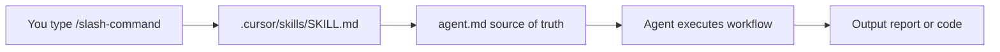

# AI Agent Tasks — Documentation

Welcome to the **AI Agent Tasks** repository. This project contains **24 Cursor agents** organized by skill level, plus runnable demo projects built by those agents.

Use this documentation to learn how to invoke agents, understand what each one produces, and run the services they create.

---

## Documentation map

| Document | What you'll learn |
| -------- | ----------------- |
| [**Complete Setup**](./complete-setup.md) | **Start here** — Cursor skills + terminal CLI + local frontend, synced automatically |
| [Project Status & Task Tracker](./project-status.md) | Assignment progress, step-by-step completion, and repo status |
| [Getting Started](./getting-started.md) | Prerequisites, Cursor setup, slash commands, and the agent workflow |
| [Agent Catalog](./agent-catalog.md) | Full reference for all 24 agents with commands and outputs |
| [Runnable Projects](./runnable-projects.md) | How to test and run FastAPI, Node.js, Rust, and polyglot demos |

---

## Repository layout

```
AI-Agents-Tasks -PML/
├── .cursor/skills/              # Slash-command registrations (points to agent.md)
├── Basic-repo-reader-and-builder/       # B1–B6  — read & build fundamentals
├── Intermediate-repo operator and polyglot builder/  # I1–I6 — analysis & polyglot
├── Advanced-parallel agent operator and system builder/ # A1–A6 — parallel & systems
├── Infra-and-DevOps/            # D1–D6  — Terraform, Docker, CI, K8s
├── agent-catalog/               # Next.js web UI to browse all agents
└── docs/                        # ← You are here
```

---

## Quick start (30 seconds)

> **Full setup guide:** [Complete Setup](./complete-setup.md) — Cursor skills, terminal CLI, and local frontend working together.

1. **Open this repo in Cursor Desktop** (repo root, not `agent-catalog/`).
2. **Start the catalog UI:** `cd agent-catalog && npm install && npm run dev` → http://localhost:3000
3. **Open the chat panel** and type a slash command, for example:

   ```
   /repo-inventory /path/to/your/repo
   ```

3. **Press Enter.** The agent reads its instructions from the matching `agent.md` file and produces a report in the agent's folder.

> **Tip:** Type `/` in Cursor chat to see all registered slash commands.

---

## Agent tiers at a glance

| Tier | Count | Focus | Example command |
| ---- | ----- | ----- | --------------- |
| **Basic** | 6 | Repo reading, API mapping, greenfield APIs | `/repo-inventory`, `/fastapi-builder` |
| **Intermediate** | 6 | ER diagrams, flow traces, polyglot systems | `/er-diagram`, `/polyglot-service-pair` |
| **Advanced** | 6 | Parallel worktrees, fraud system, code review | `/multi-worktree-plan`, `/adversarial-code-review` |
| **Infra & DevOps** | 6 | Terraform, Docker Compose, CI, Kubernetes | `/terraform-plan`, `/docker-compose-stack` |

See the [Agent Catalog](./agent-catalog.md) for the complete list.

---

## Agent Catalog web app

Browse agents visually in the included Next.js catalog:

```bash
cd agent-catalog
npm install
npm run dev
```

Open [http://localhost:3000](http://localhost:3000) in your browser.

---

## How agents are wired



- **`.cursor/skills/`** — Registers the slash command in Cursor's menu.
- **`agent.md`** — Full instructions, rules, workflow, and output format.
- **Output** — Written to the agent's folder (e.g. `repo-inventory.md`, `api-endpoint-map.md`).

---

## Need help?

| Question | Where to look |
| -------- | ------------- |
| How do I run an agent? | [Getting Started](./getting-started.md) |
| Which agent should I use? | [Agent Catalog](./agent-catalog.md) |
| How do I run the FastAPI / Node / Rust demos? | [Runnable Projects](./runnable-projects.md) |
| Full agent instructions | `{tier-folder}/{agent-folder}/agent.md` |
