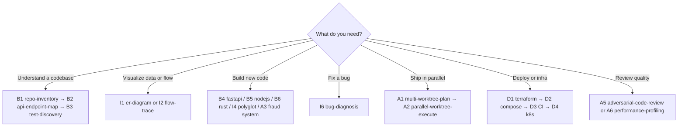

# Agent Catalog

Complete reference for all **24 agents** in this repository. Each agent has a slash command, a source-of-truth spec, and a defined output.

---

## How to read this table

| Column | Meaning |
| ------ | ------- |
| **Command** | Type this in Cursor chat (or pick from `/` menu) |
| **Purpose** | What the agent does |
| **Output** | File(s) or code produced |
| **Spec** | Full instructions live here |

---

## Basic — Repo Reader & Builder

*Folder: `Basic-repo-reader-and-builder/`*

| ID | Command | Purpose | Output |
| -- | ------- | ------- | ------ |
| **B1** | `/repo-inventory {repo-path}` | Scan a repo and catalog controllers, services, repos, schedulers, configs | `repo-inventory.md` |
| **B2** | `/api-endpoint-map {repo-path}` | Map REST, GraphQL, WebSocket, and frontend routes | `api-endpoint-map.md` |
| **B3** | `/test-discovery {repo-path}` | Discover test frameworks, suites, and run commands | `test-discovery-report.md` |
| **B4** | `/fastapi-builder` | Build & validate a FastAPI transaction API | `B4_FastAPI_greenfield_service/` |
| **B5** | `/nodejs-builder` | Build & validate an Express transaction API | `B5_Node.js_greenfield_API/` |
| **B6** | `/rust-log-analyzer` | Build & validate a Rust CLI log analyzer | `B6_Rust_greenfield/` |

### Example invocations

```bash
# Analyze any repo on your machine
/repo-inventory ~/Downloads/bo-migration-service

# Map endpoints in the current workspace
/api-endpoint-map .

# Scaffold and test the FastAPI demo
/fastapi-builder
```

### Spec locations

| Agent | Spec file |
| ----- | --------- |
| B1 | `Basic-repo-reader-and-builder/B1_Repo_Artifact_Inventory/agent.md` |
| B2 | `Basic-repo-reader-and-builder/B2_API_endpoint_map/agent.md` |
| B3 | `Basic-repo-reader-and-builder/B3_Test_discovery_and_execution/agent.md` |
| B4 | `Basic-repo-reader-and-builder/B4_FastAPI_greenfield_service/agent.md` |
| B5 | `Basic-repo-reader-and-builder/B5_Node.js_greenfield_API/agent.md` |
| B6 | `Basic-repo-reader-and-builder/B6_Rust_greenfield/agent.md` |

---

## Intermediate — Repo Operator & Polyglot Builder

*Folder: `Intermediate-repo operator and polyglot builder/`*

| ID | Command | Purpose | Output |
| -- | ------- | ------- | ------ |
| **I1** | `/er-diagram {repo-path}` | Extract entities and relationships; produce ER diagram | `er-diagram-report.md`, `er-diagram.mmd` |
| **I2** | `/flow-trace {repo-path} {entry-point}` | Trace request flow end-to-end with sequence diagram | `flow-trace-report.md`, `flow-trace-sequence.mmd` |
| **I3** | `/small-safe-change {repo-path} {change}` | Make a minimal, tested code change with proof | Patch + `change-report.md` |
| **I4** | `/polyglot-service-pair` | Build FastAPI service + Node CLI client (currency demo) | `I4/services/`, `I4/clients/` |
| **I5** | `/dockerization {service-path}` | Containerize a service with Dockerfile and health check | `Dockerfile`, `docker-report.md` |
| **I6** | `/bug-diagnosis {repo-path} {bug}` | Reproduce, fix, and verify a bug with root-cause report | `bug-investigation-report.md` |

### Example invocations

```bash
/er-diagram ~/projects/ecommerce-backend

/flow-trace . "POST /transactions"

/small-safe-change . "Add X-Request-Id response header"

/polyglot-service-pair

/dockerization Basic-repo-reader-and-builder/B4_FastAPI_greenfield_service

/bug-diagnosis . "Balance endpoint returns NaN for empty ledger"
```

### Spec locations

| Agent | Spec file |
| ----- | --------- |
| I1 | `Intermediate-repo operator and polyglot builder/I1_ER_diagram_from_repo/agent.md` |
| I2 | `Intermediate-repo operator and polyglot builder/I2_End_to_end_flow_trace/agent.md` |
| I3 | `Intermediate-repo operator and polyglot builder/I3_Small_safe_change/agent.md` |
| I4 | `Intermediate-repo operator and polyglot builder/I4/agent.md` |
| I5 | `Intermediate-repo operator and polyglot builder/I5_Polyglot_service_pair/agent.md` |
| I6 | `Intermediate-repo operator and polyglot builder/I6_Dockerize_and_run/agent.md` |

---

## Advanced — Parallel Agent Operator & System Builder

*Folder: `Advanced-parallel agent operator and system builder/`*

| ID | Command | Purpose | Output |
| -- | ------- | ------- | ------ |
| **A1** | `/multi-worktree-plan {repo} {task}` | Split work into parallel lanes with branch strategy | `multi-worktree-plan.md` |
| **A2** | `/parallel-worktree-execute {repo} {plan}` | Execute a multi-worktree plan with parallel agents | Code changes + merge report |
| **A3** | *(natural language)* | Build polyglot fraud scoring system (FastAPI + Node + Rust) | `A3_Fraud_Score_system/` |
| **A4** | `/repository-modernization {repo-path}` | Produce a modernization roadmap with prioritized phases | `docs/modernization-report.md` |
| **A5** | `/adversarial-code-review {repo} [{scope}]` | Adversarial review — find bugs, security gaps, edge cases | `code-review-report.md` |
| **A6** | `/performance-profiling {repo} [{hint}]` | Profile hot paths and recommend optimizations | `profiling-report.md` |

### Example invocations

```bash
/multi-worktree-plan . Migrate auth from sessions to JWT

/parallel-worktree-execute . @A1_Multi-worktree_parallel_plan/multi-worktree-plan.md

Build the A3 fraud scoring system with FastAPI, Node worker, and Rust engine

/repository-modernization ~/legacy/monolith

/adversarial-code-review Basic-repo-reader-and-builder/B4_FastAPI_greenfield_service

/performance-profiling . "POST /transactions handler"
```

### Spec locations

| Agent | Spec file |
| ----- | --------- |
| A1 | `Advanced-parallel agent operator and system builder/A1_Multi-worktree_parallel_plan/agent.md` |
| A2 | `Advanced-parallel agent operator and system builder/A2_Execute_two_parallel_worktrees/agent.md` |
| A3 | `Advanced-parallel agent operator and system builder/A3_Fraud_Score_system/agent.md` |
| A4 | `Advanced-parallel agent operator and system builder/A4_Repository_Modernization_Plan/agent.md` |
| A5 | `Advanced-parallel agent operator and system builder/A5_Agent_Code_Review/agent.md` |
| A6 | `Advanced-parallel agent operator and system builder/A6_Performence_Profiling/agent.md` |

---

## Infra & DevOps

*Folder: `Infra-and-DevOps/`*

| ID | Command | Purpose | Output |
| -- | ------- | ------- | ------ |
| **D1** | `/terraform-plan [{path}] [{stack}]` | Generate Terraform plan for a small service | `docs/terraform-report.md`, `.tf` files |
| **D2** | `/docker-compose-stack [{path}] [{hint}]` | Multi-service Docker Compose stack | `docker-compose.yml`, stack report |
| **D3** | `/ci-pipeline [{path}] [{github\|gitlab}]` | CI pipeline with lint, test, build stages | `.github/workflows/` or `.gitlab-ci.yml` |
| **D4** | `/kubernetes-deployment [{path}] [{kind\|minikube}]` | K8s manifests with probes and resources | `k8s/` manifests |
| **D5** | `/reproducible-dev-environment [{path}] [{tool}]` | Devcontainer, Nix, asdf, or mise setup | `Makefile`, `.devcontainer/`, etc. |
| **D6** | `/observability [{path}]` | Add metrics, logging, and health endpoints | Observability report + instrumentation |

### Example invocations

```bash
/terraform-plan services/api aws

/docker-compose-stack Basic-repo-reader-and-builder/B4_FastAPI_greenfield_service

/ci-pipeline . github

/kubernetes-deployment services/api minikube

/reproducible-dev-environment . devcontainer

/observability Advanced-parallel agent operator and system builder/A3_Fraud_Score_system
```

### Spec locations

| Agent | Spec file |
| ----- | --------- |
| D1 | `Infra-and-DevOps/D1_Terraform_Plan_For_a_small_service/agent.md` |
| D2 | `Infra-and-DevOps/D2_Docker-Compose_Stack/agent.md` |
| D3 | `Infra-and-DevOps/D3_Ci_pipiline_that_lints/agent.md` |
| D4 | `Infra-and-DevOps/D4_Kubernetes_Deployment/agent.md` |
| D5 | `Infra-and-DevOps/D5_Reproducible_dev_environment/agent.md` |
| D6 | `Infra-and-DevOps/D6_Observability_bolt_on_with_metrics/agent.md` |

---

## Choosing the right agent



---

## Skill registration

Every slash command is registered under `.cursor/skills/{name}/SKILL.md`. These are thin entry points — **always refer to `agent.md` for the full workflow**.

```
.cursor/skills/repo-inventory/SKILL.md
    └── points to → Basic-repo-reader-and-builder/B1_Repo_Artifact_Inventory/agent.md
```

Do not edit `SKILL.md` files unless adding a new agent. Edit `agent.md` to change behavior.
