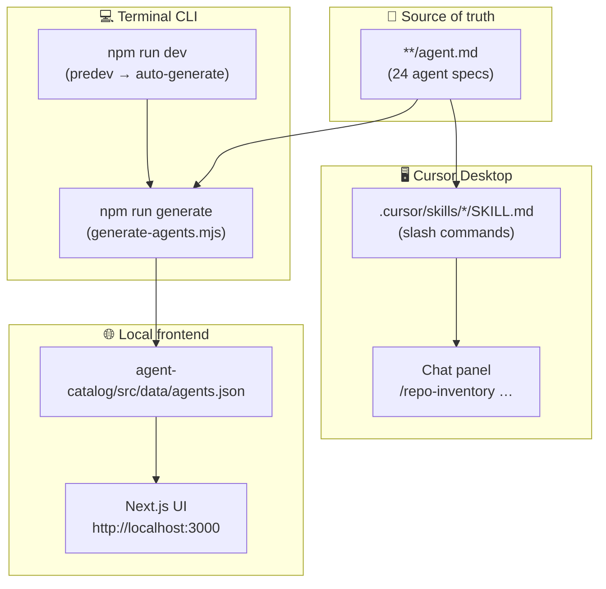

# ⚙️ Complete Setup Guide

One guide to wire up **Cursor skills**, the **terminal CLI**, and the **local frontend** so they stay in sync automatically.

> **Goal:** Clone once → run two commands → use `/slash-commands` in Cursor **and** browse agents at `localhost:3000`, with zero manual syncing.

---

## 🧩 How the three pieces connect



| Layer | Path | Role |
| ----- | ---- | ---- |
| **Agent spec** | `{tier-folder}/{agent-folder}/agent.md` | Full workflow, rules, deliverables |
| **Cursor skill** | `.cursor/skills/{name}/SKILL.md` | Registers `/slash-command` in Cursor chat |
| **Generator CLI** | `agent-catalog/scripts/generate-agents.mjs` | Scans all `agent.md` → builds `agents.json` |
| **Frontend** | `agent-catalog/` | Next.js catalog UI — reads `agents.json` |

**Automatic sync:** `npm run dev` and `npm run build` run `predev` / `prebuild`, which call the generator **before** starting Next.js. Edit an `agent.md`, restart dev (or run `npm run generate`) — the UI updates.

---

## ✅ Prerequisites

Install these once on your machine:

| Tool | Minimum version | Used for | Check |
| ---- | ----------------- | -------- | ----- |
| **Git** | any recent | Clone repo | `git --version` |
| **Node.js** | 20+ (22+ for A3 worker) | Agent catalog, B5, I4 CLI | `node --version` |
| **npm** | 10+ | Package install & scripts | `npm --version` |
| **Cursor Desktop** | latest | Slash-command agents | [cursor.com](https://cursor.com) |
| **Python** | 3.9+ | B4, I4, A3 FastAPI *(optional)* | `python3 --version` |
| **Rust** | 1.70+ | B6, A3 engine *(optional)* | `cargo --version` |

> Python and Rust are only needed when **running** greenfield demos — not for Cursor skills or the catalog UI.

---

## 🚀 One-time setup (5 minutes)

### Step 1 — Clone the repository

```bash
git clone https://github.com/Rohitverma9569/AI-Agent-Tasks_Rohit_Verma.git
cd "AI-Agent-Tasks -PML"
```

### Step 2 — Install frontend dependencies

```bash
cd agent-catalog
npm install
npm run generate
```

Expected output:

```
Generated 24 agents → src/data/agents.json
```

This creates `agent-catalog/src/data/agents.json` from every `agent.md` in the repo.

### Step 3 — Open the repo root in Cursor

**Important:** Open the **repository root**, not the `agent-catalog/` subfolder. Skills live at `.cursor/skills/` relative to the root.

```bash
cd ..                    # back to repo root
cursor .                 # or: File → Open Folder → AI-Agents-Tasks -PML
```

Alternatively in Cursor: **File → Open Folder** → select `AI-Agents-Tasks -PML`.

### Step 4 — Verify Cursor skills loaded

1. Open the **Chat** panel (`Cmd+L` / `Ctrl+L`).
2. Type `/` — you should see all 24 slash commands, e.g.:
   - `/repo-inventory`
   - `/api-endpoint-map`
   - `/fastapi-builder`
   - `/fraud-score-system`

If commands are missing, confirm the workspace root contains `.cursor/skills/` (24 folders).

---

## ▶️ Daily workflow — start everything

Use **two terminals** (or Cursor's integrated terminal split):

### Terminal 1 — Local frontend (auto-syncs agents)

```bash
cd agent-catalog
npm run dev
```

What happens automatically:

1. `predev` runs → `generate-agents.mjs` scans all `agent.md` files
2. `agents.json` is refreshed
3. Next.js dev server starts

Open **http://localhost:3000** — browse all agents, slash commands, and spec paths.

### Terminal 2 — Cursor chat (agents)

Keep Cursor open on the **repo root**. Invoke any agent:

```
/repo-inventory .
```

```
/fastapi-builder
```

```
/fraud-score-system
```

The skill file points Cursor to the matching `agent.md`; the agent executes and writes output to its folder.

---

## 🔄 Keeping everything in sync automatically

You should **never** hand-edit `agents.json`. The pipeline handles it:

| You change… | Cursor skills | Frontend UI |
| ----------- | ------------- | ----------- |
| `agent.md` (description, slash command) | ✅ if skill points to it | ✅ after `npm run dev` or `npm run generate` |
| `.cursor/skills/*/SKILL.md` | ✅ immediately on reload | ❌ not in UI (UI reads `agent.md`) |
| Add new agent folder + `agent.md` | ⚠️ also add matching `SKILL.md` | ✅ after generate |

### Manual regenerate (without starting dev server)

```bash
cd agent-catalog
npm run generate
```

### Production build (also auto-generates)

```bash
cd agent-catalog
npm run build
npm start
```

---

## 🧪 Verify the full stack

Run this checklist after setup:

| # | Check | Command / action | Expected |
| - | ----- | ---------------- | -------- |
| 1 | Skills exist | `ls .cursor/skills \| wc -l` | `24` |
| 2 | Agent JSON generated | `cat agent-catalog/src/data/agents.json \| head -5` | `"agents": [` with 24 entries |
| 3 | Frontend running | Open http://localhost:3000 | Agent catalog loads |
| 4 | Slash commands | Type `/` in Cursor chat | 24 commands listed |
| 5 | End-to-end agent | `/repo-inventory .` | Creates/updates `repo-inventory.md` |
| 6 | UI matches spec | Click **B1** in catalog | Shows `/repo-inventory` and skill path |

---

## 📂 Repository paths reference

```
AI-Agents-Tasks -PML/                          ← Open THIS in Cursor
├── .cursor/skills/                            ← Cursor slash commands (24)
│   ├── repo-inventory/SKILL.md
│   ├── fraud-score-system/SKILL.md
│   └── …
├── Basic-repo-reader-and-builder/B1_…/agent.md
├── … (all tier folders with agent.md)
├── agent-catalog/
│   ├── scripts/generate-agents.mjs            ← Terminal CLI generator
│   ├── src/data/agents.json                   ← Auto-generated (do not edit)
│   └── package.json                           ← predev / prebuild hooks
└── docs/                                      ← Documentation
```

---

## 🛠️ Terminal CLI reference

All commands run from `agent-catalog/` unless noted:

| Command | What it does |
| ------- | ------------ |
| `npm install` | Install Next.js dependencies (one-time) |
| `npm run generate` | Scan `agent.md` files → write `agents.json` |
| `npm run dev` | **Auto-generate** + start dev server on port 3000 |
| `npm run build` | **Auto-generate** + production build |
| `npm start` | Serve production build on port 3000 |
| `npm run lint` | ESLint check |

Deploy to Vercel (optional):

```bash
cd agent-catalog
npx vercel --prod
```

Live site: https://agent-catalog.vercel.app

---

## 🖥️ Cursor skills reference

Each skill follows the same pattern:

```
.cursor/skills/{name}/SKILL.md  →  {tier-folder}/{agent-folder}/agent.md
```

Example chain for B2:

```
/api-endpoint-map
    ↓
.cursor/skills/api-endpoint-map/SKILL.md
    ↓
Basic-repo-reader-and-builder/B2_API_endpoint_map/agent.md
    ↓
api-endpoint-map.md (output)
```

### Three ways to invoke an agent in Cursor

| Method | Example |
| ------ | ------- |
| **Slash command** | `/api-endpoint-map ~/my-repo` |
| **Natural language** | _"Map all REST endpoints in Backend/"_ |
| **@ file mention** | `@Basic-repo-reader-and-builder/B2_API_endpoint_map/agent.md analyze .` |

---

## 🏗️ Optional — runnable demo projects

These are **separate** from the catalog setup. Start them when you want to test agent-built code:

| Project | Start command | Port |
| ------- | ------------- | ---- |
| B4 FastAPI | `cd Basic-repo-reader-and-builder/B4_FastAPI_greenfield_service && uvicorn app.main:app --reload` | 8000 |
| B5 Node API | `cd Basic-repo-reader-and-builder/B5_Node.js_greenfield_API && npm start` | 3000 |
| B6 Rust CLI | `cd Basic-repo-reader-and-builder/B6_Rust_greenfield && cargo run -- sample.log` | — |
| A3 Fraud system | `cd Advanced-parallel…/A3_Fraud_Score_system && ./scripts/run-all.sh` | 8000, 3001 |

Full details → [Runnable Projects](./runnable-projects.md)

---

## ❗ Troubleshooting

| Problem | Cause | Fix |
| ------- | ----- | --- |
| Slash commands not in menu | Wrong folder opened in Cursor | Open **repo root**, not `agent-catalog/` |
| `agents.json` empty or stale | Generator not run | `cd agent-catalog && npm run generate` |
| Frontend shows old agent data | Dev server cached | Stop dev server, run `npm run generate`, restart `npm run dev` |
| Port 3000 in use | Another app on 3000 | `PORT=3001 npm run dev` |
| Skill runs wrong agent | Broken path in `SKILL.md` | Check skill file points to correct `agent.md` |
| `cursor` command not found | Cursor CLI not installed | Cursor → Command Palette → **Install 'cursor' command** |
| Node version errors on A3 | Node < 22 | Upgrade Node or use `nvm install 22` |

---

## 📋 Quick copy-paste — full setup from scratch

```bash
# 1. Clone
git clone https://github.com/Rohitverma9569/AI-Agent-Tasks_Rohit_Verma.git
cd "AI-Agent-Tasks -PML"

# 2. Install & generate agent catalog data
cd agent-catalog
npm install
npm run generate

# 3. Start local frontend (keep this terminal open)
npm run dev
```

Then in a **second terminal**:

```bash
# 4. Open repo root in Cursor
cd "AI-Agents-Tasks -PML"
cursor .
```

In Cursor chat, test:

```
/repo-inventory .
```

In browser, open:

```
http://localhost:3000
```

---

## 🔗 Related docs

| Document | Purpose |
| -------- | ------- |
| [Getting Started](./getting-started.md) | How to invoke agents and typical workflows |
| [Agent Catalog](./agent-catalog.md) | All 24 agents — commands and outputs |
| [Runnable Projects](./runnable-projects.md) | Run FastAPI, Node, Rust, and polyglot demos |
| [Project Status](./project-status.md) | Assignment progress tracker |

---

*Last updated: June 2026 · 24 agents · 24 Cursor skills · auto-sync via `generate-agents.mjs`*
